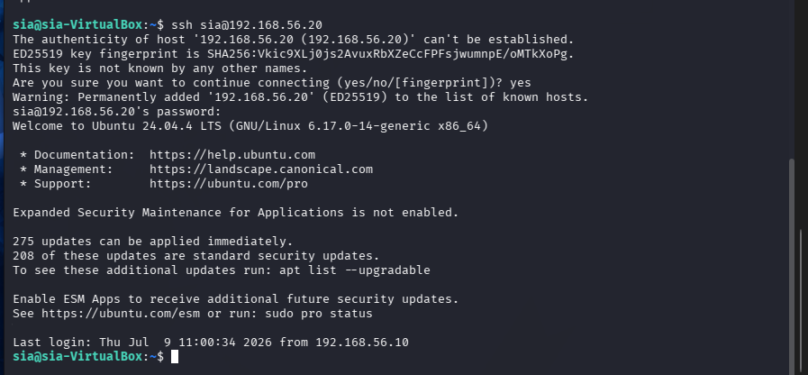
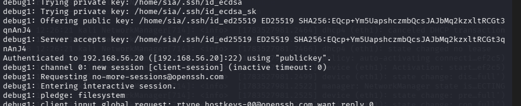
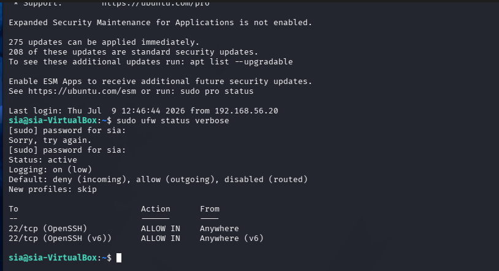
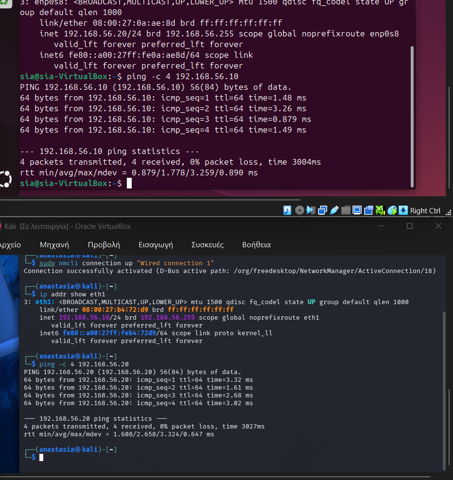
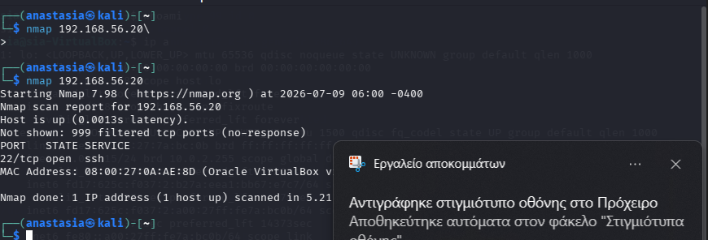
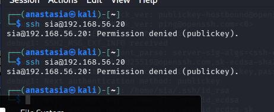
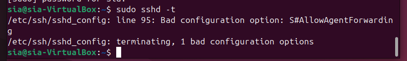
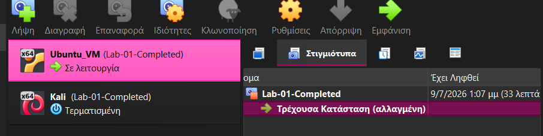

# Lab 01: Infrastructure and Secure Remote Access

`Ubuntu 24.04` `Kali Linux` `VirtualBox` `OpenSSH` `UFW` `Blue Team` `Infrastructure`

| | |
|---|---|
| **Focus** | Building the two-VM lab and establishing secure, key-based remote access |
| **Difficulty** | Beginner |
| **Duration** | ~4 hours (across two sessions) |
| **Tools** | VirtualBox, Kali Linux, Ubuntu Server, OpenSSH, UFW, Nmap |

## Executive Summary

This lab is the foundation of the CyberSecurity Homelab series. Before any hardening, monitoring, or attack simulation work can happen, there needs to be a controlled, isolated environment with reliable, authenticated remote access between machines. That is the entire scope of this lab: build a two-machine virtual network, get one machine to act as a target server and the other as an attacker/client workstation, and establish SSH access between them that is authenticated by keys rather than passwords, restricted by a firewall, and verified independently rather than just assumed to work.

Every later lab in this series (Linux hardening, network security, web security, monitoring, SOC work, and the final enterprise scenario) builds directly on top of the infrastructure documented here. The static IP addressing, the SSH trust relationship, and the firewall baseline established in this lab are not rebuilt from scratch each time. They carry forward.

## Objectives

- Build a two-VM virtual lab using VirtualBox: one Kali Linux attack/client box, one Ubuntu Server target.
- Design and implement an isolated internal network, separate from NAT/internet-facing traffic.
- Assign static IP addresses to both machines so the network topology is predictable and repeatable.
- Install and configure OpenSSH on the Ubuntu server.
- Move authentication from password-based to key-based (ED25519), and disable password authentication once key access is confirmed.
- Apply firewall rules with UFW using a default-deny posture, opening only the SSH port.
- Independently verify every claim above (connectivity, authentication method, exposed ports) using `ping`, `ssh -v`, `ufw status`, and `nmap`, rather than trusting that a config file was applied correctly.
- Document exactly what went wrong during the build and how it was diagnosed and fixed.

## Architecture

The lab runs entirely inside Oracle VirtualBox on a single host machine. Two virtual machines are connected through a dedicated **Internal Network** named `CyberLab`, which is invisible to the host's physical LAN and to any other VirtualBox network on the system. A second network adapter on each VM is attached to **NAT**, used exclusively so each machine can reach the internet for package updates. No lab traffic between Kali and Ubuntu ever touches the NAT adapter.

This separation matters for a simple reason: if the "attack" traffic and the "internet" traffic shared the same virtual network, it would be impossible to reason cleanly about what is actually exposed and to whom. Keeping them on separate adapters means the internal network can later be tightened, monitored, or attacked in isolation without touching the host's own network access.

See [`architecture/network-diagram.md`](architecture/network-diagram.md) for the full diagram, including a Mermaid version that renders natively on GitHub and GitLab.

## Virtual Machines

| | Kali Linux | Ubuntu Server |
|---|---|---|
| **Role** | Attack / client box | SSH server (hardening target) |
| **OS** | Kali Linux (rolling) | Ubuntu Server 24.04.4 LTS |
| **Hostname** | `kali` | `sia-VirtualBox` |
| **User** | `anastasia` | `sia` |
| **RAM** | 2 GB | 2 GB |
| **vCPUs** | 2 | 2 |
| **Disk** | 20 GB | 20 GB |
| **Network adapters** | NAT + Internal (`CyberLab`) | NAT + Internal (`CyberLab`) |

**Kali Linux** plays the role of the attacker/analyst workstation throughout this entire lab series. In this lab specifically, it is the machine that initiates SSH connections and runs the verification tools (`ping`, `ssh -v`, `nmap`) against the Ubuntu server.

**Ubuntu Server** plays the role of the target infrastructure. It is the machine being configured, secured, and later (in Lab 02 onward) hardened and monitored. Using a headless server distribution rather than a desktop build keeps the box closer to what a real production server looks like: no GUI, SSH as the primary access method, and a minimal attack surface by default.


*VirtualBox network configuration for the internal network adapter, named `CyberLab`.*

## Network Topology

Both VMs use two adapters each:

- **Adapter 1: NAT.** Provides internet access for OS updates and package installation. Assigned dynamically (Ubuntu received `10.0.2.15/24` on this adapter during setup).
- **Adapter 2: Internal Network (`CyberLab`).** Fully isolated from the host and from the internet. Static IPs are assigned manually here:
  - Kali Linux: `192.168.56.10/24`
  - Ubuntu Server: `192.168.56.20/24`

Static addressing was a deliberate choice over DHCP. A lab where the target's IP address can silently change between reboots makes every other artifact (SSH known_hosts entries, firewall rules, nmap results, documentation) unreliable. Fixing the addresses once, up front, means the rest of the lab (and every lab after it) can reference `192.168.56.20` as a constant.

On Ubuntu, the static IP was applied on the internal adapter (`enp0s8`) using NetworkManager:

```bash
sudo nmcli connection modify Internal ipv4.addresses 192.168.56.20/24 ipv4.method manual
sudo nmcli connection up Internal
```

Confirmed with:

```bash
$ ip addr show enp0s8
3: enp0s8: <BROADCAST,MULTICAST,UP,LOWER_UP> mtu 1500 ... state UP
    link/ether 08:00:27:0a:ae:8d brd ff:ff:ff:ff:ff:ff
    inet 192.168.56.20/24 brd 192.168.56.255 scope global noprefixroute enp0s8
```

Full diagram: [`architecture/network-diagram.md`](architecture/network-diagram.md).

## SSH Configuration

### Installing OpenSSH

The Ubuntu Server ISO does not ship with an SSH server enabled out of the box in this install, so the first `systemctl status ssh` check (run before installation) correctly failed:

```
$ systemctl status ssh
Unit ssh.service could not be found.
```

After installing and enabling the package:

```bash
sudo apt update
sudo apt install openssh-server -y
sudo systemctl enable --now ssh
```

the service came up and port 22 was confirmed listening on both IPv4 and IPv6:

```
$ ss -tln | grep :22
LISTEN 0      4096         0.0.0.0:22        0.0.0.0:*
LISTEN 0      4096            [::]:22           [::]:*
```

### First Connection (Password Authentication)

Before moving to key-based authentication, a normal password login was used to confirm basic reachability end to end: network path, SSH daemon, and account credentials.


*Initial SSH connection from Kali to Ubuntu using password authentication. The host key fingerprint is accepted on first connection and stored in `known_hosts`.*

### SSH Key Generation and Installation

An ED25519 key pair was generated on Kali:

```bash
ssh-keygen -t ed25519 -C "sia-homelab"
```

and installed on the Ubuntu server:

```bash
ssh-copy-id sia@192.168.56.20
```

ED25519 was chosen over RSA for this lab because it offers equivalent or stronger security with a much shorter key, and is the current recommended default for new SSH keys.

### Verifying Key-Based Authentication

Rather than assuming the key was picked up correctly, verbose SSH output was used to confirm the exact authentication method used for the session:

```
$ ssh -v sia@192.168.56.20
...
debug1: Offering public key: /home/sia/.ssh/id_ed25519 ED25519 SHA256:EQcp+Ym5UapshczmbQcsJAJbMq2kzxltRCGt3qnAnJ4
debug1: Server accepts key: ...
debug1: Authenticated to 192.168.56.20 ([192.168.56.20]:22) using "publickey".
```


*The line "Authenticated to 192.168.56.20 using publickey" is the definitive confirmation that key-based auth is working, not just that a connection was accepted.*

### Hardening `sshd_config`

Only after key authentication was confirmed working was password authentication disabled:

```
PubkeyAuthentication yes
PasswordAuthentication no
PermitRootLogin without-password
PermitEmptyPasswords no
```

Every change to `sshd_config` was validated before restarting the service:

```bash
sudo sshd -t
sudo systemctl restart ssh
```

## Firewall Configuration

UFW (Uncomplicated Firewall) was configured with a default-deny posture on incoming traffic, and a single explicit allow rule for SSH:

```bash
sudo ufw default deny incoming
sudo ufw default allow outgoing
sudo ufw allow OpenSSH
sudo ufw enable
```

Verified with:

```
$ sudo ufw status verbose
Status: active
Logging: on (low)
Default: deny (incoming), allow (outgoing), disabled (routed)
New profiles: skip

To                         Action      From
--                         ------      ----
22/tcp (OpenSSH)           ALLOW IN    Anywhere
22/tcp (OpenSSH (v6))      ALLOW IN    Anywhere (v6)
```


*Default-deny incoming, default-allow outgoing, with a single explicit rule permitting SSH over both IPv4 and IPv6.*

This is a deny-by-default model: nothing reaches the server unless there is an explicit rule for it. As later labs add services (web, monitoring agents), each one will require its own deliberate rule, rather than the server being open by default and locked down reactively.

## Verification

Every claim in this document was independently verified rather than assumed.

**Connectivity (ping), both directions:**

```
$ ping -c 4 192.168.56.20        (from Kali)
4 packets transmitted, 4 received, 0% packet loss
rtt min/avg/max/mdev = 1.478/1.778/3.259/0.890 ms

$ ping -c 4 192.168.56.20        (from Ubuntu, loopback path via the internal adapter)
4 packets transmitted, 4 received, 0% packet loss
rtt min/avg/max/mdev = 1.608/2.658/3.324/0.647 ms
```



**SSH access:** confirmed above in section 6, both for password login and for key-based login with verbose authentication logging.

**Firewall exposure (nmap):**

```
$ nmap 192.168.56.20
Starting Nmap 7.98 ( https://nmap.org ) at 2026-07-09
Nmap scan report for 192.168.56.20
Host is up (0.0013s latency).
Not shown: 999 filtered tcp ports (no-response)
PORT   STATE SERVICE
22/tcp open  ssh
MAC Address: 08:00:27:0A:AE:8D (Oracle VirtualBox virtual NIC)
```


*A scan from Kali against the Ubuntu server shows exactly one open port: SSH. Every other port is filtered, matching the UFW default-deny policy.*

Nmap confirms, from an outside vantage point, exactly what the firewall configuration claims: the only reachable service on this host is SSH. That agreement between "what the config says" and "what a network scan actually observes" is the whole point of running verification tools instead of trusting configuration files at face value.

## MITRE ATT&CK Mapping

Not a full ATT&CK Navigator layer, just an illustration of which techniques this lab's controls address.

| Control | Related ATT&CK Technique(s) | Relationship |
|---|---|---|
| SSH key-based authentication, password login disabled | T1078 - Valid Accounts | Mitigation |
| SSH as the sole remote access method, hardened | T1021.004 - Remote Services: SSH | Mitigation |
| UFW default-deny firewall | T1046 - Network Service Discovery | Mitigation |

## Problems Encountered

This section covers the SSH key authentication issue encountered during setup, since working through it (rather than avoiding it) is the most useful part of this lab to document.

### Symptom

After generating and installing the SSH key pair, connection attempts from Kali failed with:

```
$ ssh sia@192.168.56.20
sia@192.168.56.20: Permission denied (publickey).
```



### Root Cause

Two things had gone wrong at once, which is what made this take longer to diagnose than a single clean failure would have:

1. The key pair being offered by the client was not the one actually trusted by the server, due to an earlier mismatch in how the key was generated and installed.
2. Password authentication had already been disabled in `sshd_config` before public key authentication had been confirmed to actually work, which removed the fallback that would normally have still allowed a login while the key issue was being fixed.

### Troubleshooting Process

Rather than guessing, each layer of the connection was checked independently, from the network up to the application:

1. **Service status.** `systemctl status ssh` to confirm the daemon was running.
2. **Network reachability.** `ping` between Kali and Ubuntu to rule out a connectivity problem entirely.
3. **Port state.** `ss -tln | grep :22` to confirm the server was actually listening on port 22.
4. **Configuration syntax.** `sudo sshd -t`, which caught a separate, unrelated typo in `sshd_config`:

   ```
   $ sudo sshd -t
   /etc/ssh/sshd_config: line 95: Bad configuration option: S#AllowAgentForwarding
   /etc/ssh/sshd_config: terminating, 1 bad configuration options
   ```

   

   A stray character in front of a `#` comment turned it into an unrecognized directive name. This is exactly why `sshd -t` is run before every restart in this lab: it turns a silent misconfiguration into an explicit, actionable error message before the service is ever reloaded.

5. **File permissions and ownership.** Verified that `~/.ssh` and `~/.ssh/authorized_keys` on the Ubuntu server had the restrictive permissions SSH requires, since SSH will silently refuse to use key files that are group- or world-writable.
6. **Verbose client debugging.** `ssh -v` and `ssh -vvv` to see exactly which private key was being offered, whether the server acknowledged it, and at which step in the exchange authentication actually failed.
7. **Key confirmation.** Verified the correct private/public key pair was present locally and that the matching public key existed in `authorized_keys` on the server.
8. **Re-installation.** Reinstalled the public key with `ssh-copy-id sia@192.168.56.20`.
9. **Confirm before locking down.** Verified key-based login succeeded before disabling password authentication a second time.

### Resolution

Once the correct key pair was in place and confirmed working, `PasswordAuthentication no` was re-applied, `sshd -t` was run again to confirm clean syntax, and the service was restarted.

### Verification of the Fix

- `ssh sia@192.168.56.20` completes without ever prompting for a password.
- Verbose output shows `Authenticated to 192.168.56.20 using "publickey"`.
- `nmap` confirms only TCP/22 is reachable, meaning the fallback of a broader, less restricted access path never had to be opened to work around the issue.

## Lessons Learned

The full reflection is in [`lessons-learned.md`](lessons-learned.md). The short version: validate before you lock down, read error messages literally before assuming a more complex cause, and use verbose debugging tools early rather than as a last resort.

## Skills Demonstrated

- Virtualization and network design (VirtualBox, isolated internal network, static IP addressing)
- SSH server installation and key-based authentication (ED25519)
- Linux firewall administration (UFW, default-deny posture)
- Security verification methodology (`ping`, `ssh -v`, `ufw status`, `nmap`)
- systemd service troubleshooting and configuration validation (`sshd -t`)

## Next Phase

**Lab 02: Enterprise Linux Hardening & Security Baseline** *(complete)*

This lab intentionally stops at "secure remote access is working and verified." It does not yet cover account policy and `sudo` privilege restrictions, kernel and OS-level hardening, centralized logging of authentication attempts, or brute-force protection. All of that is the explicit scope of Lab 02, which builds directly on the static IP addressing, SSH key trust, and UFW baseline established here.

---

**Snapshot.** Both VMs were snapshotted after this lab was completed and verified, under the name `Lab-01-Completed`, to preserve a known-good baseline to branch from before starting Lab 02.



---

[🏠 Home](../README.md) &nbsp;|&nbsp; [➡️ Next: Lab 02 - Linux Hardening](../Lab-02-Linux-Hardening/README.md)
