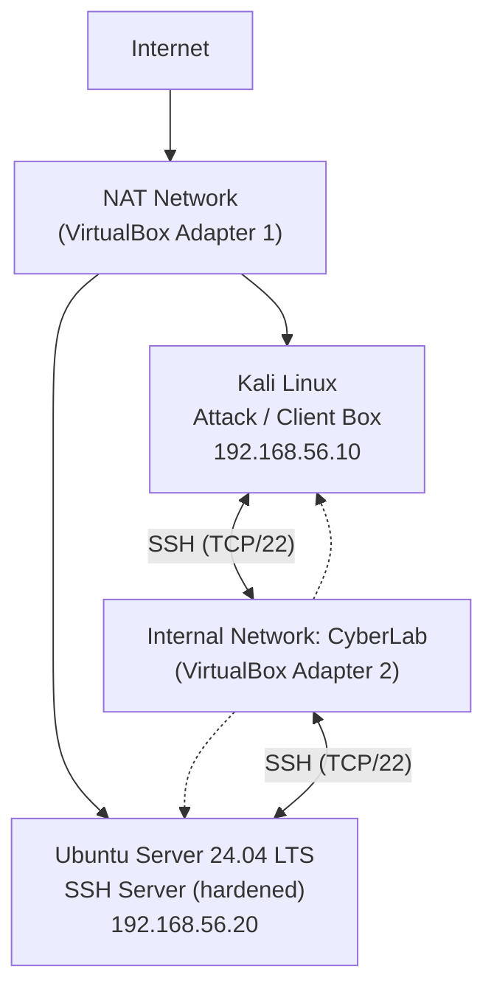

# Network Diagram: Lab 01

## Logical Topology

```
                              Internet
                                  |
                                  |
                            NAT Network
                                  |
                +-----------------+-----------------+
                |                                   |
        +---------------+                   +----------------+
        |     Kali       |                   |     Ubuntu     |
        |  Attack Box    |<----------------->|   SSH Server   |
        | 192.168.56.10  |   Internal Network |  192.168.56.20 |
        |  (CyberLab)    |     "CyberLab"      |   (CyberLab)   |
        +---------------+                   +----------------+
```

## Mermaid Version (renders natively on GitHub/GitLab)



## Adapter Summary

| VM | Adapter 1 (NAT) | Adapter 2 (Internal Network) | Role |
|----|------------------|-------------------------------|------|
| Kali Linux | DHCP (internet access, updates) | 192.168.56.10/24 static | Attack / client box |
| Ubuntu Server | DHCP (internet access, updates) | 192.168.56.20/24 static | SSH server (target) |

Both VMs share the Internal Network named **CyberLab**, which is fully isolated from the host's physical LAN. NAT is used only so each VM can independently reach the internet for package updates; all lab traffic between the two machines happens exclusively over the internal network.
