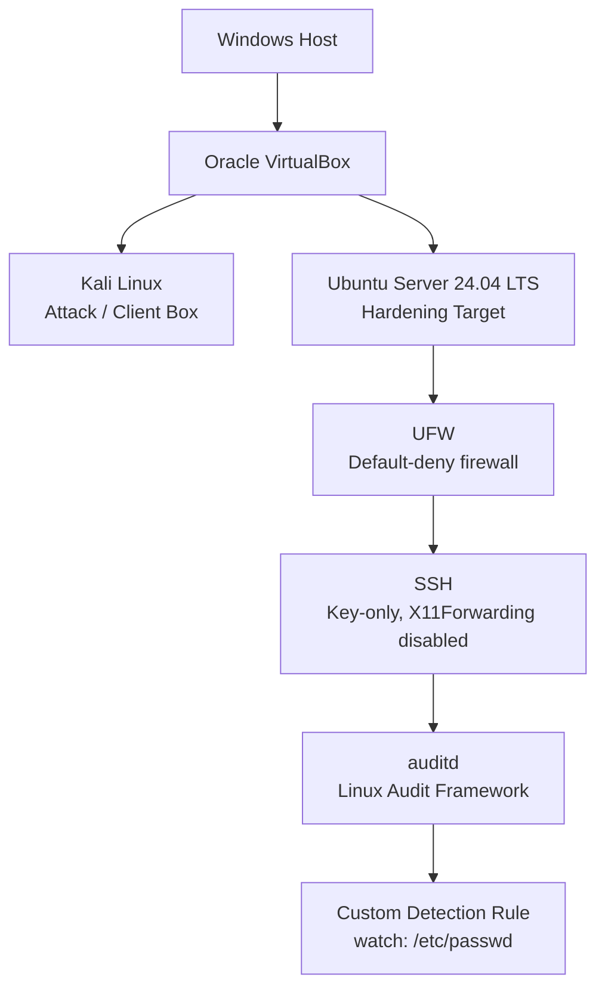
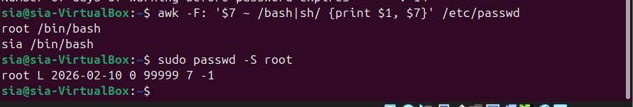
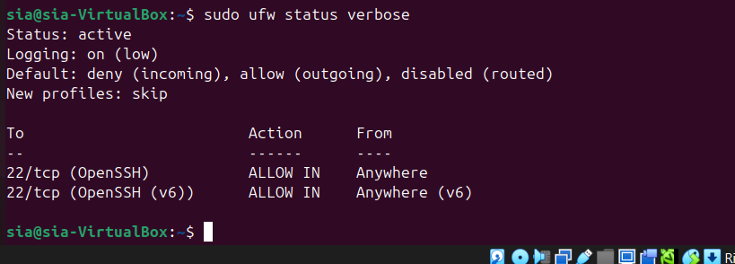
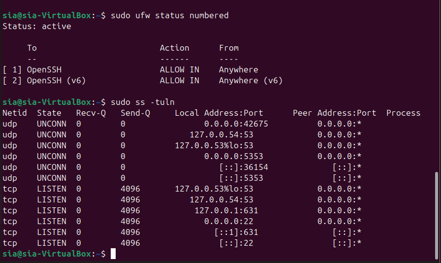
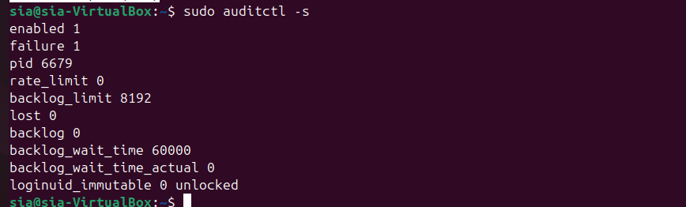
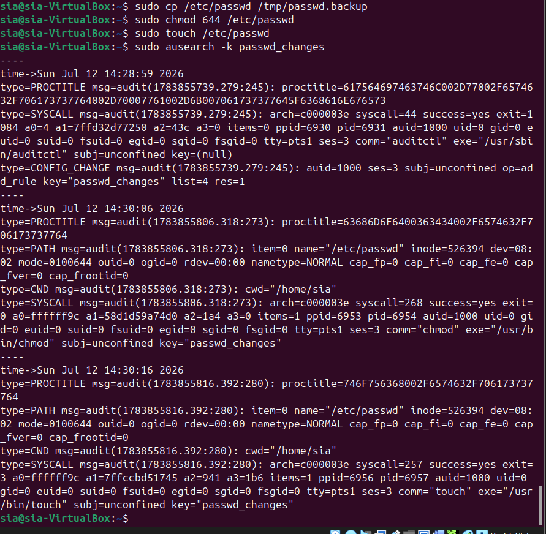

# Enterprise Linux Hardening & Security Baseline

`Ubuntu 24.04` `VirtualBox` `Blue Team` `Linux Security` `UFW` `SSH Hardening` `auditd` `Detection Engineering`

## Architecture



This lab hardens the same Ubuntu VM built in [Lab 01](../Lab-01-Infrastructure-and-Secure-Remote-Access/) (`192.168.56.20`), layering account, firewall, service, SSH, and audit controls on top of the secure remote access foundation already in place. Full network topology: [`architecture/attack-surface-diagram.md`](architecture/attack-surface-diagram.md).

## At a Glance: Before / After

| Security Control | Before | After |
|---|:---:|:---:|
| Password Aging | ❌ Not enforced | ✅ 90 / 1 / 14 days |
| Firewall Baseline (UFW) | ✅ Reviewed | ✅ Confirmed, no drift |
| CUPS (printing service) | Running | Disabled |
| Avahi (mDNS/DNS-SD) | Running | Disabled |
| X11 Forwarding | Enabled | Disabled |
| auditd | Not installed | Installed and running |
| Audit Rules | None | Custom watch on `/etc/passwd`, verified |

## Executive Summary

This lab treats the Ubuntu Server 24.04 VM from Lab 01 as a newly delivered workstation that has not yet joined a corporate network, and works through it using a professional assessment methodology: **Assessment → Hardening → Verification → Documentation**. Six findings came out of that process, covering account and password policy, unnecessary network services, SSH configuration, and the complete absence of host-level auditing. Every finding below follows the same structure a real security assessment would use: what the risk is, what was done about it, and how the fix was independently verified, not assumed.

## Scenario

A newly deployed Ubuntu 24.04 workstation has been delivered to the Security Team before joining the corporate network. The objective is to assess the system, identify security weaknesses, apply hardening measures, verify every change, and document the security improvements, the way a security engineer would be expected to before handing a machine off to production.

## Objectives

- Establish a baseline understanding of the system before making any changes.
- Assess account and privilege security (root status, sudo configuration).
- Enforce a password aging policy.
- Review the firewall configuration inherited from Lab 01.
- Enumerate every listening network service and question whether each one needs to exist.
- Reduce the attack surface by disabling services with no legitimate purpose on this host.
- Harden the SSH daemon beyond the baseline established in Lab 01.
- Deploy host-level auditing (`auditd`) and prove, with a real triggered event, that a custom detection rule works.

## Environment and Baseline

This lab reuses the Ubuntu Server 24.04.4 LTS VM (`sia-VirtualBox`, `192.168.56.20`) built in Lab 01. No new virtual machines were created; every command below was run over the SSH key-based connection established there.

```
$ hostnamectl
  Operating System: Ubuntu 24.04.4 LTS
            Kernel: Linux 6.17.0-35-generic
  Virtualization: oracle

$ id
uid=1000(sia) gid=1000(sia) groups=1000(sia),4(adm),24(cdrom),27(sudo),30(dip),46(plugdev),100(users),114(lpadmin)
```


Account structure was confirmed sound before looking for anything to fix: only `root` and `sia` have interactive shells, and root itself is locked, meaning all administrative access is forced through `sudo` rather than a direct root login.

```
$ sudo passwd -S root
root L 2026-02-10 0 99999 7 -1
```



`L` confirms root has no valid password and cannot log in directly. This was already correct out of the box and did not require a fix, but it was verified rather than assumed.

---

## Findings

### Finding 1: Password Aging Not Enforced

**Risk.** By default, the `sia` account's password never expired. An indefinitely valid password increases the value of a single credential compromise: if it leaks once, it stays valid forever unless someone notices and rotates it manually.

**Mitigation.**

```bash
sudo chage -M 90 -m 1 -W 14 sia
```

Maximum age 90 days forces periodic rotation, minimum age 1 day stops a user from immediately cycling back to their previous password, and a 14-day warning gives notice before lockout.

**Verification.**

```
Minimum number of days between password change  : 1
Maximum number of days between password change  : 90
Number of days of warning before password expires : 14
```


### Finding 2: Firewall Baseline Confirmed, No Drift

**Risk.** Firewall configuration can silently drift over time as services are installed or configs are edited. A firewall that was correct on day one is not guaranteed to still be correct later without periodic re-verification.

**Mitigation.** No change was required. This finding is a verification-only check, included because a real assessment re-confirms existing controls rather than only looking for new problems.

**Verification.**

```
$ sudo ufw status verbose
Status: active
Default: deny (incoming), allow (outgoing), disabled (routed)
22/tcp (OpenSSH)           ALLOW IN    Anywhere
22/tcp (OpenSSH (v6))      ALLOW IN    Anywhere (v6)
```



### Finding 3: Unnecessary Network Services Exposed (CUPS, Avahi)

**Risk.** `ss -tuln` showed four listening services, not just SSH: a loopback-only DNS stub resolver, CUPS (printing, port 631), and Avahi (mDNS/DNS-SD, port 5353). Neither CUPS nor Avahi has a legitimate purpose on a headless server, and every additional listening service is additional code that can potentially be exploited or fingerprinted.

```
$ sudo ss -tuln
tcp   LISTEN 0      4096       127.0.0.1:631            0.0.0.0:*
udp   UNCONN 0      0             0.0.0.0:5353           0.0.0.0:*
tcp   LISTEN 0      4096         0.0.0.0:22             0.0.0.0:*
```



**Mitigation.**

```bash
sudo systemctl stop cups
sudo systemctl disable cups
sudo systemctl disable --now cups.socket
sudo systemctl disable --now cups.path
sudo systemctl disable avahi-daemon
sudo systemctl disable --now avahi-daemon.socket
```

Disabling only the `.service` unit would not have been enough: systemd socket activation means `cups.socket` can silently restart the service the moment something connects to port 631. All three unit types were handled for CUPS.


**Verification.** Re-running the exact same enumeration command:

```
$ sudo ss -tuln
tcp   LISTEN 0      4096         0.0.0.0:22            0.0.0.0:*
tcp   LISTEN 0      4096              [::]:22              [::]:*
```


Ports 631 and 5353 are both gone. Only SSH and the unchanged, loopback-only DNS stub resolver remain.

### Finding 4: SSH X11 Forwarding Enabled

**Risk.** `X11Forwarding yes` was still active in `sshd_config`. X11 forwarding relays a graphical session over SSH; on a headless server with no GUI use case, it is unnecessary exposure and a known historical vector for X11 session and display-hijacking issues. It is disabled by default in hardening baselines like CIS for that reason.

**Mitigation.**

```bash
sudo cp /etc/ssh/sshd_config /etc/ssh/sshd_config.bak
sudo nano /etc/ssh/sshd_config   # X11Forwarding no
sudo sshd -t
sudo systemctl restart ssh
```

A backup was taken before editing, and `sshd -t` was run before restarting, consistent with the config-validation discipline established in Lab 01: never edit a config that controls your only remote access path without a way back.

**Verification.**

```
Before:  X11Forwarding yes
After:   X11Forwarding no
```


### Finding 5: No Host-Level Auditing Present

**Risk.** Before this lab, the system had no mechanism to record security-relevant events. A firewall and hardened SSH config prevent some things from happening, but neither one tells you what actually happened on the host after the fact. Without auditing, there is no forensic trail.

**Mitigation.**

```bash
sudo apt install auditd audispd-plugins -y
```

**Verification.**

```
$ sudo auditctl -s
enabled 1
pid 6679
backlog_limit 8192
lost 0
```



`enabled 1` confirms the audit subsystem is active in the kernel; `lost 0` confirms no events have been dropped.

### Finding 6: No Detection Coverage for Account-File Tampering

**Risk.** Installing `auditd` alone provides no value without rules that watch for something specific. `/etc/passwd` defines every account on the system; any technique that creates, modifies, or hides an account has to touch this file, whether through `useradd`, a direct edit, or a persistence script.

**Mitigation.**

```bash
sudo auditctl -w /etc/passwd -p wa -k passwd_changes
```

Watches `/etc/passwd` for write and attribute-change events, tagged with the key `passwd_changes`. This rule was added to the live kernel ruleset only; making it persist across reboots (via `/etc/audit/rules.d/`) is an open item, see [`lessons-learned.md`](lessons-learned.md).

**Verification.** A real event was generated, not just assumed to trigger the rule:

```bash
sudo chmod 644 /etc/passwd
sudo touch /etc/passwd
sudo ausearch -k passwd_changes
```

```
type=CONFIG_CHANGE ... op=add_rule key="passwd_changes" list=4 res=1
type=SYSCALL ... comm="chmod" ... key="passwd_changes"
type=SYSCALL ... comm="touch" ... key="passwd_changes"
```



Both the `chmod` and the `touch` were captured, each tagged with the rule's key and showing the responsible command, process ID, and exact file touched. This is the point of Findings 5 and 6 together: install the framework, write a rule that matters, and prove with a real event that it fires.

---

## MITRE ATT&CK Mapping

Not a full ATT&CK Navigator layer, just an illustration of why each control matters in adversary-technique terms.

| Finding | Related ATT&CK Technique(s) | Relationship |
|---|---|---|
| Password aging | T1110 - Brute Force; T1078 - Valid Accounts | Mitigation |
| Firewall baseline | T1046 - Network Service Discovery; T1190 - Exploit Public-Facing Application | Mitigation |
| CUPS / Avahi disabled | T1046 - Network Service Discovery; T1210 - Exploitation of Remote Services | Mitigation (attack surface reduction) |
| SSH X11 forwarding disabled | T1021.004 - Remote Services: SSH; T1563.001 - Remote Service Session Hijacking: SSH Hijacking | Mitigation |
| auditd + `/etc/passwd` watch rule | T1098 - Account Manipulation; T1136 - Create Account | Detection |

## Verification Summary

Every finding above was independently re-checked after being fixed, using the same tool that would have detected the problem in the first place: `chage -l` after the aging policy, `ss -tuln` after disabling services, a re-grep of `sshd_config` after editing, `auditctl -s` after installing `auditd`, and a real triggered file event confirmed with `ausearch`.

## Problems Encountered

Applying the password aging policy (Finding 1) had an immediate, not just future, effect: the very next `sudo` authentication attempt was forced into a password reset before any further command, including a read-only one like `chage -l`, would run.

```
sudo: Account or password is expired, reset your password and try again
```

This is expected `chage` behavior, not a bug: the new policy is evaluated against the account's existing password-change history immediately. The reset was completed and `chage -l` then confirmed the policy was applied correctly. On a production system with real users, this is the kind of change that generates help desk tickets if it isn't communicated in advance.

## Lessons Learned

Full write-up in [`lessons-learned.md`](lessons-learned.md). The core lesson from this lab: learning how to assess a Linux workstation before applying security controls, not simply memorizing hardening commands. Verification has to happen at the same layer as the change, a `ss -tuln` check proves a port is closed in a way a `systemctl status` check does not, and a systemd service is not fully disabled until its socket and path activation units are handled too.

## Skills Demonstrated

- Linux system administration and baseline security assessment
- Account and password policy hardening
- Firewall management and verification (UFW)
- Network service enumeration and attack surface reduction
- SSH security configuration
- Linux Audit Framework (`auditd`) deployment
- Detection engineering: writing and proving a rule for a specific, security-relevant event
- MITRE ATT&CK-informed defensive reasoning

## Next Phase

**Lab 2.5: Extended Hardening** *(planned)*

The following controls were deliberately scoped out of this lab to keep it focused and demo-able, and will land in a smaller follow-up lab rather than being bolted onto this one:

- Fail2Ban (automated response to repeated failed SSH attempts)
- AIDE (file integrity monitoring, extending the detection work started here)
- Lynis (automated security auditing/benchmarking)
- `unattended-upgrades` (automatic security patching)
- Persisting the `/etc/passwd` audit rule across reboots
- Additional `auditd` rules, `logrotate`, AppArmor policy review, `sysctl` kernel hardening

**Lab 03: Network Security** *(planned)*

Shifts focus from the host itself to the network layer it sits on.

---

**Environment note:** this lab was performed entirely on the Ubuntu Server VM (`192.168.56.20`) from Lab 01. No changes were made to the Kali attack box or the network topology.
