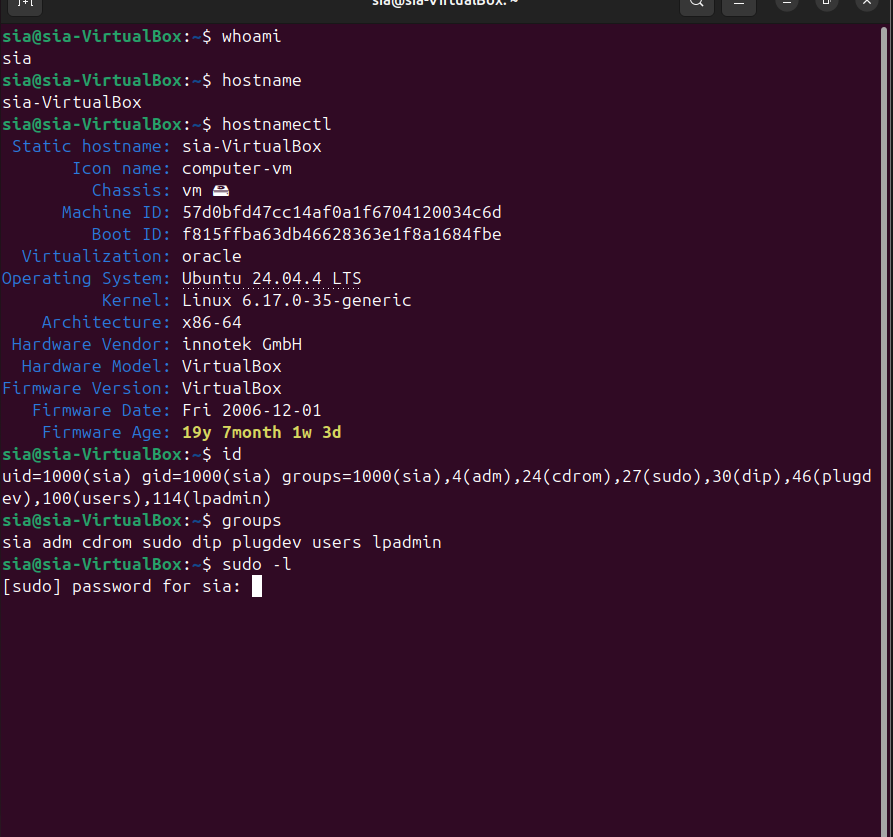
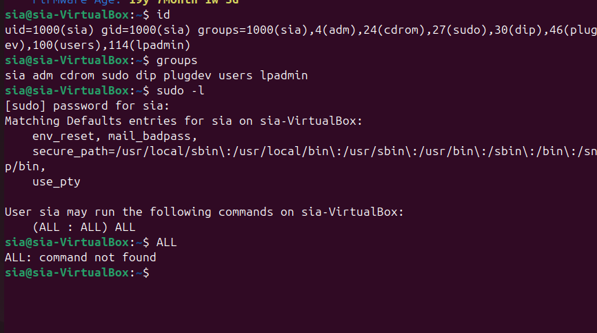
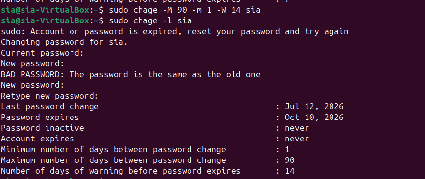
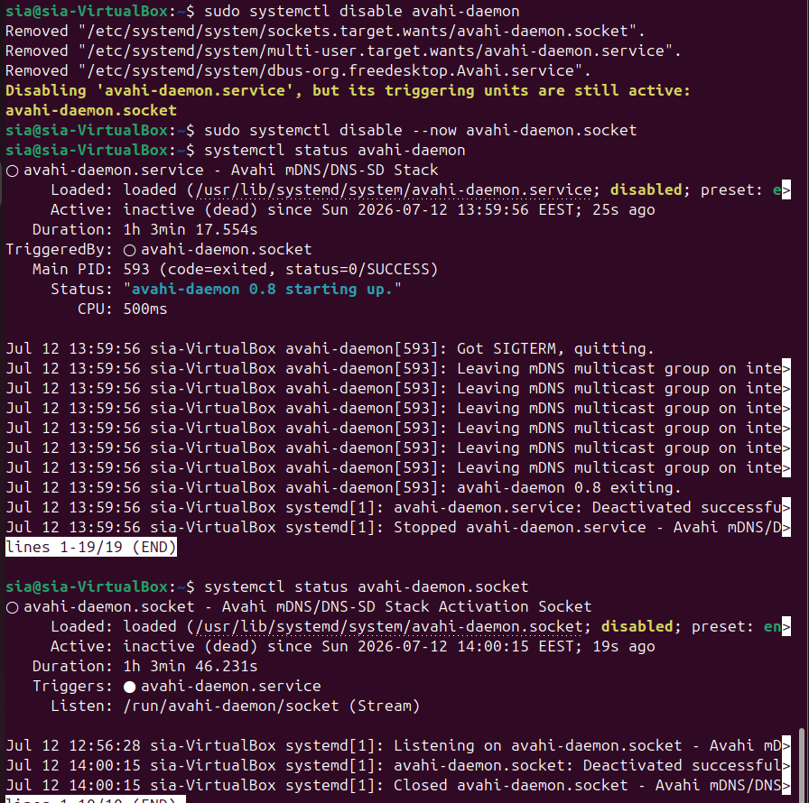
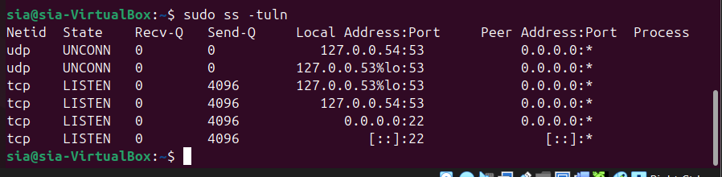
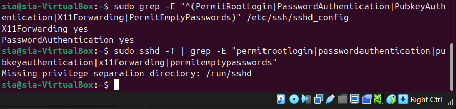
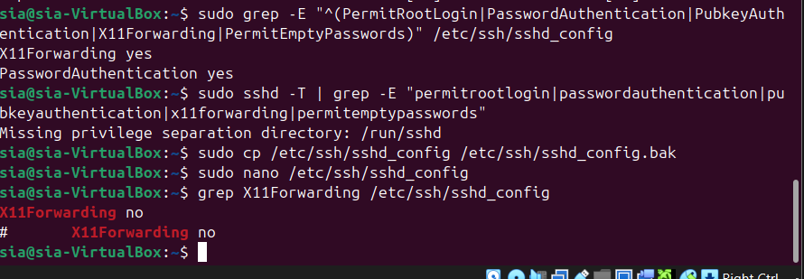

# Lab 02: Enterprise Linux Hardening and Security Baseline

## Executive Summary

This lab takes the Ubuntu Server 24.04 VM built in Lab 01 and treats it as a newly delivered workstation that has not yet joined a corporate network. Following a professional assessment methodology (**Assessment → Hardening → Verification → Documentation**), ten distinct security controls were reviewed and, where necessary, hardened: account security, password aging, firewall policy, network service exposure, SSH configuration, and host-level auditing. Two unnecessary network services (CUPS printing, Avahi mDNS) were identified and disabled, password aging was enforced, SSH was restricted further, and a Linux Audit Framework (`auditd`) deployment was completed with a custom detection rule that was independently triggered and verified. Every finding in this document is backed by command output actually captured on the VM, not assumed from documentation.

## Scenario

A newly deployed Ubuntu 24.04 workstation has been delivered to the Security Team before joining the corporate network. The objective is to assess the system, identify security weaknesses, apply hardening measures, verify every change, and document the security improvements, the way a security engineer would be expected to before handing a machine off to production.

## Objectives

Convert a "default Ubuntu" installation into a hardened workstation by working through a repeatable, professional methodology:

**Assessment → Hardening → Verification → Documentation**

Specifically:

- Establish a baseline understanding of the system before making any changes.
- Assess account and privilege security (root status, sudo configuration).
- Enforce a password aging policy.
- Review the firewall configuration inherited from Lab 01.
- Enumerate every listening network service and question whether each one needs to exist.
- Reduce the attack surface by disabling services with no legitimate purpose on this host.
- Harden the SSH daemon beyond the baseline established in Lab 01.
- Deploy host-level auditing (`auditd`).
- Implement a custom detection rule and prove, with a real triggered event, that it works.

## Methodology

Each of the ten phases below follows the same pattern: check the current state, decide whether it needs to change, apply the change if needed, and verify the result independently rather than trusting that a command "probably worked."

## Environment

This lab reuses the Ubuntu Server 24.04.4 LTS VM (`sia-VirtualBox`, `192.168.56.20`) built in [Lab 01: Infrastructure and Secure Remote Access](../Lab-01-Infrastructure-and-Secure-Remote-Access/). No new virtual machines were created. All commands were run locally on the Ubuntu VM over the SSH key-based connection established in Lab 01.

See [`architecture/attack-surface-diagram.md`](architecture/attack-surface-diagram.md) for the full before/after service exposure diagram.

---

## Phase 1: Baseline Assessment

**Goal:** know the exact starting state of the system before changing anything.

Checked: Ubuntu version, kernel version, hostname, current user, group memberships, and sudo privileges.

```
$ hostnamectl
  Static hostname: sia-VirtualBox
  Operating System: Ubuntu 24.04.4 LTS
            Kernel: Linux 6.17.0-35-generic
      Architecture: x86-64
  Virtualization: oracle

$ id
uid=1000(sia) gid=1000(sia) groups=1000(sia),4(adm),24(cdrom),27(sudo),30(dip),46(plugdev),100(users),114(lpadmin)

$ groups
sia adm cdrom sudo dip plugdev users lpadmin
```



```
$ sudo -l
User sia may run the following commands on sia-VirtualBox:
    (ALL : ALL) ALL
```



**Finding:** the `sia` account has unrestricted sudo access (`ALL : ALL) ALL`), which is expected for a single-admin lab VM but would be flagged in a real corporate baseline review as a least-privilege violation on a multi-user system.

## Phase 2: Account Security Assessment

**Goal:** confirm that the account structure follows the principle of least privilege, and that the root account itself is not directly usable.

```
$ awk -F: '$7 ~ /bash|sh/ {print $1, $7}' /etc/passwd
root /bin/bash
sia /bin/bash

$ sudo passwd -S root
root L 2026-02-10 0 99999 7 -1
```


**Findings:**

- Only two accounts on the system have an interactive shell: `root` and `sia`. No unexpected service accounts have shell access.
- `passwd -S root` returns `L` (locked), meaning the root account has no valid password and cannot be used to log in directly. All administrative access goes through `sudo`, which is the correct posture.
- `sudo -l` (Phase 1) confirms `sia` has full sudo rights, which is properly gated behind the account's own password, not root's.

## Phase 3: Password Hardening

**Goal:** enforce a password aging policy instead of leaving passwords valid indefinitely.

```bash
sudo chage -M 90 -m 1 -W 14 sia
```

Applied policy:

| Setting | Value |
|---|---|
| Maximum password age | 90 days |
| Minimum password age | 1 day |
| Warning before expiry | 14 days |

Verified with `chage -l`:

```
Minimum number of days between password change  : 1
Maximum number of days between password change  : 90
Number of days of warning before password expires : 14
```



A 90-day maximum forces periodic rotation, a 1-day minimum prevents a user from cycling through required password changes instantly to get back to their original password, and a 14-day warning gives enough notice that a password is about to expire without the account being locked out unexpectedly.

## Phase 4: Firewall Assessment

**Goal:** confirm the UFW baseline established in Lab 01 is still correctly enforced.

```
$ sudo ufw status verbose
Status: active
Logging: on (low)
Default: deny (incoming), allow (outgoing), disabled (routed)

To                         Action      From
--                         ------      ----
22/tcp (OpenSSH)           ALLOW IN    Anywhere
22/tcp (OpenSSH (v6))      ALLOW IN    Anywhere (v6)
```


**Finding:** the default-deny incoming policy and single SSH allow rule from Lab 01 were both still correctly in place; no drift had occurred.

## Phase 5: Network Service Enumeration

**Goal:** find out what is actually listening on the network, independent of what the firewall claims to allow. A firewall rule only controls what can reach a port; it does not control what services exist in the first place.

```
$ sudo ss -tuln
Netid State  Recv-Q Send-Q  Local Address:Port      Peer Address:Port
udp   UNCONN 0      0            0.0.0.0:42675          0.0.0.0:*
udp   UNCONN 0      0          127.0.0.53:53            0.0.0.0:*
udp   UNCONN 0      0       127.0.0.53%lo:53            0.0.0.0:*
udp   UNCONN 0      0             0.0.0.0:5353           0.0.0.0:*
udp   UNCONN 0      0                [::]:5353              [::]:*
tcp   LISTEN 0      4096   127.0.0.53%lo:53            0.0.0.0:*
tcp   LISTEN 0      4096       127.0.0.1:631            0.0.0.0:*
tcp   LISTEN 0      4096         0.0.0.0:22             0.0.0.0:*
tcp   LISTEN 0      4096              [::1]:631             [::]:*
tcp   LISTEN 0      4096               [::]:22              [::]:*
```


**Findings:**

| Port | Service | Reachable from | Legitimate on this host? |
|---|---|---|---|
| 22/tcp | SSH | Network-wide | Yes, this is the intended access method |
| 53/udp, 53/tcp | systemd-resolved (DNS stub) | Loopback only | Yes, local resolver, not externally reachable |
| 5353/udp | Avahi (mDNS/DNS-SD) | Network-wide | **No:** zero-configuration network discovery, no purpose on a hardened server |
| 631/tcp | CUPS | Loopback only | **No:** printing service, this VM has no printing use case |

Two services (Avahi, CUPS) have no legitimate reason to run on this host and were selected for removal in Phase 6.

## Phase 6: Attack Surface Reduction

**Goal:** disable the unnecessary services identified in Phase 5, and prove they are actually gone rather than just assuming a `systemctl disable` command worked.

```bash
sudo systemctl stop cups
sudo systemctl disable cups
sudo systemctl disable --now cups.socket
sudo systemctl disable --now cups.path

sudo systemctl disable avahi-daemon
sudo systemctl disable --now avahi-daemon.socket
```



A common mistake at this step is disabling only the `.service` unit and forgetting the associated `.socket` and `.path` units, which can silently re-trigger the service on the next connection attempt (socket activation). All three unit types were explicitly disabled for CUPS, and the socket unit for Avahi.

Verification, re-running the exact same enumeration command from Phase 5:

```
$ sudo ss -tuln
Netid State  Recv-Q Send-Q  Local Address:Port     Peer Address:Port
udp   UNCONN 0      0          127.0.0.54:53           0.0.0.0:*
udp   UNCONN 0      0       127.0.0.53%lo:53           0.0.0.0:*
tcp   LISTEN 0      4096   127.0.0.53%lo:53           0.0.0.0:*
tcp   LISTEN 0      4096       127.0.0.54:53           0.0.0.0:*
tcp   LISTEN 0      4096         0.0.0.0:22            0.0.0.0:*
tcp   LISTEN 0      4096              [::]:22              [::]:*
```



**Result:** ports 631 (CUPS) and 5353 (Avahi) are both gone. Only the DNS stub resolver (loopback-only, unchanged) and SSH remain listening. This is the same verification discipline used throughout this lab series: don't just trust that a hardening step worked, re-run the tool that would detect it if it hadn't.

## Phase 7: SSH Assessment and Hardening

**Goal:** review the SSH configuration inherited from Lab 01 for anything beyond password authentication that should also be restricted.

Before:

```
$ sudo grep -E "^(PermitRootLogin|PasswordAuthentication|PubkeyAuthentication|X11Forwarding|PermitEmptyPasswords)" /etc/ssh/sshd_config
X11Forwarding yes
PasswordAuthentication yes
```



`PasswordAuthentication yes` here reflects the config file's literal contents; Lab 01 disabled password login at the effective/active level and confirmed it through actual connection testing rather than solely through this config directive, and that key-only behavior was re-confirmed during this lab. `X11Forwarding yes`, however, was still active and had not been addressed in Lab 01.

X11 forwarding relays a graphical session over the SSH connection. On a headless server with no legitimate GUI use case, leaving it enabled is unnecessary exposure: it has historically been a vector for X11-related session and display hijacking issues, and it is disabled by default in hardening baselines like CIS for exactly that reason.

Hardening applied:

```bash
sudo cp /etc/ssh/sshd_config /etc/ssh/sshd_config.bak
sudo nano /etc/ssh/sshd_config
```

```
X11Forwarding no
```



A backup of the working configuration was taken before editing, consistent with the `sshd -t` validation discipline established in Lab 01: never edit a config that controls your only remote access path without a way back.

## Phase 8: Linux Audit Framework

**Goal:** move from "we configured things correctly" to "we can prove, after the fact, what happened on this system." `auditd` is the standard Linux framework for that.

```bash
sudo apt install auditd audispd-plugins -y
```

Verified the audit subsystem is actually running, not just installed:

```
$ sudo auditctl -s
enabled 1
failure 1
pid 6679
rate_limit 0
backlog_limit 8192
lost 0
backlog 0
```


`enabled 1` confirms the audit subsystem is active in the kernel, and `lost 0` confirms no audit events have been dropped due to backlog pressure.

## Phase 9: Detection Engineering

**Goal:** go beyond generic auditing and write a rule that detects a specific, security-relevant event: unauthorized modification of `/etc/passwd`, the file that defines every account on the system.

```bash
sudo auditctl -w /etc/passwd -p wa -k passwd_changes
```

This rule watches (`-w`) the file `/etc/passwd` for write and attribute-change events (`-p wa`), and tags any matching event with the key `passwd_changes` (`-k`) so it can be found quickly in the audit log later. The rule's existence is confirmed indirectly in Phase 10: the `ausearch` output includes a `CONFIG_CHANGE` / `op=add_rule key="passwd_changes"` entry, which is the kernel audit subsystem's own log of the rule being registered.

Watching `/etc/passwd` specifically is a well-known, high-value detection use case: any tool or attacker technique that creates, modifies, or hides an account has to touch this file, whether through a `useradd`, a direct edit, or an automated persistence script.

## Phase 10: Detection Verification

**Goal:** don't just assume the rule from Phase 9 works. Trigger it, and prove the event was actually captured.

```bash
sudo cp /etc/passwd /tmp/passwd.backup
sudo chmod 644 /etc/passwd
sudo touch /etc/passwd
sudo ausearch -k passwd_changes
```

```
type=CONFIG_CHANGE ... op=add_rule key="passwd_changes" list=4 res=1

type=PATH ... name="/etc/passwd" ...
type=SYSCALL ... comm="chmod" ... key="passwd_changes"

type=PATH ... name="/etc/passwd" ...
type=SYSCALL ... comm="touch" ... key="passwd_changes"
```


**Result:** both the `chmod` and the `touch` against `/etc/passwd` were captured, each tagged with `key="passwd_changes"` and each showing the responsible command (`comm=`), process ID, and the exact file touched (`name="/etc/passwd"`). This is the entire point of Phases 8 through 10 taken together: install the framework, write a rule that matters, and prove with a real event that the rule actually fires.

---

## MITRE ATT&CK Mapping

The controls applied in this lab map to defensive mitigations and detections against the following ATT&CK (Enterprise) techniques. This is not a full ATT&CK Navigator layer, just an illustration of why each control matters in adversary-technique terms.

| Security Control | Related ATT&CK Technique(s) | Relationship |
|---|---|---|
| Password aging policy | T1110 - Brute Force; T1078 - Valid Accounts | Mitigation |
| Root account locked, sudo-gated admin access | T1078 - Valid Accounts; T1548.003 - Abuse Elevation Control Mechanism: Sudo and Sudo Caching | Mitigation |
| UFW default-deny firewall | T1046 - Network Service Discovery; T1190 - Exploit Public-Facing Application | Mitigation |
| Disabling CUPS and Avahi | T1046 - Network Service Discovery; T1210 - Exploitation of Remote Services | Mitigation (attack surface reduction) |
| SSH hardening (`X11Forwarding no`, key-only auth) | T1021.004 - Remote Services: SSH; T1563.001 - Remote Service Session Hijacking: SSH Hijacking | Mitigation |
| `auditd` deployment and `/etc/passwd` watch rule | T1098 - Account Manipulation; T1136 - Create Account | Detection |

## Attack Surface: Before and After

Full diagram: [`architecture/attack-surface-diagram.md`](architecture/attack-surface-diagram.md).

| | Before | After |
|---|---|---|
| Listening services | SSH, DNS (local), Avahi, CUPS | SSH, DNS (local) |
| Password expiry | Never | 90 days, 1-day minimum, 14-day warning |
| SSH X11 forwarding | Enabled | Disabled |
| Host-level auditing | None | `auditd` active, custom watch rule on `/etc/passwd` |

## Verification Summary

Every hardening step in this lab was independently re-checked after being applied, not assumed to have taken effect:

- Password policy: `chage -l` re-read after `chage -M/-m/-W` was applied.
- Firewall: `ufw status verbose` re-run to confirm no drift from the Lab 01 baseline.
- Service removal: `ss -tuln` re-run after disabling CUPS and Avahi, confirming ports 631 and 5353 were gone.
- SSH hardening: `sshd_config` re-grepped after editing to confirm `X11Forwarding no` was actually saved.
- Auditing: `auditctl -s` confirmed the audit subsystem was enabled and had lost zero events.
- Detection rule: a real file event (`chmod`, `touch` on `/etc/passwd`) was generated and located in the audit log with `ausearch`, rather than trusting that the rule syntax was correct.

## Problems Encountered

While applying the password aging policy in Phase 3, running `chage -l sia` immediately after `chage -M 90 -m 1 -W 14 sia` did not go straight to the expected output. Instead, `sudo` responded with:

```
sudo: Account or password is expired, reset your password and try again
Changing password for sia.
Current password:
New password:
BAD PASSWORD: The password is the same as the old one
```

Applying the new aging policy caused the account to be flagged as needing an immediate password reset before `sudo` would proceed with any further command, including a purely read-only one like `chage -l`. This is expected behavior, not a bug: `chage` evaluates the new policy against the account's existing password-change history immediately, and if the account's last password change falls outside the new policy window, the next authentication attempt forces a reset rather than silently deferring it. The reset was completed (a new password was set, distinct from the previous one) and `chage -l` was then re-run successfully, producing the verified output shown in Phase 3.

The practical lesson: changing password aging policy on an account can have an immediate, user-facing effect the moment it is applied, not just a future one. On a production system with real users, this is worth communicating in advance rather than discovering when someone is unexpectedly locked out of a routine command.

## Lessons Learned

The full reflection is in [`lessons-learned.md`](lessons-learned.md). In short: verification has to happen at the same layer as the change (a `ss -tuln` check, not a `systemctl status` check, is what actually proves a port is closed), and disabling a systemd service is not complete until its socket and path activation units are handled too.

## Skills Demonstrated

This lab is not just "Linux commands." Taken as a whole, it demonstrates:

- Linux system administration and baseline assessment
- OS and account-level hardening
- Firewall management and verification (UFW)
- Network service enumeration and attack surface reduction
- SSH security configuration
- Linux Audit Framework (`auditd`) deployment
- Detection engineering (writing a rule for a specific, security-relevant event)
- Security verification discipline (independently proving every change, not assuming it worked)

## Future Improvements

This lab intentionally stops at the ten phases above to keep the write-up focused and demo-able. The following additional hardening controls are planned as a follow-up, smaller lab (**Lab 2.5**) rather than being folded into this one:

- Fail2Ban (automated response to repeated failed SSH attempts)
- AIDE (file integrity monitoring, extending the detection work started with `auditd`)
- Lynis (automated security auditing/benchmarking)
- `unattended-upgrades` (automatic security patching)
- Additional `auditd` rules beyond the single `/etc/passwd` watch
- `logrotate` configuration for audit and application logs
- AppArmor policy review
- `sysctl` kernel hardening parameters

---

**Environment note:** this lab was performed entirely on the Ubuntu Server VM (`192.168.56.20`) from [Lab 01](../Lab-01-Infrastructure-and-Secure-Remote-Access/). No changes were made to the Kali attack box or the network topology.
