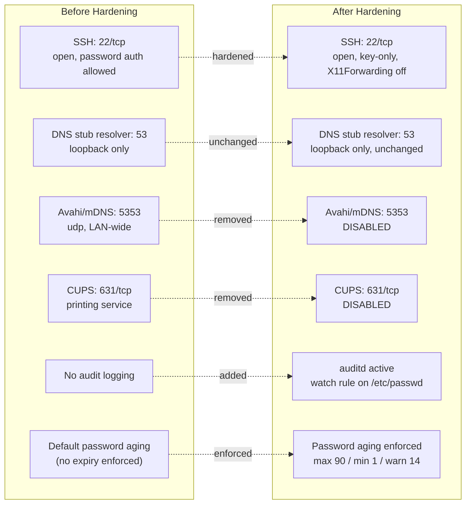

# Attack Surface: Before and After

This lab hardens the same Ubuntu Server 24.04 VM built in [Lab 01](../../Lab-01-Infrastructure-and-Secure-Remote-Access/), reusing its static IP (`192.168.56.20`), internal network, and SSH key trust relationship. No new infrastructure was built; the scope of this lab is entirely the security posture of the existing host.

## Mermaid Version (renders natively on GitHub/GitLab)

## Service Exposure Summary

| Port / Protocol | Service | Before | After | Notes |
|---|---|---|---|---|
| 22/tcp | SSH | Open | Open | Key-based auth only, carried from Lab 01; `X11Forwarding` explicitly disabled |
| 53/udp+tcp | systemd-resolved (DNS stub) | Loopback only | Loopback only | Not attacker-reachable in either state, left unchanged |
| 5353/udp | Avahi (mDNS/DNS-SD) | Open | **Disabled** | Zero-configuration discovery service, unnecessary on a hardened server |
| 631/tcp | CUPS | Open (localhost + `[::1]`) | **Disabled** | Printing service, no legitimate use on a headless server |

Removing Avahi and CUPS reduces the number of listening services from four to two, which directly shrinks the set of remotely reachable attack surfaces without affecting SSH access or DNS resolution.
