# Network Security & Traffic Analysis

`Ubuntu 24.04` `Kali Linux` `VirtualBox` `Nmap` `Wireshark` `Blue Team` `Network Security`

| | |
|---|---|
| **Focus** | Validating the Lab 02 hardening from the network: attack surface, service fingerprinting, protocol-level traffic analysis |
| **Difficulty** | Intermediate |
| **Duration** | ~2.5 hours |
| **Tools** | Nmap, Nmap NSE, Wireshark |

## Architecture

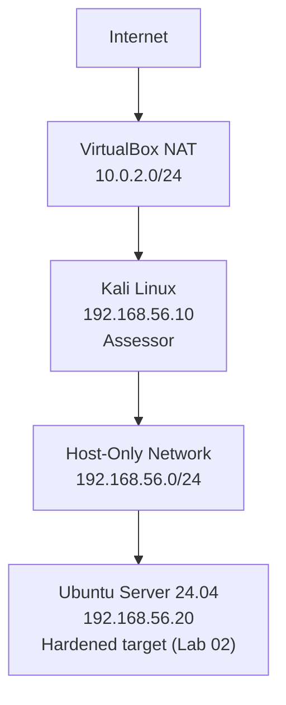

Full diagram: [`architecture/network-diagram.md`](architecture/network-diagram.md).

## Series Continuity

```
Lab 01 -> Deploy infrastructure
Lab 02 -> Secure the host
Lab 03 -> Validate the host from the network
```

Lab 01 built the two-VM environment and secured remote access. Lab 02 hardened the Ubuntu host from the inside: account policy, firewall, reduced services, SSH configuration, auditing. This lab closes the loop by assessing that same host from the outside, from another machine on the network, the way a security engineer would validate a hardening pass before signing off on it rather than just trusting the change log.

## Executive Summary

This lab evaluates the hardened Ubuntu server from the perspective of another host on the same network. The objective is not to exploit the target, but to assess its attack surface, identify exposed services, inspect network communications, and validate that the hardening controls implemented in Lab 02 are actually observable from the network, not just present in a config file. Host discovery, port scanning, service fingerprinting, and SSH algorithm enumeration were performed with Nmap; packet-level analysis of TCP, SSH, DNS, and TLS traffic was performed with Wireshark. Every finding below is backed by real captured output.

## Scenario

A Security Engineer receives a newly hardened Linux server before it is deployed to production. Before approving the deployment, the engineer performs a network assessment from an independent workstation to verify that only the intended services are reachable and that network communications behave as expected.

## Objectives

- Discover live hosts on the internal network.
- Map the network from an independent vantage point.
- Identify exposed services on the target.
- Fingerprint the software and version behind each exposed service.
- Validate firewall exposure end to end, not just by reading a config file.
- Inspect SSH communication at the protocol level.
- Analyze encrypted traffic and understand what is, and is not, visible to an observer on the wire.
- Observe DNS resolution in transit.
- Validate a TLS negotiation in transit.
- Document the resulting attack surface and reach a conclusion, not just a pile of screenshots.

## Environment

- **Ubuntu Server 24.04.4 LTS** (`192.168.56.20`): the Lab 02 hardened target.
- **Kali Linux** (`192.168.56.10`): the assessment workstation.
- **Oracle VirtualBox**, Host-Only / Internal Network (`192.168.56.0/24`), same topology as Lab 01 and Lab 02.
- **Nmap** 7.98: host discovery, port scanning, service fingerprinting, script-based enumeration.
- **Wireshark**: packet capture and protocol-level analysis.
- **OpenSSH**: the only service exposed by the target, already hardened in Lab 02.

```
$ ip route   (Kali)
192.168.56.0/24 dev eth1 proto kernel scope link src 192.168.56.10 metric 101
```

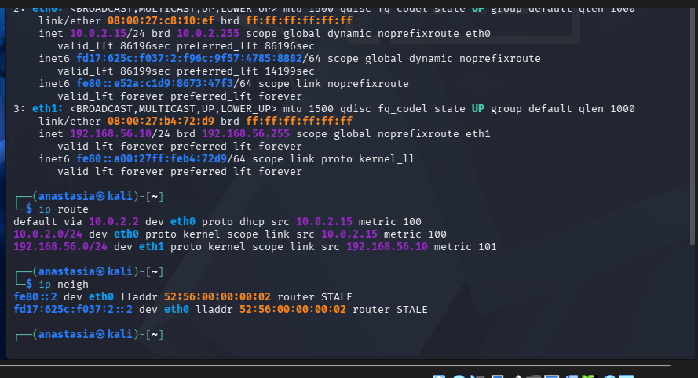

## Methodology

Not a list of commands. A flow, the same one a security engineer would actually follow:

```
Host Discovery
     |
Network Enumeration
     |
Port Discovery
     |
Service Fingerprinting
     |
SSH Analysis
     |
Packet Capture
     |
Traffic Inspection
     |
Documentation
```

Each stage only asks the next question once the previous one has an answer: first "what's alive," then "what's listening," then "what is it running," then "what does that look like on the wire."

---

## Findings

### Finding 1: Host Discovery

**Risk.** Before assessing any single host, the assessor needs to know what else is actually on the network. Assuming a network's population instead of discovering it is how assessments miss systems.

**Assessment.**

```bash
sudo nmap -sn 192.168.56.0/24
```

**Evidence.**

```
Nmap scan report for 192.168.56.20
Host is up (0.0016s latency).
Nmap scan report for 192.168.56.10
Host is up.
Nmap done: 256 IP addresses (2 hosts up) scanned in 3.19 seconds
```

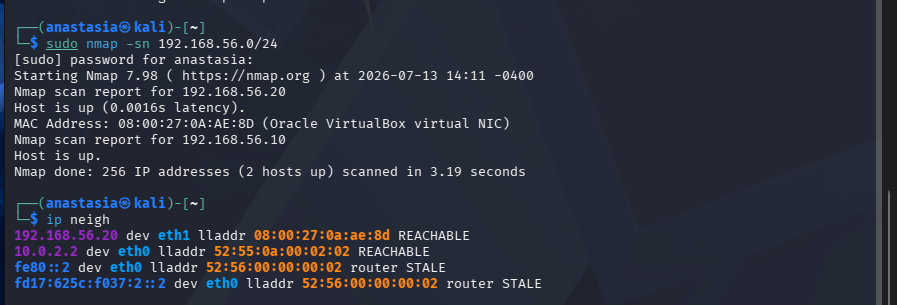

**Conclusion.** Exactly two hosts respond across the entire `/24` range: the assessor (`.10`) and the target (`.20`). The network is small and controlled, matching the intended lab topology with no unexpected devices present.

### Finding 2: Only SSH Exposed

**Risk.** Every additional reachable port is additional attack surface. An assessment has to confirm what is actually reachable, not what a firewall configuration claims should be reachable.

**Assessment.**

```bash
sudo nmap -sS -Pn 192.168.56.20
```

**Evidence.**

```
Not shown: 999 filtered tcp ports (no-response)
PORT   STATE SERVICE
22/tcp open  ssh
```

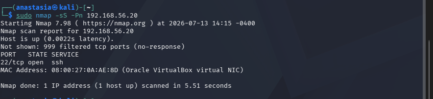

**Conclusion.** Across the top 1000 TCP ports, exactly one is open: SSH. Every other probed port returned no response, consistent with the default-deny UFW policy validated from the inside in Lab 02. Finding 8 below confirms this holds across the full 65535-port range, not just the common ones.

### Finding 3: Service Fingerprinting

**Risk.** An open port alone doesn't say what's actually running behind it. Fingerprinting identifies the exact software and version, information relevant to any later vulnerability assessment. No exploitation was performed here, only identification.

**Assessment.**

```bash
sudo nmap -sV -Pn 192.168.56.20
```

**Evidence.**

```
22/tcp open  ssh   OpenSSH 9.6p1 Ubuntu 3ubuntu13.16 (Ubuntu Linux; protocol 2.0)
```

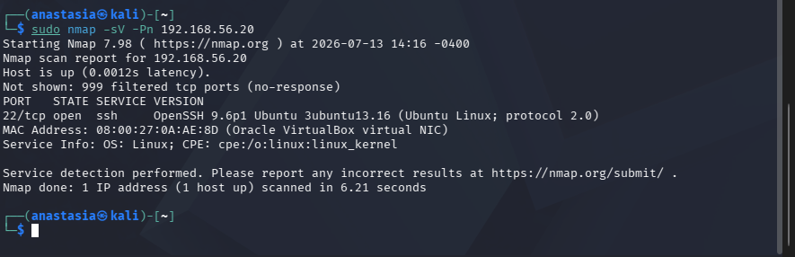

**Conclusion.** The target runs OpenSSH 9.6p1 on Ubuntu, SSH protocol 2.0 (protocol 1 is not offered, correct: protocol 1 has known cryptographic weaknesses and has been deprecated for years). This is identification for documentation purposes, not a launch point for exploitation, which is explicitly out of scope for this lab.

### Finding 4: SSH Cryptographic Algorithms

**Risk.** Knowing a service is "SSH" is not the same as knowing which cryptographic algorithms it will actually negotiate. Weak or legacy algorithms left enabled can undermine an otherwise well-configured service.

**Assessment.**

```bash
sudo nmap -sV --script=banner,ssh2-enum-algos -Pn 192.168.56.20
```

**Evidence.**

```
kex_algorithms: (12) ... sntrup761x25519-sha512@openssh.com, curve25519-sha256, ecdh-sha2-nistp256/384/521, diffie-hellman-group-exchange-sha256, ...
server_host_key_algorithms: (4) rsa-sha2-512, rsa-sha2-256, ecdsa-sha2-nistp256, ssh-ed25519
encryption_algorithms: (6) chacha20-poly1305@openssh.com, aes128-ctr, aes192-ctr, aes256-ctr, aes128-gcm@openssh.com, aes256-gcm@openssh.com
mac_algorithms: (10) ...
compression_algorithms: (2) none, zlib@openssh.com
_banner: SSH-2.0-OpenSSH_9.6p1 Ubuntu-3ubuntu13.16
```

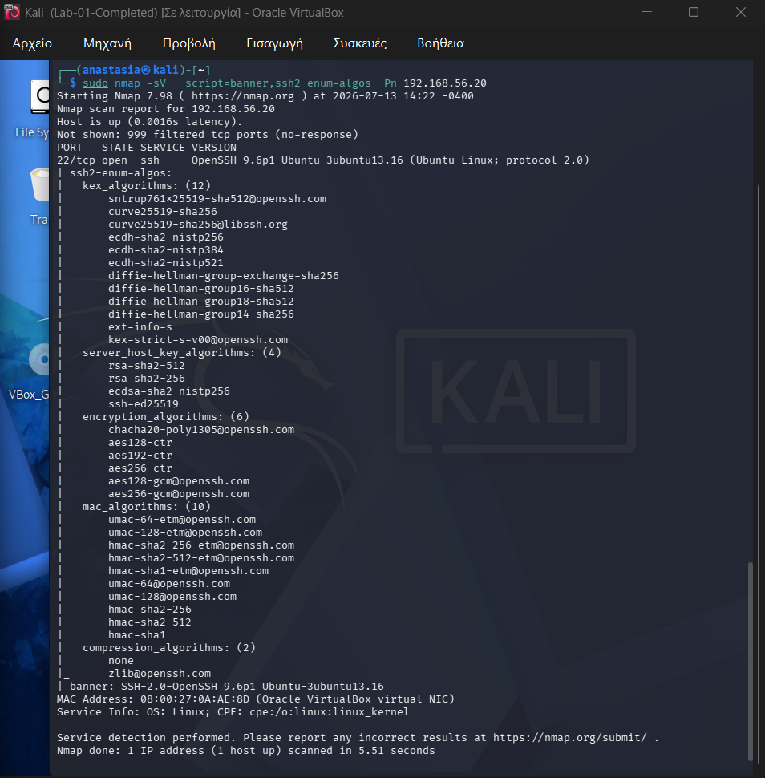

**Conclusion.** No legacy key exchange methods (e.g. `diffie-hellman-group1-sha1`), no weak ciphers (e.g. `arcfour`, CBC-mode-only), and no `none` MAC are offered. The default OpenSSH 9.6 configuration on Ubuntu 24.04 already reflects current cryptographic guidance without any additional hardening being required for algorithm selection specifically. This is exactly what a Security Engineer would check before signing off: not "is SSH running," but "which cryptography would SSH actually agree to use."

### Finding 5: TCP Session Establishment

**Risk.** Understanding what a normal connection looks like at the packet level is a prerequisite for spotting an abnormal one later. This finding establishes that baseline.

**Assessment.** Captured the opening of an SSH connection in Wireshark and inspected the first packets.

**Evidence.**

```
Packet 1: 192.168.56.10 -> 192.168.56.20   TCP   Flags: SYN
Packet 2: 192.168.56.20 -> 192.168.56.10   TCP   Flags: SYN, ACK
Packet 3: 192.168.56.10 -> 192.168.56.20   TCP   Flags: ACK
```

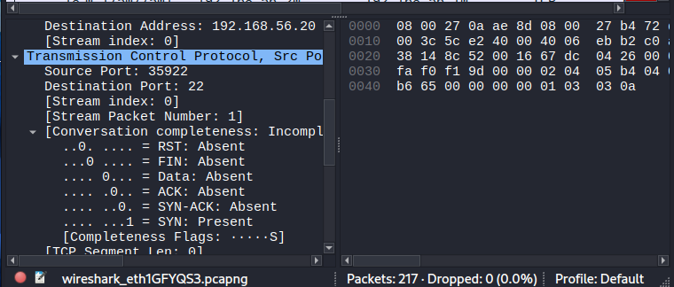

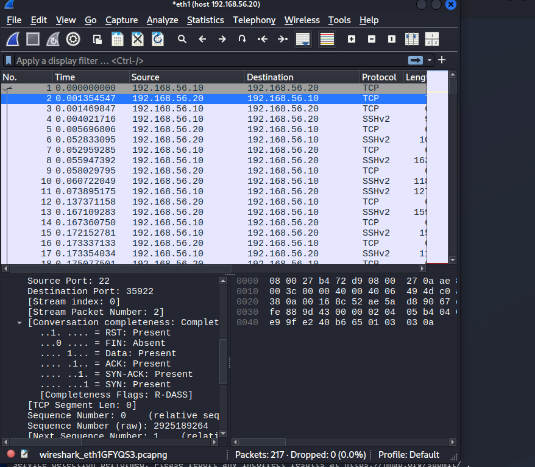

**Conclusion.** Every TCP connection, SSH included, begins with this same three-packet exchange before a single byte of the actual protocol is sent. Wireshark's own completeness analysis independently confirms the handshake completed cleanly, which is the baseline every later, more interesting packet in this capture builds on.

### Finding 6: SSH Handshake

**Risk.** SSH does not encrypt everything from the very first byte. Knowing exactly where the plaintext-to-ciphertext boundary sits is what lets an analyst reason correctly about what a network observer can and cannot see.

**Assessment.** Followed the TCP stream of the SSH session from its first packet.

**Evidence.**

```
SSH-2.0-OpenSSH_10.2p1 Debian-5            <- Kali (client) banner, plaintext
SSH-2.0-OpenSSH_9.6p1 Ubuntu-3ubuntu13.16  <- Ubuntu (server) banner, plaintext
...key exchange algorithm negotiation, still plaintext...
93 client pkts, 96 server pkts, 189 turns
```

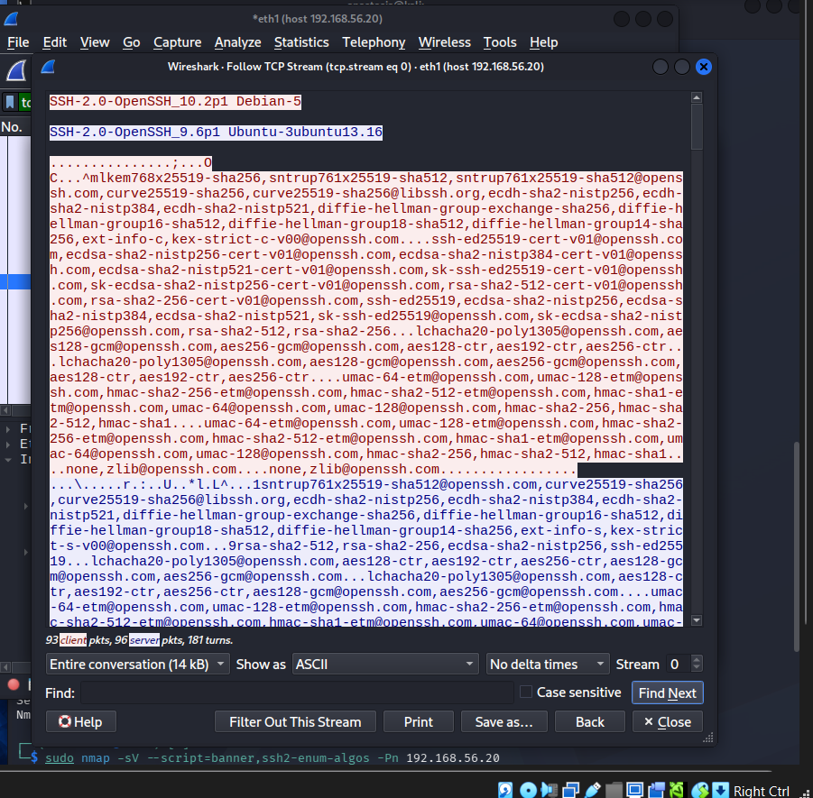

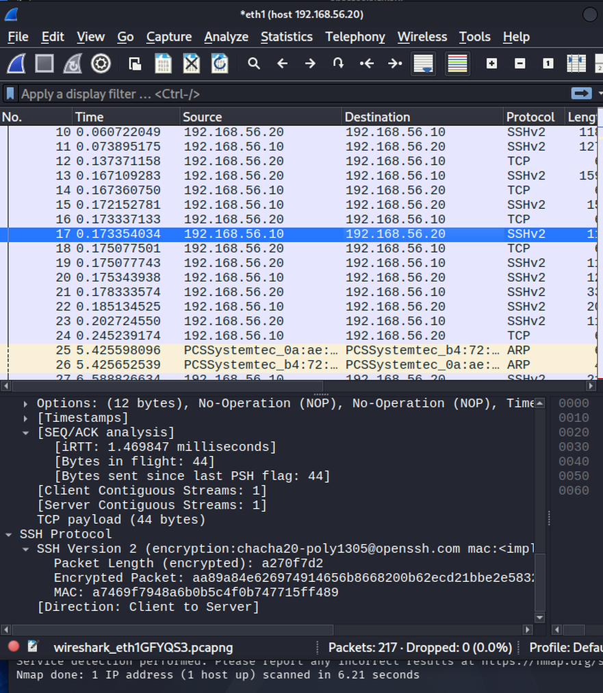

**Conclusion.** Both sides identify themselves and negotiate algorithms in the clear before any encryption begins. This is by design: SSH has to agree on how to encrypt before it can start encrypting. The banners and algorithm list are visible to anyone capturing this traffic; the actual session content is not, which is exactly what Finding 7 demonstrates.

### Finding 7: Encrypted Traffic

**Risk.** If SSH's protection could be verified by SSH itself claiming it, that would not be verification. Confirming from an independent capture that the session is actually opaque after key exchange is the point of doing this with Wireshark rather than just trusting the banner.

**Assessment.** Reviewed the protocol distribution of the full captured session.

**Evidence.**

```
Frame                100.0%   215 packets
  Ethernet           100.0%
    IPv4             100.0%
      TCP            100.0%
        SSH Protocol  87.9%   189 packets
```

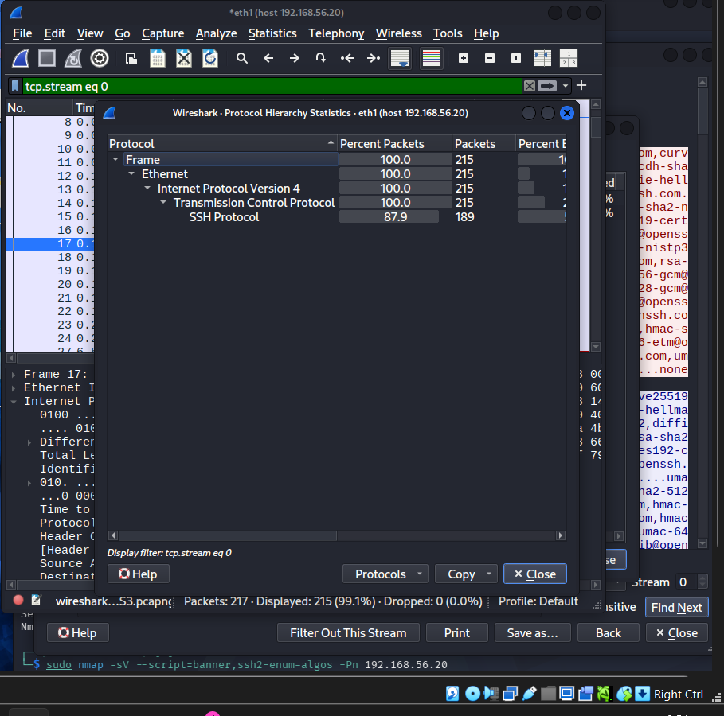

**Conclusion.** 189 of 215 packets in the session are SSH protocol data, meaning after the initial handshake in Finding 6, essentially the entire conversation is the encrypted session. An observer on this network segment can see that an SSH conversation is happening and roughly how much data moved, but not a single command or character of its content. This is the practical, wire-level proof that the key-based SSH hardening from Lab 01 and Lab 02 is doing what it is supposed to do.

### Finding 8: DNS Resolution in Transit

**Risk.** DNS is unencrypted by default and one of the easiest protocols to observe on a network. Understanding what a plain DNS lookup looks like on the wire is baseline knowledge for reading any packet capture.

**Assessment.** Captured a DNS lookup from the Kali workstation and inspected the query/response pair.

**Evidence.**

```
DNS   93 bytes   Standard query 0x309b  A google.com OPT
DNS  177 bytes   Standard query response 0x309b  A google.com A 142.251.20.102 ...
```

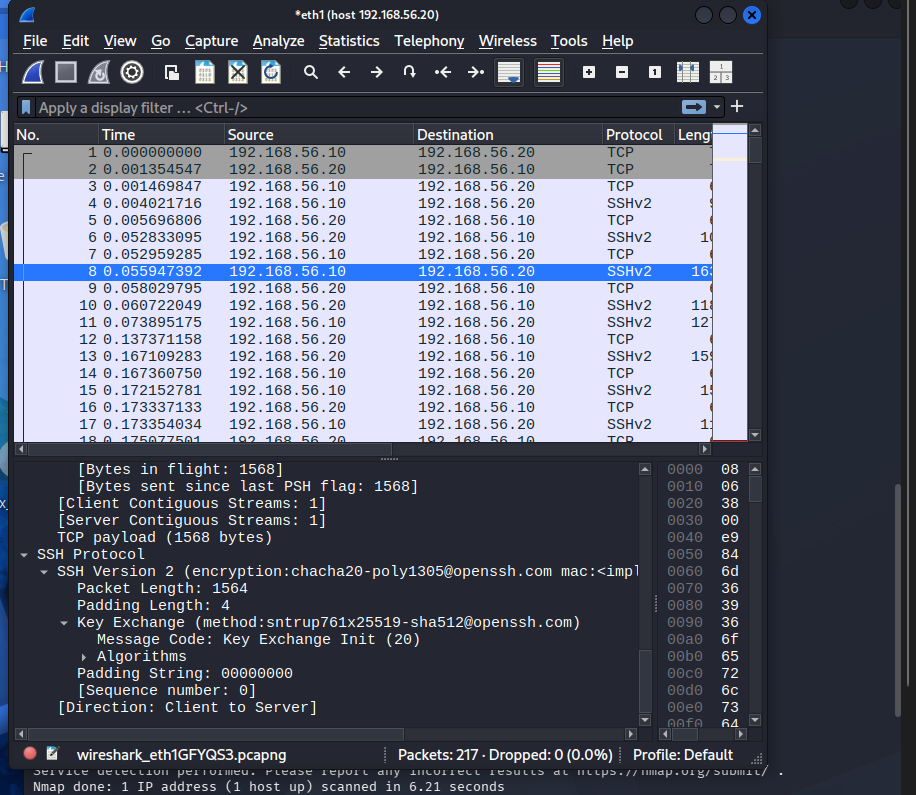

**Conclusion.** Both the question and the answer are fully readable: the domain being looked up, and the IP address returned. Unlike the SSH traffic in Finding 7, there is no confidentiality here by design, DNS is a lookup protocol, not a secure channel, which is exactly why the SSH traffic in this same capture stands out by contrast.

### Finding 9: TLS Negotiation

**Risk.** Not every protocol handles the "negotiate in the clear, then encrypt" problem the same way SSH does. Confirming how TLS's handshake looks in transit, and where its own plaintext boundary sits, rounds out the protocol picture this lab set out to build.

**Assessment.** Captured an outbound HTTPS connection and inspected the TLS handshake.

**Evidence.**

```
TLSv1.3 Record Layer: Handshake Protocol: Client Hello
  Version: TLS 1.2 (0x0303)
  Cipher Suites Length: 180 (90 suites offered)
  Extension: server_name (len=16) name=example.com
```

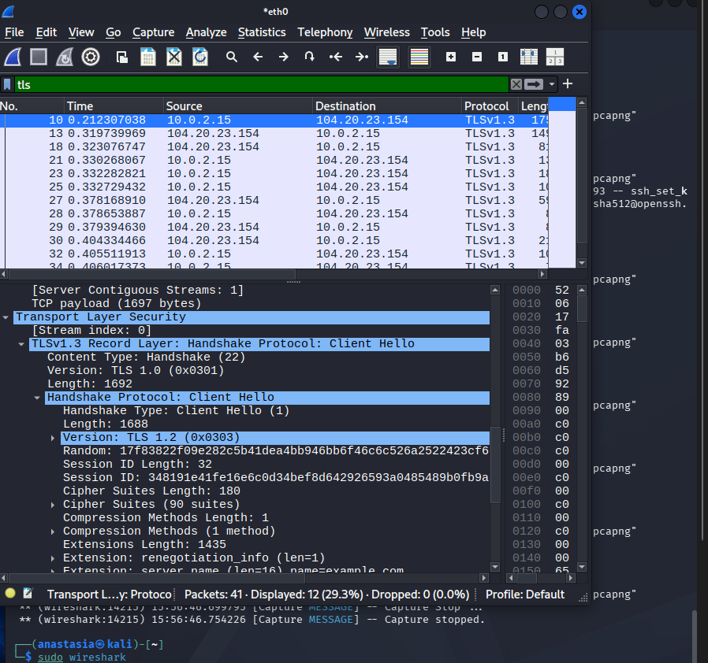

**Conclusion.** Even in TLS 1.3, the Client Hello itself, including the destination hostname via the SNI extension, is sent in plaintext; encryption only begins after the handshake completes. This is a useful contrast to SSH's model in Finding 6: both protocols negotiate before encrypting, but what each one reveals in that negotiation phase differs, and knowing that difference matters when reading real traffic.

### Finding 10: Full Attack Surface Confirmed (All 65,535 Ports)

**Risk.** Finding 2 confirmed only SSH is open across the top 1000 ports. A complete assessment should not stop at "the common ports," since a service could in principle be listening on an unusual, uncommon port outside that range.

**Assessment.**

```bash
sudo nmap -p- 192.168.56.20
```

**Evidence.**

```
Not shown: 65534 filtered tcp ports (no-response)
PORT   STATE SERVICE
22/tcp open  ssh
Nmap done: 1 IP address (1 host up) scanned in 108.24 seconds
```

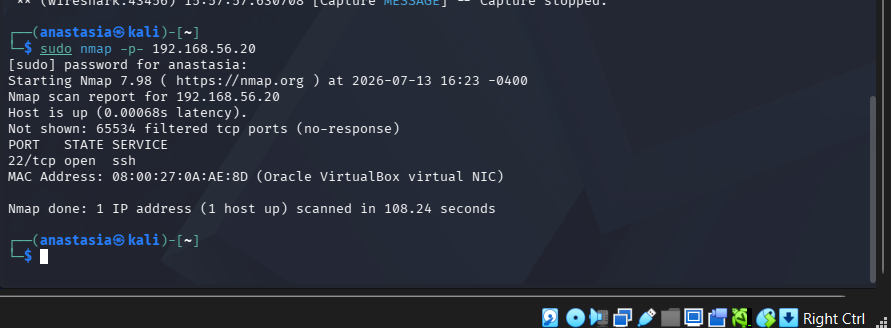

**Conclusion.** Across the entire TCP port space, not a sample of it, exactly one port is open. This is the evidence the Security Assessment conclusion below is actually built on, not an assumption extrapolated from the top-1000 scan.

---

## Wireshark Analysis Summary

The full packet-level story captured across Findings 5 through 9, in the order it actually happens on the wire:

```
TCP SYN
   |
TCP SYN-ACK
   |
TCP ACK
   |
SSH Banner Exchange (plaintext)
   |
SSH Key Exchange (plaintext negotiation)
   |
Encrypted SSH Traffic (opaque)
   |
DNS Query / Response (plaintext, separate lookup)
   |
TLS Client Hello (plaintext negotiation, then encrypted)
```

## Attack Surface Summary

| Service | Port | Status | Exposure |
|---|---|---|---|
| SSH | 22/tcp | Open | Expected, hardened in Lab 02, key-only auth |
| HTTP | 80/tcp | Filtered / closed | Good, no reason to be open |
| HTTPS | 443/tcp | Filtered / closed | Good, no reason to be open |
| SMB | 445/tcp | Filtered / closed | Good, no reason to be open |
| All other TCP ports (1-65535) | - | Filtered / closed | Confirmed by full-range scan, Finding 10 |

No unnecessary services were observed. The results validate the hardening work performed in Lab 02: CUPS and Avahi, both explicitly disabled there, do not appear anywhere in this lab's scans, and the only reachable service is the one that was always meant to be reachable.

## MITRE ATT&CK Mapping

Not a full ATT&CK Navigator layer, just an illustration of which reconnaissance techniques this lab's activities correspond to. Framed here as the defensive validation of an attack surface, the same techniques an adversary's own reconnaissance would use.

| Activity | Related ATT&CK Technique(s) | Relationship |
|---|---|---|
| Host discovery (Finding 1) | T1018 - Remote System Discovery | Reconnaissance |
| Port and service scanning (Findings 2, 3, 10) | T1046 - Network Service Discovery | Reconnaissance |
| Nmap-based active scanning methodology | T1595 - Active Scanning; T1595.001 - Scanning IP Blocks | Reconnaissance |
| SSH/service fingerprinting (Findings 3, 4) | T1592.002 - Gather Victim Host Information: Software | Reconnaissance |
| Packet capture and traffic inspection (Findings 5-9) | T1040 - Network Sniffing | Collection |

## Security Assessment: Is the Host Adequately Exposed?

**Yes.** The evidence supports this conclusion directly:

- SSH is the only reachable service across the entire 65,535-port TCP range (Findings 2 and 10), not just the common ports.
- The exposed SSH service is running current software with no legacy cryptographic algorithms on offer (Finding 4).
- The default-deny firewall policy validated from inside the host in Lab 02 is independently confirmed from the network in this lab; the two match.
- The password aging, service reduction (CUPS/Avahi removal), and auditd deployment from Lab 02 are not directly visible on the wire, since they are host-internal controls, but their expected side effect (a minimal, single-service attack surface) is exactly what this lab observes from the outside.
- Actual SSH session content is confirmed opaque to a network observer once key exchange completes (Finding 7), meaning the hardening is not just configured, it is effective in practice.

## Verification Summary

| Check | Status |
|---|---|
| Host Discovery | Confirmed: 2 hosts, matches expected topology |
| Port Scan (top 1000) | Confirmed: only 22/tcp open |
| Full Port Scan (all 65535) | Confirmed: only 22/tcp open |
| Service Detection | Confirmed: OpenSSH 9.6p1 Ubuntu, protocol 2.0 |
| SSH Algorithm Enumeration | Confirmed: no legacy algorithms offered |
| TCP Handshake Analysis | Confirmed: clean 3-way handshake |
| SSH Protocol Analysis | Confirmed: plaintext banner/negotiation, encrypted thereafter |
| DNS Inspection | Confirmed: plaintext query/response, as expected |
| TLS Inspection | Confirmed: plaintext Client Hello, encrypted thereafter |

## Problems Encountered

- **`resolvectl` missing on Kali.** An early attempt to check DNS resolver status with `resolvectl status` failed with "Command 'resolvectl' not found." Kali does not ship `systemd-resolved` by default the way Ubuntu does. Worked around this by reading `/etc/resolv.conf` and using `nslookup` directly instead of assuming every Linux distribution ships the same resolver tooling.
- **DNS packet capture confusion.** The first attempt to isolate a DNS exchange in Wireshark pulled in unrelated background traffic (mDNS, other lookups already cached) before the `dns` display filter was applied, briefly making it unclear which query/response pair belonged to the intentional lookup. Applying the filter and re-triggering a fresh, uncached lookup resolved this.
- **Understanding encrypted SSH traffic.** Initially expected to see something visually distinctive marking "this packet is encrypted" in the packet list. In reality, encrypted SSH packets are labeled identically to the earlier plaintext ones (protocol column just says `SSHv2`), and the only way to confirm opacity is to actually try reading the payload and see that it is ciphertext, which is why Finding 7 relies on protocol statistics rather than a single visually obvious packet.
- **Learning Wireshark filter syntax.** Time was lost early on typing filters as if they were `grep` patterns (e.g. plain substrings) instead of Wireshark's field-based filter syntax (`tcp.flags.syn == 1`, `dns`, `tls.handshake.type == 1`). Reading the filter bar's autocomplete suggestions turned out to be faster than guessing.

## Lessons Learned

Full write-up in [`lessons-learned.md`](lessons-learned.md). The short version: host discovery is not a vulnerability assessment, an open port is not automatically a problem, correctly interpreting traffic matters as much as running the scan that produced it, and once an SSH key exchange completes there is no way to see command content from the wire without the session keys. Wireshark shows how systems are talking to each other, not just which ports happen to be open.

## Skills Demonstrated

- Network reconnaissance and host discovery
- Port scanning and service fingerprinting (Nmap)
- SSH protocol and cryptographic algorithm analysis
- TCP/IP packet analysis
- Wireshark packet inspection and protocol filtering
- DNS traffic analysis
- TLS handshake analysis
- Network security documentation
- Security assessment methodology (assess, don't assume)

## Next Phase

**Lab 04: SSH Hardening & Secure Remote Access** *(complete)*

Finding 2 through Finding 4 above established that SSH is the only exposed service on this host and profiled it from the outside: open port, software version, offered algorithms. The next lab takes that single service and carries it through a complete assessment-to-hardening-to-validation cycle, adding brute-force protection (Fail2Ban), an independent configuration audit (Lynis, `ssh-audit`), and a move to key-only authentication with password and root login explicitly disabled and verified.

---

**Environment note:** this lab performed read-only reconnaissance and traffic analysis only. No exploitation tools (Hydra, Metasploit, or similar) were used, and no attempt was made to gain unauthorized access to either VM. That scope is intentionally reserved for a later, explicitly-scoped lab.

---

[⬅️ Previous: Lab 02 - Linux Hardening](../Lab-02-Linux-Hardening/README.md) &nbsp;|&nbsp; [🏠 Home](../README.md) &nbsp;|&nbsp; [➡️ Next: Lab 04 - SSH Hardening & Secure Remote Access](../Lab-04-SSH-Hardening-and-Secure-Remote-Access/README.md)
