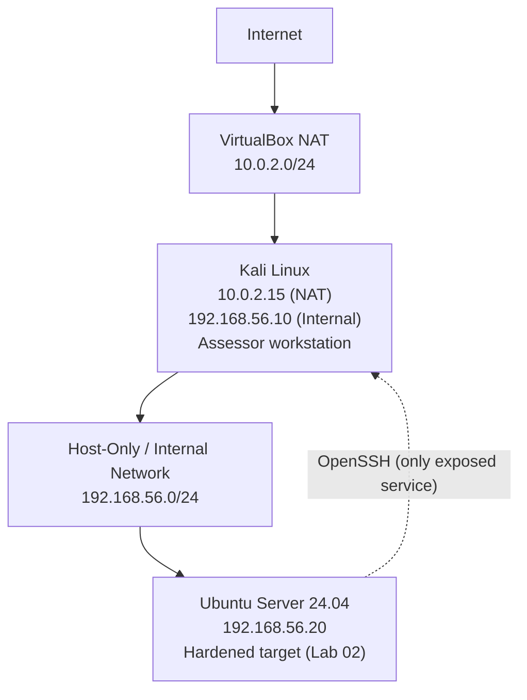

# Network Diagram: Lab 03

Same physical topology as Lab 01 and Lab 02. This lab adds nothing new to the infrastructure; it observes and validates it from the network.

## Mermaid Version (renders natively on GitHub/GitLab)

## Adapter Summary

| VM | NAT IP | Internal IP | Role in this lab |
|---|---|---|---|
| Kali Linux | 10.0.2.15 | 192.168.56.10 | Assessor: runs Nmap and Wireshark against the target |
| Ubuntu Server | 10.0.2.15 (separate NAT segment) | 192.168.56.20 | Target: the Lab 02 hardened host being validated |

Both NAT addresses show as `10.0.2.15` because VirtualBox NAT is per-VM and privately scoped; this is expected, not a conflict. All assessment traffic in this lab travels exclusively over the `192.168.56.0/24` internal network, the same network Lab 01 and Lab 02 established and hardened.
