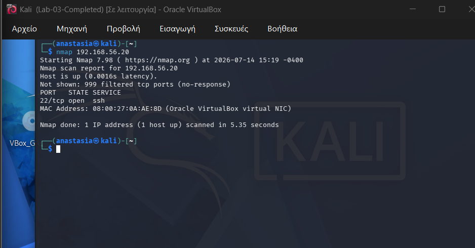
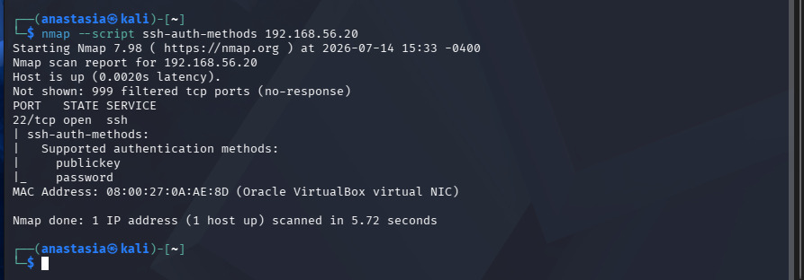
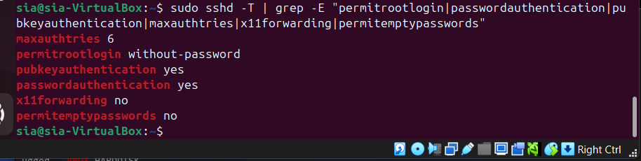
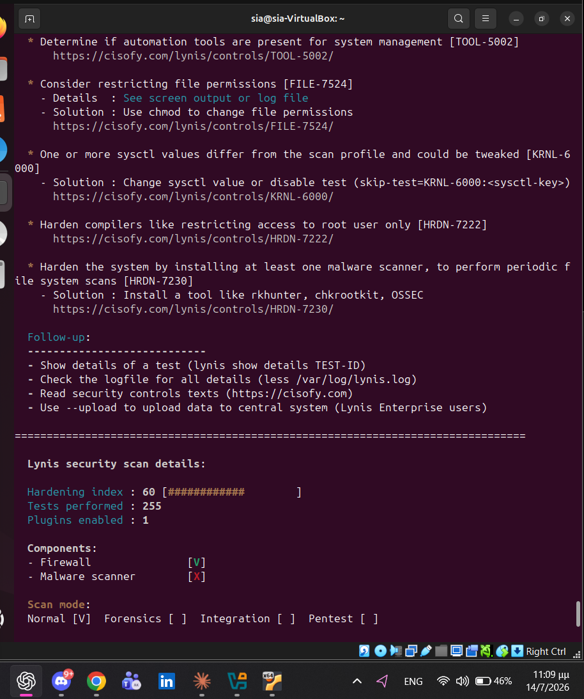
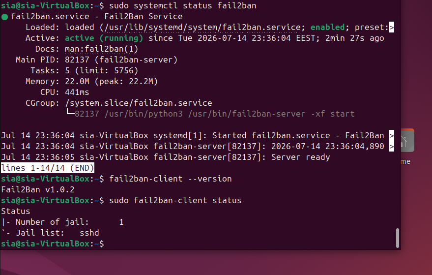
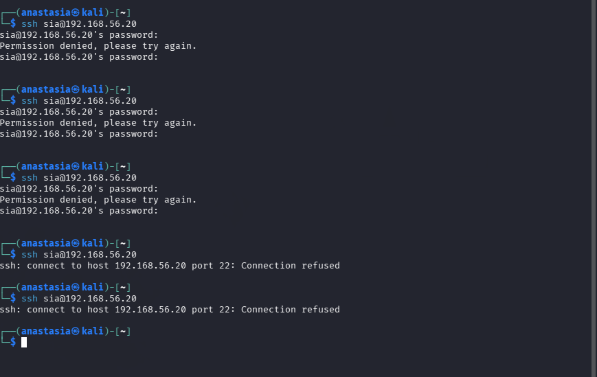
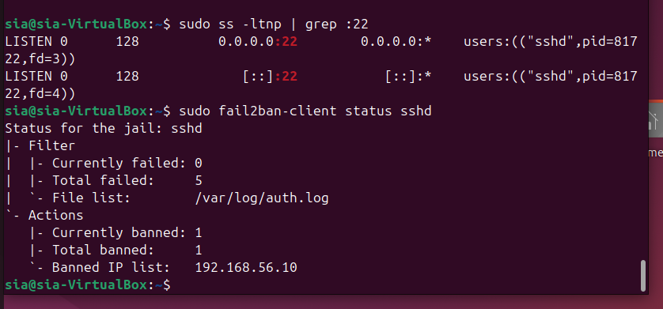
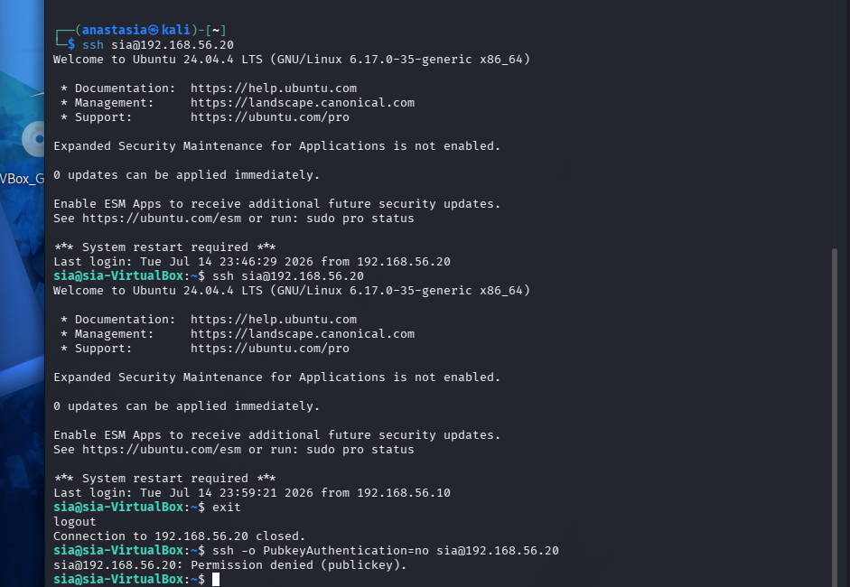
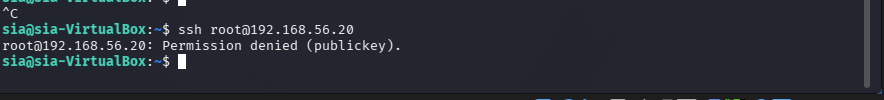
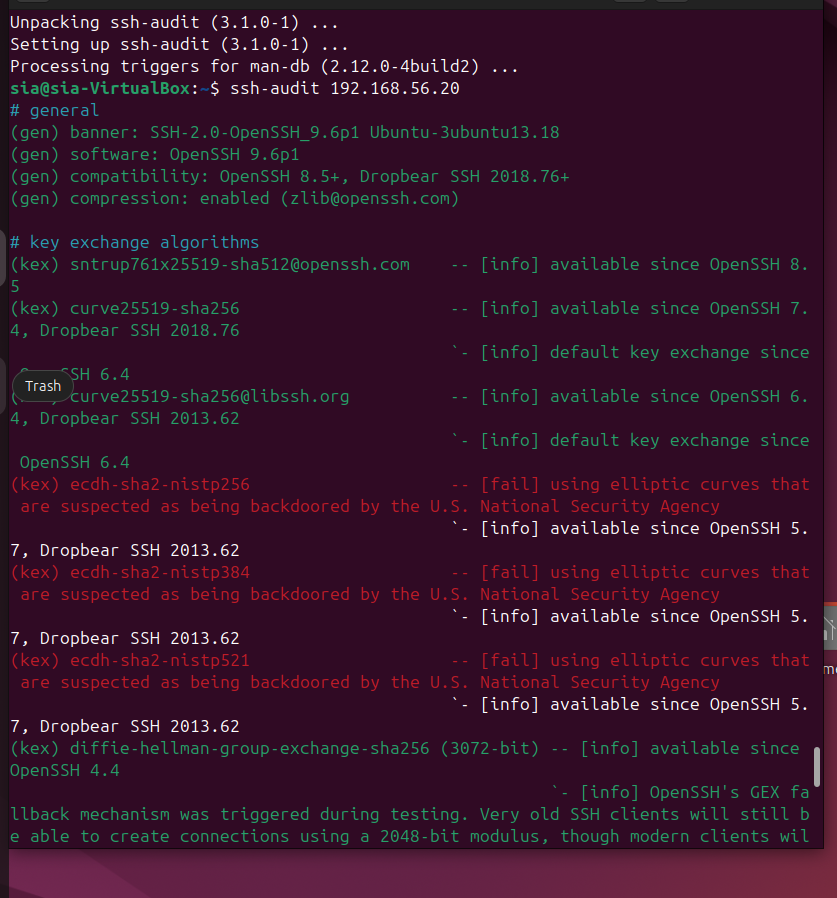

# SSH Hardening & Secure Remote Access

`Ubuntu 24.04` `Kali Linux` `OpenSSH` `Fail2Ban` `Lynis` `ssh-audit` `Blue Team` `SSH Security`

| | |
|---|---|
| **Focus** | Taking the one exposed service through a full assessment-to-hardening-to-validation cycle |
| **Difficulty** | Intermediate |
| **Duration** | ~2 hours |
| **Tools** | Nmap, Nmap NSE, Lynis, Fail2Ban, `ssh-audit`, OpenSSH |

## Architecture


Full flow diagram: [`architecture/lab-flow-diagram.md`](architecture/lab-flow-diagram.md). Same infrastructure as Labs 01-03: Kali (`192.168.56.10`) assessing and attacking Ubuntu Server 24.04 (`192.168.56.20`).

## Executive Summary

Lab 03 identified SSH as the single service exposed on the hardened Ubuntu host and profiled it from the network. This lab takes that one service and carries it through a complete security lifecycle: discovery, enumeration, configuration review, an independent audit (Lynis), brute-force protection (Fail2Ban), a real simulated attack against that protection, a move to key-only authentication, and a final independent validation with `ssh-audit`. This is not a single technique applied once. It is assessment, hardening, protection, and validation, in that order, with every step verified rather than assumed.

## Objectives

Perform a security assessment of an OpenSSH service, identify its exposed configuration, implement industry-standard hardening techniques, protect the service against brute-force attacks, replace password-based authentication with public-key authentication, and validate the effectiveness of the implemented security controls.

## Lab Environment

| | Kali Linux | Ubuntu Server |
|---|---|---|
| Role | Attacker / assessor | Target (SSH service) |
| IP (internal network) | 192.168.56.10 | 192.168.56.20 |
| Network | VirtualBox Host-Only, `192.168.56.0/24` | same |

## Tools Used

- **Nmap** and **Nmap NSE scripts** (`ssh-auth-methods`, `ssh2-enum-algos`, `vuln`)
- **OpenSSH** client and server
- **Fail2Ban**
- **Lynis**
- **ssh-audit**
- **systemctl** / **journalctl**

## Methodology

### Phase 1: Initial Service Discovery

```bash
ping -c 4 192.168.56.20
nmap 192.168.56.20
nmap -sV 192.168.56.20
```

```
4 packets transmitted, 4 received, 0% packet loss
...
PORT   STATE SERVICE VERSION
22/tcp open  ssh     OpenSSH 9.6p1 Ubuntu 3ubuntu13.16
```



### Phase 2: SSH Enumeration

```bash
nmap --script ssh-auth-methods 192.168.56.20
nmap --script ssh2-enum-algos 192.168.56.20
nmap --script vuln 192.168.56.20
```

```
| ssh-auth-methods:
|   Supported authentication methods:
|     publickey
|_    password
```



The vulnerability scan (`--script vuln`) returned no flagged CVEs against this OpenSSH version. Algorithm enumeration (12 key exchange, 4 host key, 6 encryption, 10 MAC, 2 compression algorithms) is documented in full in `commands.md`; no legacy algorithms were on offer, consistent with the finding already made independently in Lab 03.

### Phase 3: SSH Configuration Review

```bash
sudo sshd -T | grep -E "permitrootlogin|passwordauthentication|pubkeyauthentication|maxauthtries|x11forwarding|permitemptypasswords"
```

```
maxauthtries 6
permitrootlogin without-password
pubkeyauthentication yes
passwordauthentication yes
x11forwarding no
permitemptypasswords no
```



This is the starting point: key auth is already possible (inherited from Lab 01), but password authentication is still accepted, root login still allows a non-password fallback, and there is no brute-force protection. Everything from here on addresses one of these gaps directly.

### Phase 4: Security Audit (Lynis)

```bash
sudo lynis audit system
```

```
Hardening index : 60 [###########       ]
Tests performed : 255
```



Lynis flagged a broad set of system-wide suggestions (compiler restriction, malware scanner installation, sysctl tuning, file permission review). Not all of them were addressed here, only the ones directly relevant to SSH and remote access hardening were carried into the phases below; the rest are noted as open items in Lessons Learned rather than silently ignored.

### Phase 5: System Updates

```bash
sudo apt update && sudo apt upgrade -y
```

Packages were brought current before any hardening was applied, so that later results reflect the hardening itself and not a coincidentally-patched vulnerability.

### Phase 6: Fail2Ban Deployment

```bash
sudo apt install fail2ban -y
sudo systemctl status fail2ban
sudo fail2ban-client status
```

```
Active: active (running)
Number of jail:     1
Jail list:  sshd
```



### Phase 7: Brute-Force Simulation

The most direct way to confirm brute-force protection works is to actually trigger it.

```
Kali repeatedly runs: ssh sia@192.168.56.20
     |
Wrong password submitted each time
     |
Ubuntu logs each failure (/var/log/auth.log)
     |
Fail2Ban's sshd filter counts the failures
     |
Threshold reached -> Fail2Ban bans the source IP
     |
Further connection attempts are refused outright
```

```
sia@192.168.56.20's password:
Permission denied, please try again.
...
ssh: connect to host 192.168.56.20 port 22: Connection refused
```



```bash
sudo fail2ban-client status sshd
```

```
Currently failed: 0
Total failed:     5
Currently banned: 1
Total banned:     1
Banned IP list:   192.168.56.10
```



This is the clearest evidence in the lab that the protection is not just configured, it works. The attacking machine's own IP address, `192.168.56.10`, is right there in the ban list.

### Phase 8: SSH Public Key Authentication

```bash
ssh-keygen -t ed25519 -C "homelab-lab4"
ssh-copy-id -i ~/.ssh/id_ed25519.pub sia@192.168.56.20
ssh sia@192.168.56.20
```

```
Number of key(s) added: 1
...
Welcome to Ubuntu 24.04.4 LTS ...
Last login: Tue Jul 14 23:59:21 2026 from 192.168.56.10
```



### Phase 9: SSH Hardening

```
PasswordAuthentication no
PermitRootLogin no
```

The same screenshot above also captures the enforcement check: connecting with `ssh -o PubkeyAuthentication=no sia@192.168.56.20` (deliberately refusing to offer the key) returns `Permission denied (publickey)` immediately, with no password prompt at all. That is the real proof `PasswordAuthentication no` is active, not just present in a config file: there is no fallback being offered.

```bash
ssh root@192.168.56.20
```

```
root@192.168.56.20: Permission denied (publickey).
```



### Phase 10: External Security Assessment (ssh-audit)

Independent validation of the exposed SSH service from a separate tool, not the same one used to configure it.

```bash
ssh-audit 192.168.56.20
```

```
(gen) software: OpenSSH 9.6p1
(kex) ecdh-sha2-nistp256 -- [fail] using elliptic curves that are suspected as being backdoored by the U.S. National Security Agency
(fin) ssh-ed25519: SHA256:Vkic9XLj0js2AvuxRbXZeCcFPFsjwumnpE/oMTkXoPg
```



`ssh-audit` flags the `ecdh-sha2-nistp*` key exchange methods over their disputed NSA-curve provenance, a known, debated concern in the cryptography community rather than a confirmed vulnerability, and confirms the server correctly supports the strict key exchange marker that protects against the Terrapin vulnerability (CVE-2023-48795). The reported ED25519 host key fingerprint, `SHA256:Vkic9XLj0js2AvuxRbXZeCcFPFsjwumnpE/oMTkXoPg`, matches exactly what Kali recorded when first connecting to this host in Lab 01, independent confirmation that the host identity has not changed across this entire lab series.

---

## Security Improvements

| Security Control | Status |
|---|---|
| SSH Service Identified | Yes |
| Version Enumeration | Yes |
| Authentication Enumeration | Yes |
| Algorithm Enumeration | Yes |
| SSH Configuration Review | Yes |
| Lynis Audit | Yes |
| System Updated | Yes |
| Fail2Ban Installed | Yes |
| Brute-Force Protection (tested live) | Yes |
| SSH Key Authentication | Yes |
| Password Authentication Disabled | Yes |
| Root Login Disabled | Yes |
| Independent SSH Security Audit | Yes |
| End-to-End Validation | Yes |

## Problems Encountered

Restarting the SSH service mid-lab (`sudo systemctl restart ssh`) failed outright:

```
A dependency job for ssh.service failed. See 'journalctl -xe' for details.
```

`journalctl -xe` showed `ssh.socket` failing with result `resources`, which cascaded into `ssh.service` failing as a dependency. Digging further with `systemctl status ssh.service` revealed the actual cause:

```
Unit process 3208 (sshd) remains running after unit stopped.
This usually indicates unclean termination of a previous run.
error: Bind to port 22 on 0.0.0.0 failed: Address already in use.
error: Bind to port 22 on :: failed: Address already in use.
fatal: Cannot bind any address.
```

A leftover `sshd` process from an earlier, uncleanly-terminated run (PID 3208) was still holding port 22, so the new service instance had nowhere to bind. Ubuntu's SSH setup uses systemd socket activation (`ssh.socket` owns the listening socket and hands connections to `ssh.service`), which normally makes restarts clean, but an orphaned process outside that lifecycle can still block the port underneath it.

Resolved by identifying and killing the stale process, then restarting cleanly:

```bash
sudo kill 3208
sudo systemctl start ssh
systemctl status ssh
```

```
Active: active (running)
Server listening on 0.0.0.0 port 22.
Server listening on :: port 22.
```

Verified with a fresh `ss -ltnp | grep :22` showing the new process ID bound to the port before moving on. This is exactly the kind of failure that looks alarming from the error message alone ("dependency job failed") but has a specific, findable root cause once you read past the first line of the journal.

## Lessons Learned

Full write-up in [`lessons-learned.md`](lessons-learned.md). Short version: a service being "hardened" is not one setting, it is a stack of independent controls (authentication method, brute-force response, root access, algorithm choice) that each have to be checked on their own; a security tool telling you something is configured is not the same as an attack proving it works; and systemd socket activation makes SSH more resilient in general but does not make it immune to a stale process holding the port underneath it.

## Skills Demonstrated

- Linux system administration
- SSH security assessment and enumeration (Nmap NSE)
- Vulnerability and configuration auditing (Lynis, `ssh-audit`)
- Security hardening (authentication policy, access control)
- Fail2Ban deployment and brute-force mitigation
- SSH key management (ED25519 generation and deployment)
- Security control validation (proving controls work, not just that they're configured)
- systemd service and socket troubleshooting

## Next Phase

**Lab 05: Web Application Security Assessment** *(planned)*

Moves from securing infrastructure services to assessing an application running on top of them, the next layer up from everything Labs 01 through 04 have hardened and validated so far.

---

**Screenshots note:** 10 screenshots are embedded above, covering the key moments of the lab. The full evidence set (18 screenshots, including package installation, key generation, and additional enumeration output) is in [`screenshots/`](screenshots/).

---

[⬅️ Previous: Lab 03 - Network Security & Traffic Analysis](../Lab-03-Network-Security-and-Traffic-Analysis/README.md) &nbsp;|&nbsp; [🏠 Home](../README.md) &nbsp;|&nbsp; ➡️ Next: Lab 05 - Web Application Security Assessment *(planned)*
