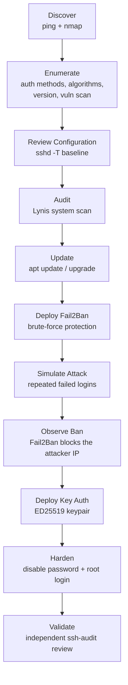

# Lab 04 Flow: Assessment to Hardening to Validation

Same two-VM topology as Labs 01-03 (Kali `192.168.56.10`, Ubuntu `192.168.56.20`). This lab adds no new infrastructure; it takes the one exposed service on the target, OpenSSH, and carries it through a complete security lifecycle.

Each stage depends on the one before it: hardening before the config is understood is guesswork, and disabling password authentication before key-based login is confirmed working is how you lock yourself out (a mistake already made once, and fixed, in Lab 01).
