# Web Application Security Assessment

`Ubuntu 24.04` `Kali Linux` `Docker` `DVWA` `Nmap` `Nikto` `Burp Suite` `OWASP Top 10`

| | |
|---|---|
| **Focus** | Full assessment cycle on a deliberately vulnerable web application: recon, exploitation, mitigation testing, and HTTP-layer manipulation |
| **Difficulty** | Intermediate |
| **Duration** | ~3 hours (across three sessions) |
| **Tools** | Docker, Nmap, curl, Nikto, Burp Suite Community Edition |

## Architecture

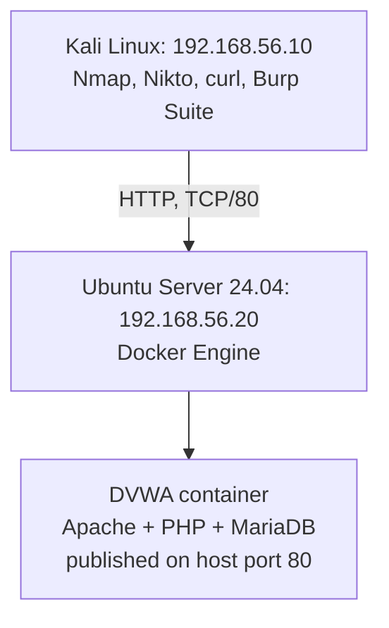

Full diagram and notes: [`architecture/lab-architecture.md`](architecture/lab-architecture.md).

## Series Continuity

```
Lab 01-04 -> Build and harden the infrastructure and its one exposed service (SSH)
Lab 05    -> Move up a layer: assess an application running on top of that infrastructure
```

Everything in this lab runs on the same Ubuntu host hardened in Labs 01-02 and validated in Lab 03-04. Nothing about the underlying OS was touched; this lab is scoped entirely to the web application layer and how it interacts with the host it runs on.

## Executive Summary

This lab deploys a deliberately vulnerable web application (DVWA) in Docker on the Lab 01-04 Ubuntu host, then assesses it the way a web application security engineer would: reconnaissance, HTTP-layer analysis with Burp Suite, and manual validation of specific vulnerability classes rather than an unstructured "poke around and see what happens." Six findings came out of that process, ranging from an infrastructure-level firewall bypass caused by Docker itself, through the three classic OWASP Top 10 categories (SQL Injection, Command Injection, Stored XSS), to an advanced finding demonstrating that the application's own security-level control could be defeated by tampering with a client-side cookie. Every finding includes a working exploit, an OWASP mapping, a justified severity rating, and a concrete remediation, not just "vulnerability found."

## Scenario

A web application has been deployed on infrastructure that was previously hardened and validated (Labs 01-04). Before this application could be trusted in anything resembling production, a security engineer needs to assess it independently: confirm what is actually reachable, identify real vulnerabilities with working proof rather than scanner output alone, and document severity and remediation clearly enough that a development team could act on it.

## Objectives

- Deploy a deliberately vulnerable web application in an isolated lab environment.
- Verify the deployment does not silently undermine the host's existing firewall posture.
- Perform reconnaissance and enumeration against the running application.
- Analyze HTTP traffic at the protocol level using an intercepting proxy.
- Identify and manually validate real vulnerabilities across multiple OWASP Top 10 categories, with working exploits, not just scanner flags.
- Map each finding to OWASP Top 10 (2021), assign a justified severity, and provide a specific, actionable remediation.
- Document a finding precisely, without overstating its scope beyond what was actually demonstrated.

## Environment

- **Ubuntu Server 24.04.4 LTS** (`192.168.56.20`): the Lab 01-04 hardened host, now also running Docker.
- **Kali Linux** (`192.168.56.10`): the assessment workstation.
- **DVWA** (`vulnerables/web-dvwa` Docker image): Apache + PHP + MariaDB, published on host port 80.
- **Tools:** Nmap, curl, Nikto, Burp Suite Community Edition (Proxy, Intercept, Match and Replace).

## Methodology

```
Phase 0: Environment Verification
     |
Phase 1: Deployment (Docker + DVWA)
     |
Phase 2: Enumeration (Nmap, curl, Nikto)
     |
Phase 3: HTTP Analysis (Burp Suite)
     |
Phase 4: Vulnerability Assessment and Exploitation
     |
Phase 5: Mitigation Testing (Low vs. Medium security level)
     |
Phase 6: Documentation
```

Each finding below follows the same fixed structure: what it is, where it was found, how it was proven, what it actually means, where it sits in OWASP Top 10, how severe it is and why, and specifically how it would be fixed.

---

## Findings

### Finding 1: Docker Container Publishing Bypasses the Host Firewall

**Description.** Publishing a container port with `docker run -p 80:80` made the DVWA container reachable on the network, even though UFW's ruleset only allows inbound traffic on port 22.

**Affected Component.** Host-level firewall (UFW) versus Docker's own iptables management on the Ubuntu host.

**Evidence.**

```
$ sudo ufw status verbose
Default: deny (incoming), allow (outgoing), disabled (routed)
22/tcp (OpenSSH)  ALLOW IN  Anywhere
```
No rule exists for port 80. Yet from Kali:
```
$ nmap -p 80 192.168.56.20
80/tcp open  http
```

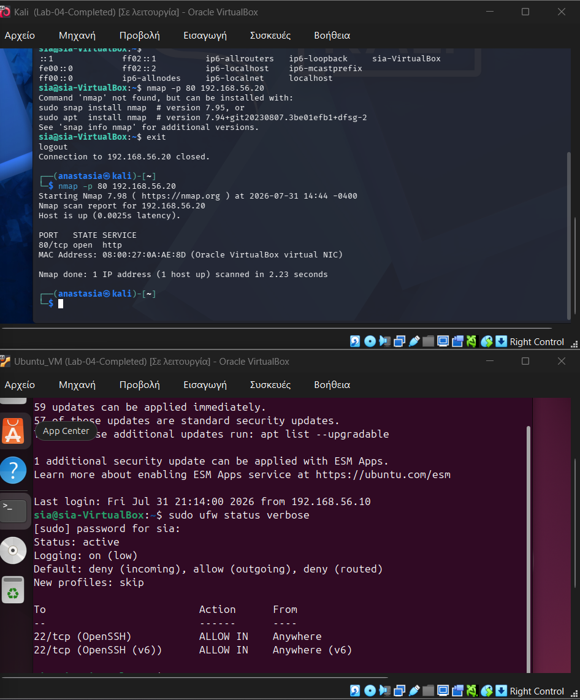

Root cause, confirmed directly:
```
$ sudo iptables -L DOCKER -n
ACCEPT  tcp -- 0.0.0.0/0  172.17.0.2  tcp dpt:80

$ sudo iptables -L FORWARD -n
Chain FORWARD (policy DROP)
DOCKER-USER
DOCKER-FORWARD        <- Docker's own ACCEPT is reached here
ufw-before-forward     <- UFW's rules are only evaluated after this
...
```

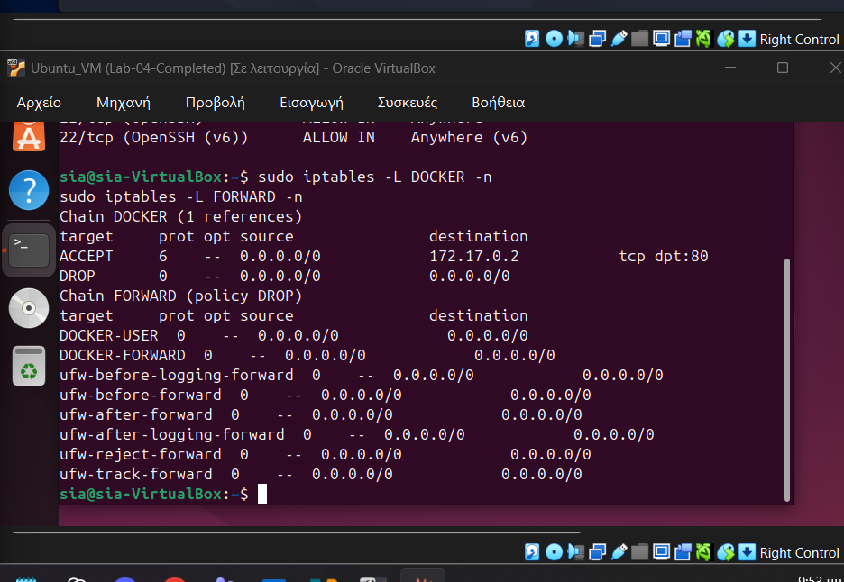

**Security Impact.** Docker manipulates iptables directly and inserts its own accept rules into the `FORWARD` chain ahead of UFW's own chains. Any port published with `docker run -p` becomes reachable regardless of what UFW's ruleset says, silently. An operator who checks `ufw status` and concludes a host is locked down could be completely wrong the moment a container publishes a port.

**OWASP Mapping.** Not a traditional web application vulnerability; closest fit is **A05:2021 - Security Misconfiguration** (a security control that is trusted but not actually authoritative).

**Severity.** **Medium** in this lab's isolated internal network, where the only reachable network is the assessment network itself. Would be **High** on any host with a public or shared network interface, since it means the host firewall cannot be relied on to gate container-exposed services at all.

**Remediation.** Manage container-exposed ports through the `DOCKER-USER` iptables chain, which Docker will not override, rather than relying on UFW alone. Alternatively, bind published ports to a specific internal interface/IP instead of `0.0.0.0`, or disable Docker's automatic iptables management (`"iptables": false` in `daemon.json`) and manage all rules explicitly. At minimum: never assume `ufw status` reflects true exposure on a host running Docker; verify with an external scan.

### Finding 2: SQL Injection

**Description.** The `User ID` parameter in DVWA's SQL Injection module concatenates user input directly into a SQL query without sanitization at the Low security level.

**Affected Component.** `/vulnerabilities/sqli/` (`id` parameter).

**Evidence.** Baseline, normal use:
```
id=1 -> ID: 1 / First name: admin / Surname: admin
```
Logic bypass:
```
id=1' OR '1'='1  -> all 5 users returned (admin, Gordon Brown, Hack Me, Pablo Picasso, Bob Smith)
```

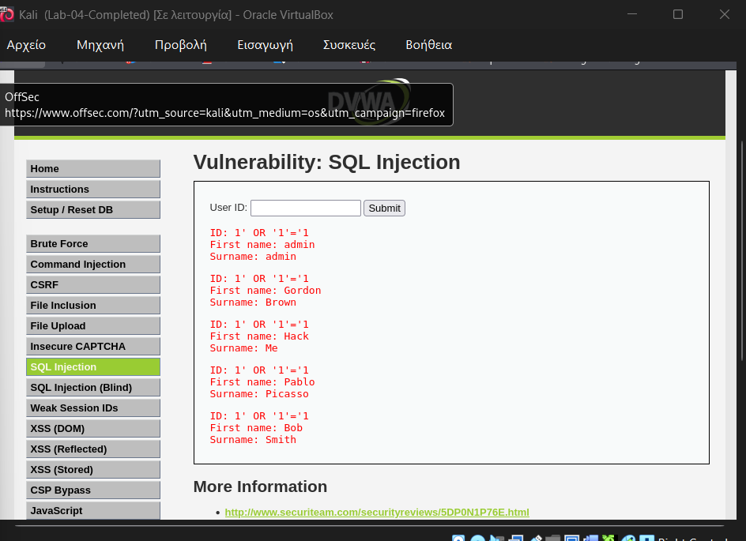

Data extraction, escalating impact beyond a logic bypass:
```
id=1' UNION SELECT user, password FROM users #
```
```
admin   / 5f4dcc3b5aa765d61d8327deb882cf99   (password)
gordonb / e99a18c428cb38d5f260853678922e03   (abc123)
1337    / 8d3533d75ae2c3966d7e0d4fcc69216b   (charley)
pablo   / 0d107d09f5bbe40cade3de5c71e9eb7    (letmein)
smithy  / 5f4dcc3b5aa765d61d8327deb882cf99   (password)
```

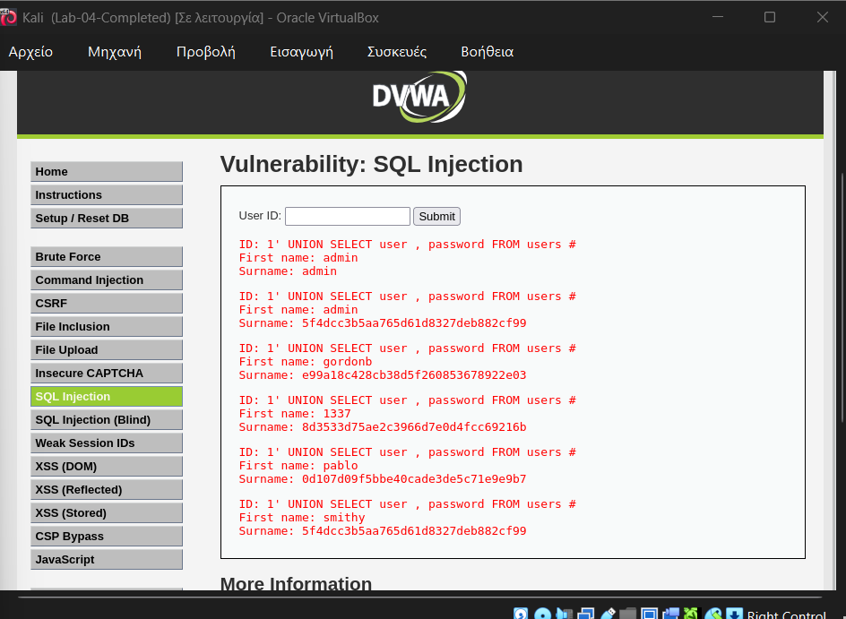

**Mitigation Testing (Medium level).** The same payload, submitted with the DVWA-imposed UI restriction bypassed by editing the URL directly, returned no data and no error at Medium security level, confirming server-side input escaping is actually in effect at that level, not just a UI restriction.

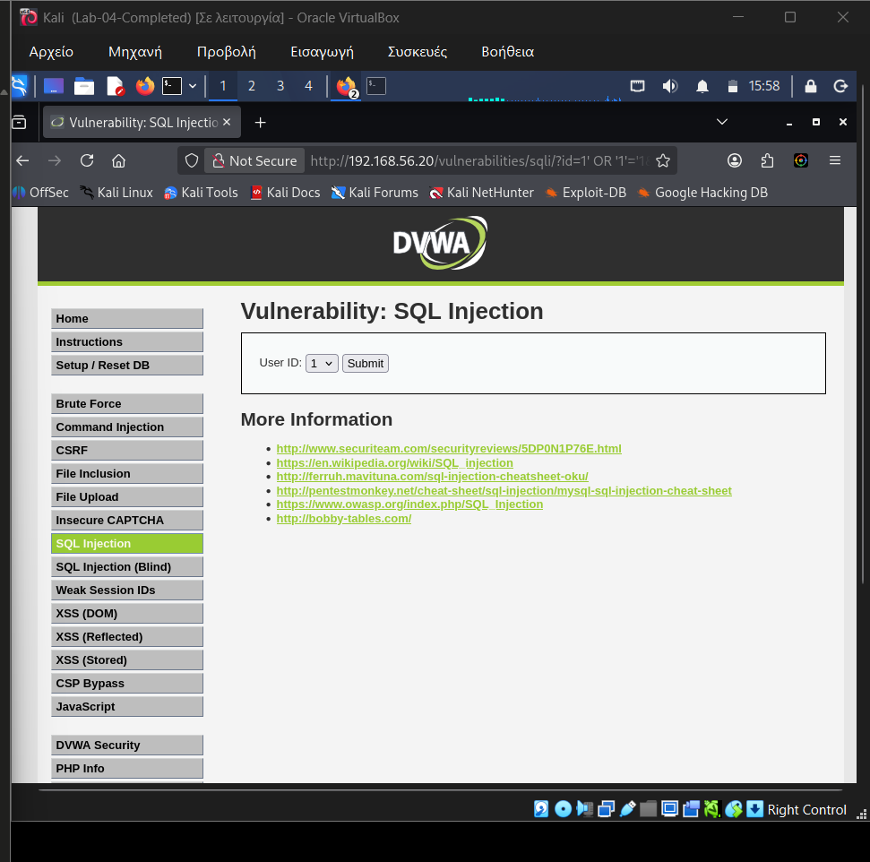

**Security Impact.** Complete compromise of the application's data layer: arbitrary read access to every table the database user can see, demonstrated here by extracting all application credentials directly.

**OWASP Mapping.** **A03:2021 - Injection.**

**Severity.** **Critical.** Full, unauthenticated (from the perspective of the query logic) read access to the credential store, with a demonstrated working exploit, not just a theoretical finding.

**Remediation.** Parameterized queries / prepared statements everywhere user input reaches SQL, never string concatenation. Server-side input validation as defense in depth, not as the primary control. Least-privilege database accounts (the application account should not be able to read columns like `password` if the calling code never legitimately needs to). Generic error handling that does not leak database structure or error text to the client.

### Finding 3: OS Command Injection

**Description.** DVWA's "ping a device" utility passes user input directly to a shell command without sanitizing shell metacharacters.

**Affected Component.** `/vulnerabilities/exec/` (IP address field).

**Evidence.** Baseline:
```
127.0.0.1 -> normal ping output, 4 packets, 0% loss
```
Command chaining:
```
127.0.0.1 && whoami -> ping output, plus an extra line: www-data
```

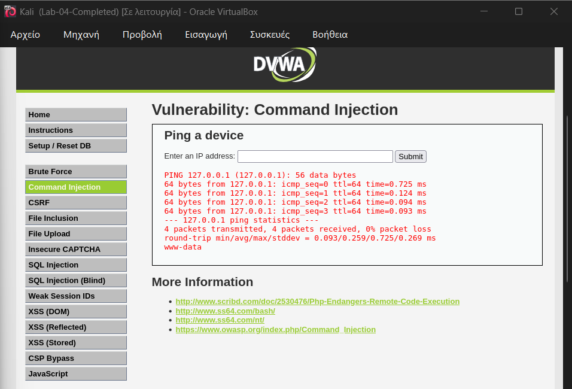

Escalated to file read:
```
127.0.0.1 && cat /etc/passwd -> full /etc/passwd contents returned
```

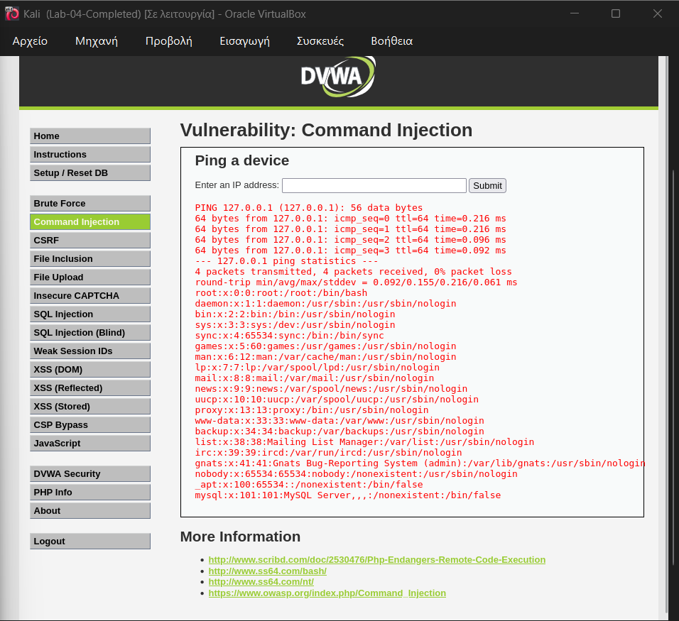

**Security Impact.** Arbitrary command execution as the `www-data` user inside the container. Demonstrated here as a read primitive (`whoami`, `cat`), but the same injection point would allow any command that user's shell permissions allow, including reverse shells, further reconnaissance, or lateral movement within the container.

**OWASP Mapping.** **A03:2021 - Injection.**

**Severity.** **Critical.** Arbitrary command execution is the most severe class of web application impact, independent of what the current user's privileges happen to be.

**Remediation.** Avoid invoking a shell for user-influenced input entirely. Where a system call is genuinely necessary, use language-level APIs that pass arguments as an array rather than a concatenated string (avoiding shell interpretation altogether), and validate input against a strict allow-list (e.g., a valid IPv4/IPv6 address pattern) before it is used at all.

### Finding 4: Stored Cross-Site Scripting (XSS)

**Description.** The guestbook "Message" field in DVWA's Stored XSS module stores raw HTML/JavaScript without sanitization or output encoding, and renders it for every subsequent visitor.

**Affected Component.** `/vulnerabilities/xss_s/` (Message field).

**Evidence.**
```
Message: <script>alert('XSS')</script>
```
Submitting this executed immediately, and re-executed automatically on every later page load with no further action required.

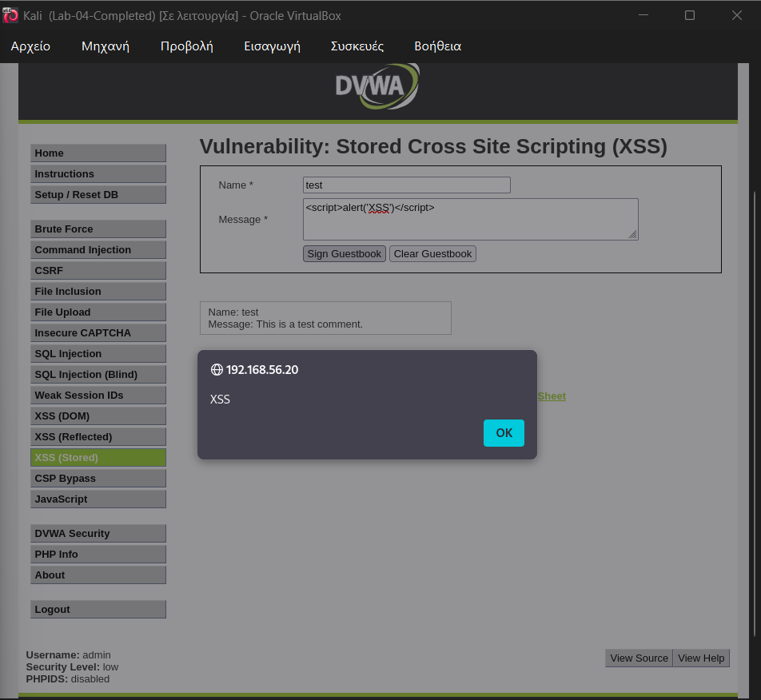

**Security Impact.** Unlike reflected XSS, this payload persists in the database and executes for every visitor to the page, no crafted link or social engineering required. Combined with Finding 5 (session cookies missing the `HttpOnly` flag), a real attacker payload here would not stop at an `alert()`; it could exfiltrate `document.cookie` and hijack another user's session.

**OWASP Mapping.** **A03:2021 - Injection** (OWASP 2021 folds XSS into the Injection category).

**Severity.** **High.** Persistent, requires no victim interaction beyond visiting the page, and is directly compounded by the missing `HttpOnly` cookie flag found in Finding 5.

**Remediation.** Context-aware output encoding on every rendering of user-supplied content (HTML-entity encode for HTML body context, JS-string encode for script context, etc.), input validation as a secondary control, and a Content-Security-Policy header restricting script execution to trusted sources. Mark session cookies `HttpOnly` so that even a successful XSS payload cannot read them via `document.cookie`.

### Finding 5: Missing Security Headers and Insecure Cookie Flags

**Description.** A Nikto scan against the application identified missing HTTP security headers and session cookies issued without protective flags.

**Affected Component.** Application-wide (all responses).

**Evidence.**
```
+ Cookie PHPSESSID created without the httponly flag
+ Cookie security created without the httponly flag
+ Suggested security header missing: content-security-policy
+ Suggested security header missing: x-content-type-options
+ Suggested security header missing: referrer-policy
+ Suggested security header missing: permissions-policy
+ Suggested security header missing: strict-transport-security
+ Apache/2.4.25 appears to be outdated (current is at least 2.4.66)
+ /config/: Directory indexing found
+ 8069 requests: 16 errors and 16 items reported on the remote host (386 seconds)
```

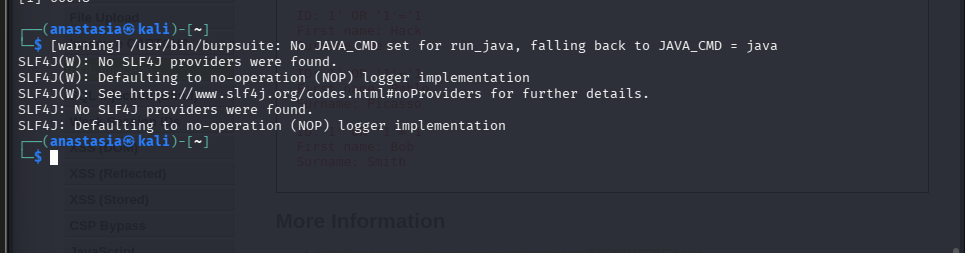

**Security Impact.** None of these are independently exploitable the way Findings 2-4 are, but each one raises the impact ceiling of another finding: the missing `HttpOnly` flag is what would turn Finding 4's Stored XSS into session theft, the missing CSP header is what would have made Finding 4 harder to exploit in the first place, and the outdated Apache version means any Apache-specific CVE from the last several releases is a live concern, not a hypothetical one.

**OWASP Mapping.** **A05:2021 - Security Misconfiguration.**

**Severity.** **Medium.** Not directly exploitable in isolation, but materially increases the severity of Finding 4 and the general attack surface.

**Remediation.** Set `HttpOnly`, `Secure`, and `SameSite` on all session cookies. Add `Content-Security-Policy`, `X-Content-Type-Options: nosniff`, `Referrer-Policy`, `Permissions-Policy`, and `Strict-Transport-Security` headers. Keep Apache patched to a current release, since a 2.4.25 install is missing years of security fixes.

### Finding 6: Security-Level Enforcement Bypass via Client-Side Cookie Tampering

**Description.** DVWA's security level (Low / Medium / High) is tracked entirely through a `security` cookie sent by the client, rather than being enforced server-side against a trusted, authenticated session record.

**Affected Component.** Application-wide; observed via `/vulnerabilities/sqli/`.

**Evidence.** A captured request showed the setting travelling as plain client-supplied state:
```
Cookie: PHPSESSID=tf18v1b0f3o0b2fbiha094gcc7; security=medium
```

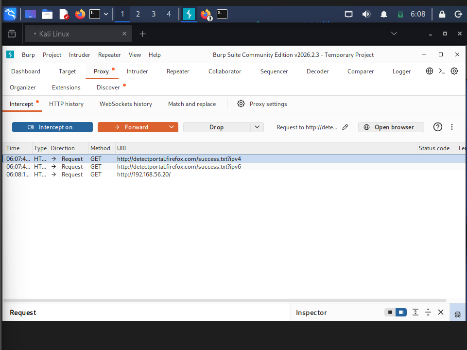

Using Burp Suite's **Match and Replace** feature, every outgoing request's `security=medium` was automatically rewritten to `security=low`, without touching DVWA's own security settings page at all. The application immediately began rendering the Low-level UI (a free-text field instead of a restricted dropdown):

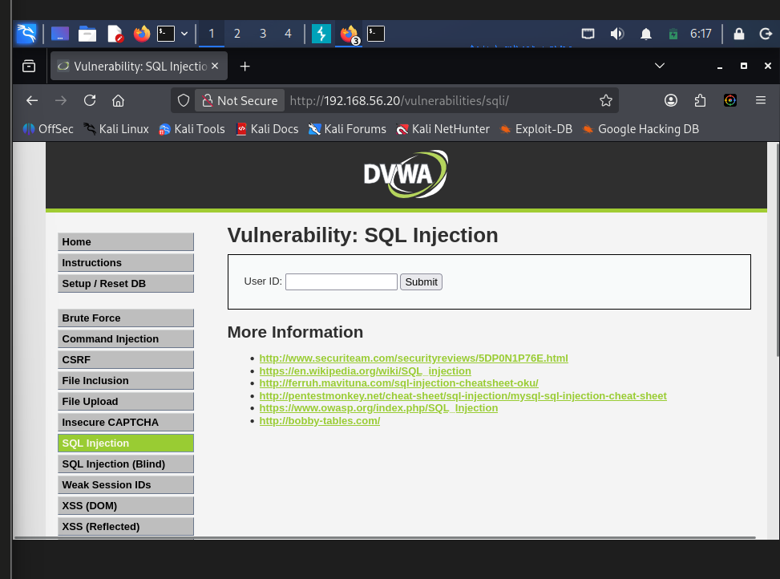

The same `1' OR '1'='1` payload that Finding 2 showed being correctly blocked at Medium level was then submitted again, and returned all 5 users:

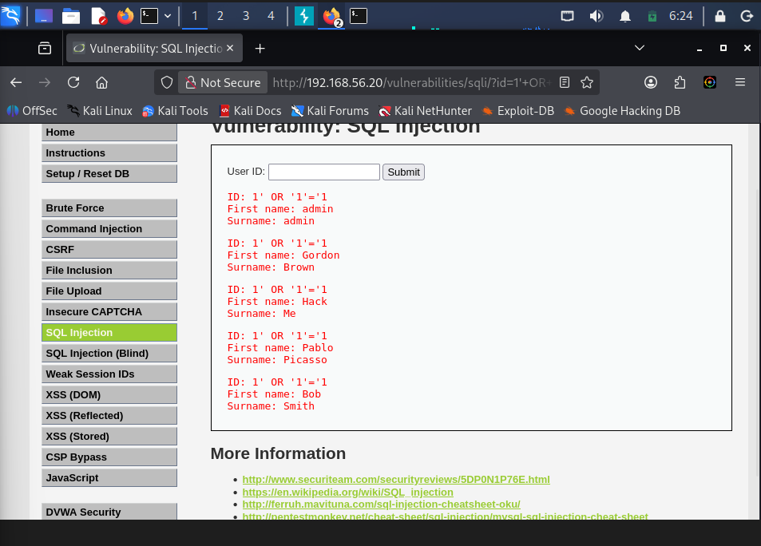

**Security Impact.** This is deliberately described precisely: it is **not** an authentication bypass. Login state and session identity were never touched or forged. What was bypassed is the application's **security-level enforcement**, a control the server should own and trust only from its own session state, but which was instead willing to trust a value the client sent it. The broader lesson generalizes well beyond DVWA's training scenario: any security-relevant setting whose state is read from a cookie, hidden form field, or other client-controlled input, rather than from server-side session state, can be manipulated by anyone capable of intercepting or crafting their own requests, with an intercepting proxy like Burp Suite being the standard tool for finding exactly this class of flaw.

**OWASP Mapping.** **A04:2021 - Insecure Design.** This is a design-level flaw (trusting client state for a security decision), not an implementation bug in a single line of code.

**Severity.** **High.** It defeats a control specifically meant to represent "how hardened is this session" without needing any credentials, session token forgery, or knowledge of an existing vulnerability in the target logic being protected.

**Remediation.** Never store security-relevant configuration in client-controlled state. Enforce settings like this server-side, scoped to the authenticated session and stored in server-side session storage (or a database row keyed to the session), never trusting a client-supplied value for anything that changes the application's security posture. If a setting must be adjustable per-session, changing it should require re-validation server-side, not just accepting whatever the client presents on the next request.

---

## Findings Summary

| # | Finding | OWASP Category | Severity |
|---|---|---|---|
| 1 | Docker container publishing bypasses UFW | A05:2021 - Security Misconfiguration | Medium |
| 2 | SQL Injection | A03:2021 - Injection | Critical |
| 3 | OS Command Injection | A03:2021 - Injection | Critical |
| 4 | Stored XSS | A03:2021 - Injection | High |
| 5 | Missing security headers / insecure cookie flags | A05:2021 - Security Misconfiguration | Medium |
| 6 | Security-level bypass via cookie tampering | A04:2021 - Insecure Design | High |

## MITRE ATT&CK Mapping

OWASP Top 10 is the primary framework for this lab since every finding is an application-layer issue, which is what OWASP is built to categorize. MITRE ATT&CK is included alongside it, as in Labs 02 and 03, to show how the same findings correspond to adversary technique behavior once an attacker is actually using them, not as a replacement for the OWASP mapping above.

| Finding | Related ATT&CK Technique(s) | Note |
|---|---|---|
| 1. Docker/UFW firewall bypass | T1599 - Network Boundary Bridging | Bypassing a network-layer security boundary control |
| 2. SQL Injection | T1190 - Exploit Public-Facing Application; T1552 - Unsecured Credentials | Initial exploitation, then credential exposure as impact |
| 3. Command Injection | T1190 - Exploit Public-Facing Application; T1059 - Command and Scripting Interpreter | Exploitation leading to arbitrary command execution |
| 4. Stored XSS | T1185 - Browser Session Hijacking | Realistic downstream impact if combined with Finding 5's missing `HttpOnly` flag |
| 5. Missing headers / cookie flags | T1595.002 - Active Scanning: Vulnerability Scanning | How this was identified (Nikto), not how it would be exploited directly |
| 6. Cookie tampering bypass | T1211 - Exploitation for Defense Evasion | Defeating a defensive security control through client-side manipulation |

## Verification Summary

| Check | Status |
|---|---|
| Deployment reachable and firewall behavior verified | Confirmed (and a real gap found: Finding 1) |
| Enumeration (Nmap, curl, Nikto) | Confirmed |
| SQL Injection exploited and mitigation tested | Confirmed at both Low and Medium |
| Command Injection exploited | Confirmed, escalated from `whoami` to full file read |
| Stored XSS exploited | Confirmed, persistent execution demonstrated |
| HTTP-layer manipulation (Burp Suite) | Confirmed, including a live mitigation bypass |

## Problems Encountered

**Environment regression before this lab even started.** The Phase 0 baseline check found CUPS (port 631) and Avahi (port 5353) listening again on the Ubuntu host, despite both having been explicitly disabled in Lab 02 and confirmed absent in Lab 03. `systemctl is-enabled` correctly reported both services and their socket units as `disabled`, meaning something restarted them at runtime independent of their boot-time configuration, most likely a routine `apt upgrade` restarting the installed daemons as part of its own package post-install step, regardless of their disabled state. Since `disable` had already proven insufficient across a reboot once before, the packages were removed outright this time rather than disabled again, and `ss -tuln` confirmed both ports gone afterward. This is a direct, real-world instance of the exact risk flagged in Lab 02's lessons learned: a disabled service is not a removed service.

**SSH session vs. native Kali shell confusion.** Early in this lab, a command believed to be running on Kali (`nmap`) was actually still being typed inside an active SSH session into Ubuntu, which does not have (and does not need) Nmap installed. The fix was simply `exit`-ing the SSH session to return to a native Kali prompt before running assessor-side tools. A small mistake, but a good reminder to always check which prompt you are actually looking at before troubleshooting a "command not found" as if it were a real problem.

**Cookie tampering only affecting a single request.** The first attempt at editing the `security` cookie manually inside Burp's Intercept view only changed the one request that happened to be paused at that moment; every subsequent request from Firefox still carried its own stored `security=medium` cookie. Burp Suite's **Match and Replace** feature (Proxy settings) solved this properly by rewriting the cookie automatically on every outgoing request, which is what actually enabled a clean, repeatable demonstration of Finding 6.

## Lessons Learned

Full write-up in [`lessons-learned.md`](lessons-learned.md). In short: a disabled service is not a removed service, a UI restriction is not a security control, a firewall's own status output is not proof of actual exposure once Docker is involved, and a security setting that lives in a cookie is a setting an attacker owns just as much as the server does.

## Skills Demonstrated

- Containerized deployment of a test application (Docker)
- Firewall behavior verification independent of configuration files (Nmap, iptables)
- Web reconnaissance and vulnerability scanning (Nmap, curl, Nikto)
- HTTP-layer traffic interception and manipulation (Burp Suite: Proxy, Intercept, Match and Replace)
- Manual exploitation and validation of SQL Injection, OS Command Injection, and Stored XSS
- Mitigation testing (proving a control works, not just that a vulnerability exists)
- OWASP Top 10 (2021) mapping and CVSS-informed severity reasoning
- Precise security writing: describing a client-side security-control bypass as exactly what it is, not inflating it into "authentication bypass"

## Next Phase

**Lab 06: Detection Engineering & System Monitoring** *(planned)*

Every finding in this lab was identified by an assessor who already knew what to look for. The next lab asks the inverse question: what would show up in logs and monitoring if an attacker did this without the defender's cooperation, and how would a SOC analyst actually notice?

---

**Scope note:** every exploitation technique in this lab was performed against DVWA, a deliberately vulnerable application, running in an isolated internal network with no exposure to the host's real network or the internet. No technique here was used against production infrastructure or any system outside this lab.

**Screenshots note:** 12 screenshots are embedded above, covering the key moments of each finding. The full evidence set (24 screenshots, including baseline checks, the Docker/DVWA deployment, and the Nikto scan in progress) is in [`screenshots/`](screenshots/).

---

[⬅️ Previous: Lab 04 - SSH Hardening & Secure Remote Access](../Lab-04-SSH-Hardening-and-Secure-Remote-Access/README.md) &nbsp;|&nbsp; [🏠 Home](../README.md) &nbsp;|&nbsp; ➡️ Next: Lab 06 - Detection Engineering & System Monitoring *(planned)*
