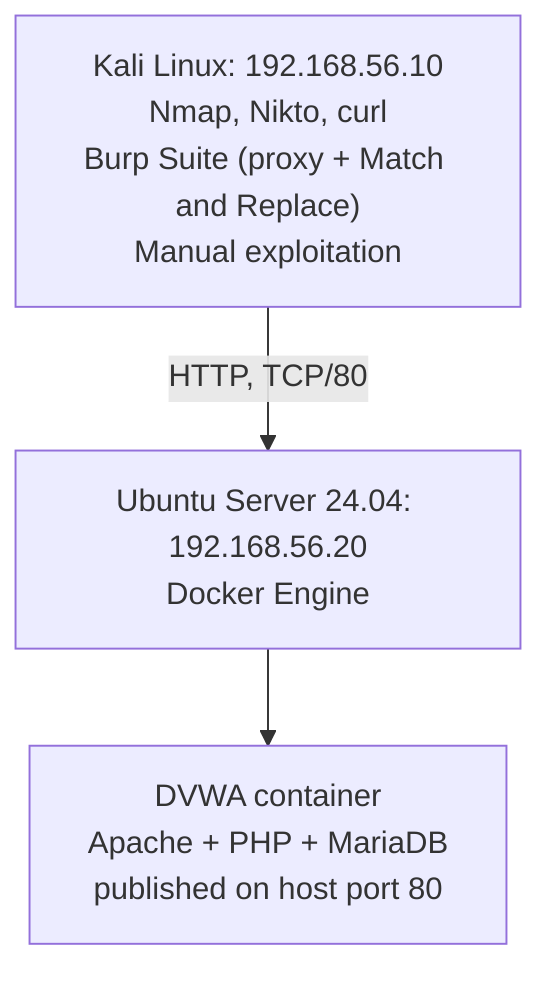

# Architecture: Lab 05

Same physical topology as Labs 01-04. This lab adds one new component: a deliberately vulnerable web application, deployed in Docker on the existing Ubuntu host, and assessed from the existing Kali workstation.

## Deployment note

DVWA was deployed via the pre-built `vulnerables/web-dvwa` Docker image rather than a manual LAMP install (Apache, MariaDB, PHP installed and configured separately). Both approaches reach the same end state, a working DVWA instance reachable at `http://192.168.56.20`, but the container approach is faster to stand up and, as Finding 0 below shows, has its own firewall implications worth understanding.

## Reused from Labs 01-04

- Static IP addressing and internal network isolation (Lab 01)
- UFW default-deny firewall baseline (Lab 01, reverified in Lab 02)
- Hardened SSH access between Kali and Ubuntu (Lab 01, Lab 04)
- Ubuntu account, service, and audit baseline (Lab 02), which this lab's Phase 0 re-verified before building on top of it
