# Detection Engineering & System Monitoring

`Ubuntu 24.04` `Kali Linux` `auditd` `Fail2ban` `Docker` `Python3` `MITRE ATT&CK` `Blue Team`

| | |
|---|---|
| **Focus** | Whether Labs 03-05's attacks would actually be noticed by a defender, not just possible for an attacker |
| **Difficulty** | Intermediate-Advanced |
| **Duration** | ~7 hours (across two sessions) |
| **Tools** | auditd, Docker syslog log driver, Python3, journald, Fail2ban, Nmap, Burp Suite |

## Architecture

Full diagram and notes: [`architecture/lab-architecture.md`](architecture/lab-architecture.md). This lab adds no new machines or attack surface; it adds visibility on top of the host built in Labs 01-05, then replays those labs' attacks against it.

## Series Continuity

```
Labs 01-05 -> Build, harden, and attack the infrastructure and its application layer
Lab 06     -> Switch sides: would a defender monitoring this host actually see any of that happen?
```

Every attack replayed in this lab was already performed once, for real, in Labs 03-05. Nothing here is a new offensive technique. The only new question is visibility.

## Executive Summary

This lab does not add new attack surface. It adds detection capability to the Lab 01-05 host, then replays five attacks from earlier labs against it to answer one question honestly: would a defender monitoring this host actually see this happening? The answer is mixed, on purpose, since a lab where every attack is caught cleanly would not be a credible one. One unifying theme runs through nearly every finding in this lab, discovered three separate times through three unrelated investigations: **"active," "configured," and "alerting" are not synonyms for "effective."** `auditd` was running with zero rules configured. Fail2ban's `sshd` jail was active and had been since Lab 04, and still never banned a single real attacker until a two-part root cause was found and fixed. A detection alert fired during the final attack replay, but firing did not mean the tool had actually seen the mechanism that mattered. Each of these is documented as its own finding, with its own evidence, not smoothed over into a single generic lesson.

## Scenario

The Lab 01-05 host has already been attacked, successfully, multiple times, by an assessor who knew exactly what to look for. Before this environment could be trusted to defend itself, someone needs to build actual detection capability on top of it and then honestly test whether that capability works, including being willing to document the parts that do not.

## Objectives

- Establish a baseline understanding of what visibility already exists on the host, and what does not.
- Build targeted `auditd` detection rules for identity, privilege escalation, and configuration-change events.
- Close the gap where an application's own logs are trapped inside a Docker container's filesystem, invisible to host-level monitoring.
- Build a custom, multi-source detection script correlating web, SSH, and process-execution telemetry in real time.
- Replay real attacks from Labs 03-05 against the now-monitored host and record, honestly, what was detected and what was missed.
- Investigate and fix an existing security control (Fail2ban) that had been "active" for two labs without ever actually working.
- Map every finding to MITRE ATT&CK, and be precise about what a passing or failing detection actually proves.

## Environment

- **Ubuntu Server 24.04.4 LTS** (`192.168.56.20`): the Lab 01-05 host, unchanged except for the detection tooling added in this lab.
- **Kali Linux** (`192.168.56.10`): the attack replay source.
- **DVWA** (Docker container from Lab 05), recreated with a syslog log driver.
- **Tools:** `auditd`, `augenrules`, `ausearch`, Docker's `syslog` log driver, Python3 (`threading`, `re`, `subprocess`, `urllib.parse`), `journalctl`, Fail2ban, Nmap, Burp Suite.

## Methodology

```
Phase 0: Baseline Visibility Audit
     |
Phase 1: auditd Detection Rules
     |
Phase 2: Docker Logging to Syslog
     |
Phase 3: Custom Detection Script (detect.py)
     |
Phase 4: Attack Replay from Kali (5 attacks)
     |
Cross-Lab Validation: Fail2ban Investigation
     |
Documentation
```

---

## Findings

### Finding 1: Baseline Visibility Gaps

**Description.** Before adding anything, the existing visibility on the host was audited directly rather than assumed.

**Evidence.**

```
$ sudo systemctl status auditd
Active: active (running)

$ sudo auditctl -l
No rules

$ journalctl --disk-usage
Archived and active journals take up 279.3M in the file system.

$ cat /etc/rsyslog.d/*
rotate 4
```

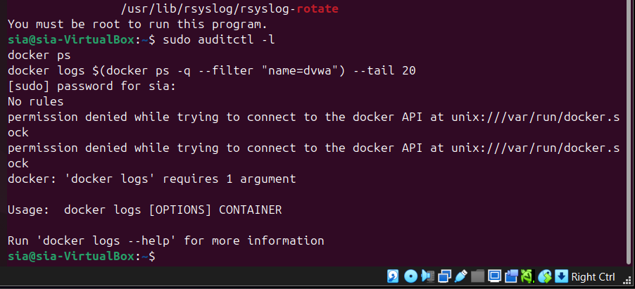

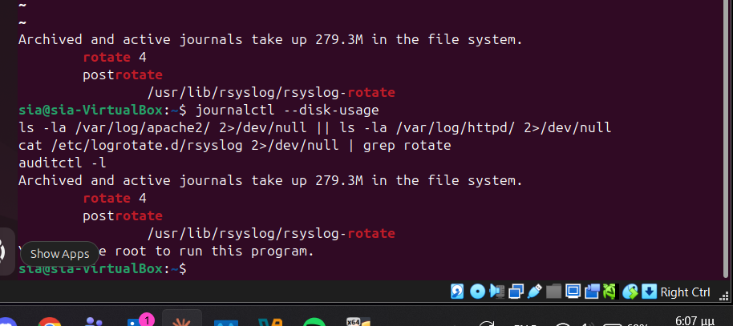

DVWA's own Apache access log was confirmed to exist only inside the container's filesystem:

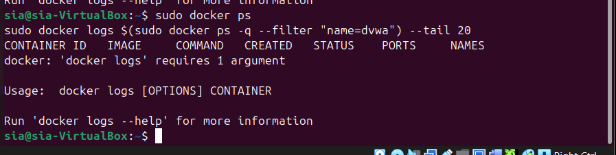

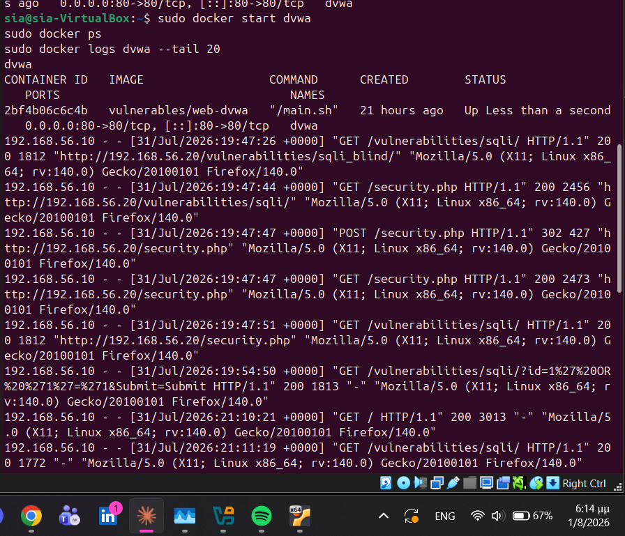

Fail2ban's `sshd` jail looked correctly configured at this stage:

```
$ fail2ban-client status sshd
Currently failed: 0
Total failed:     0
File list:        /var/log/auth.log
```

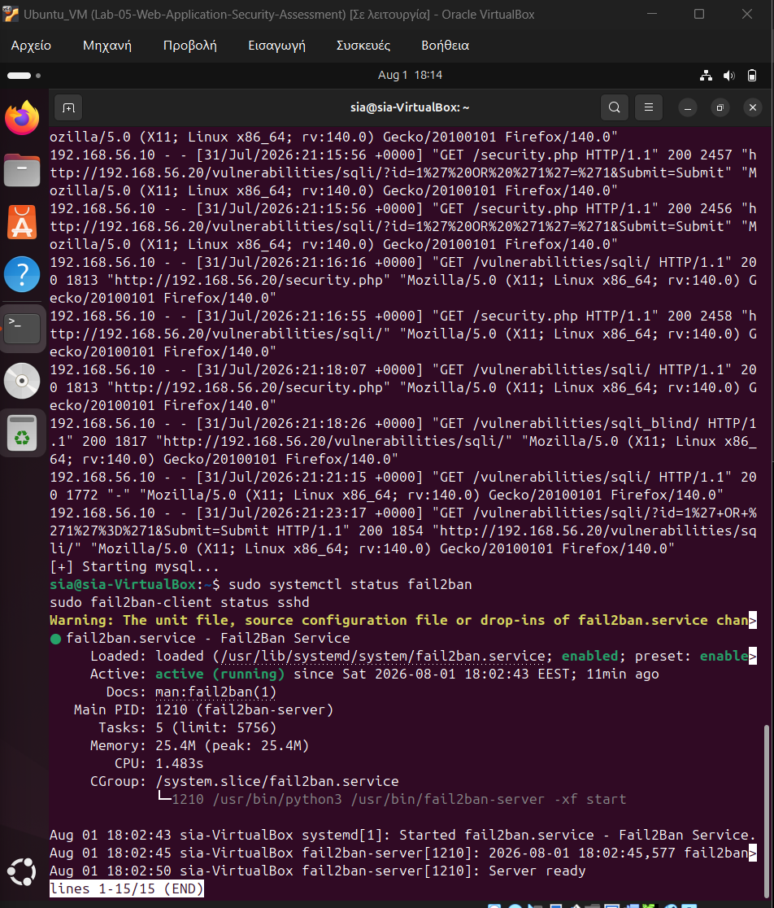

**Security Impact.** `auditd`, a daemon Lab 02 explicitly deployed, had been running with zero rules the entire time since. A running daemon with no rules provides exactly the same detection coverage as no daemon at all. DVWA's logs being trapped inside the container means an attack against the application it hosts would leave no trace anywhere a host-level defender would normally look.

**MITRE Mapping.** Not an attack technique; this finding is about detection posture, and directly sets up Findings 2-6.

**Severity.** **High.** This is the finding that makes every other finding in this lab possible: none of the subsequent detections would have worked without first closing these specific gaps.

**Remediation.** Deploy `auditd` rules at the same time the daemon is deployed, not as a separate, later step. Treat "service is active" and "service is providing coverage" as two different claims requiring two different checks.

### Finding 2: Network Reconnaissance Is Invisible to Host-Based Detection Alone

**Description.** A full Nmap scan against the host (`nmap -p- -sV 192.168.56.20`) was replayed from Kali after all of this lab's detection tooling was in place.

**Evidence.**

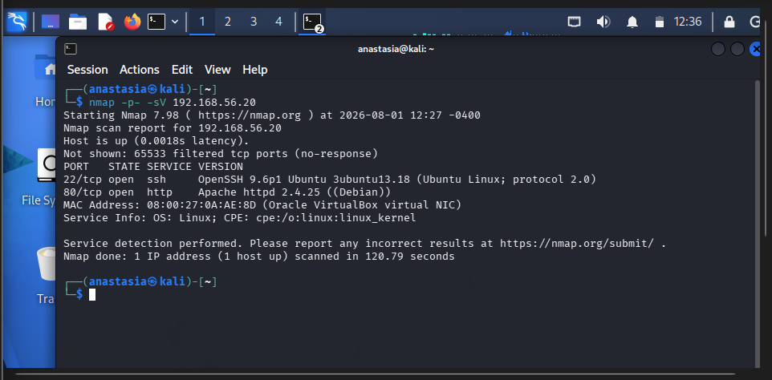

The scan completed and returned results as expected. Nothing appeared in `detections.log`, and no auditd, Fail2ban, or `detect.py` alert fired at any point during or after the scan.

**Security Impact.** Every detection mechanism built in this lab is host-based: it watches files, processes, and application logs on the Ubuntu host itself. None of them watch the network layer. A port scan generates no file access, no process execution on the target, and no application-layer log entry, so there was never going to be anything for any of this lab's tooling to catch. This is a structural blind spot, not a misconfiguration.

**MITRE Mapping.** **T1595 - Active Scanning** (the reconnaissance technique itself, undetected).

**Severity.** **Medium.** Reconnaissance alone does not compromise anything, but a host that cannot see itself being scanned loses the earliest possible warning that it is being targeted.

**Remediation.** Host-based tooling cannot close this gap by design. It requires a network-layer sensor (an IDS such as Suricata or Zeek, or at minimum firewall connection logging) positioned to see traffic before it reaches the host. See Detection Engineering Improvements below.

### Finding 3: SQL Injection Detected via Custom Web Log Monitoring

**Description.** The SQL Injection attack from Lab 05 (`1' UNION SELECT user,password FROM users #`) was replayed against DVWA.

**Evidence.**

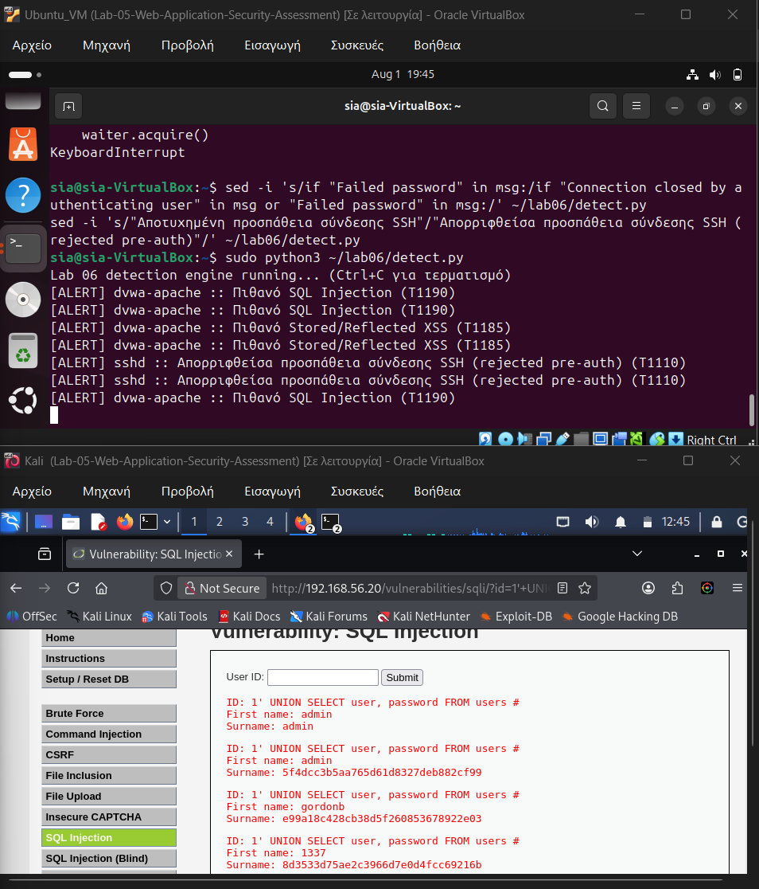

`detect.py`'s `watch_web()` thread, tailing the `dvwa-apache` syslog tag, matched the `UNION...SELECT` pattern and logged an alert in real time:

```
[ALERT] dvwa-apache :: Πιθανό SQL Injection (T1190)
```

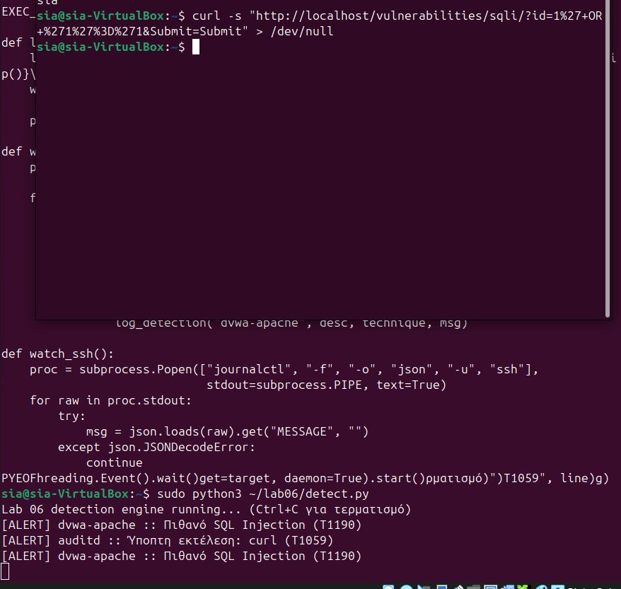

**Security Impact.** This is the detection working as intended: an attack that succeeded undetected in Lab 05 is now caught in real time, purely because Finding 1's visibility gap (DVWA logs trapped in the container) was closed first. Detection here was only possible because Phase 2 (Docker syslog logging) and Phase 3 (the web watcher) were both in place before the replay.

**MITRE Mapping.** **T1190 - Exploit Public-Facing Application.**

**Severity.** **High** as a detection result (meaning: this finding demonstrates a working, valuable detection, not a vulnerability). The underlying SQL Injection vulnerability itself was already rated Critical in Lab 05.

**Remediation.** N/A, this finding documents a working control. The main risk going forward is regex fragility: the current pattern set catches the specific payload shapes tested, not every possible SQL injection syntax variant.

### Finding 4: Command Injection Detected via auditd, and Why a Shared Kernel Is Not a Detection Boundary

**Description.** The Command Injection attack from Lab 05 (`127.0.0.1 && whoami`) was replayed against DVWA's command injection module.

**Evidence.**

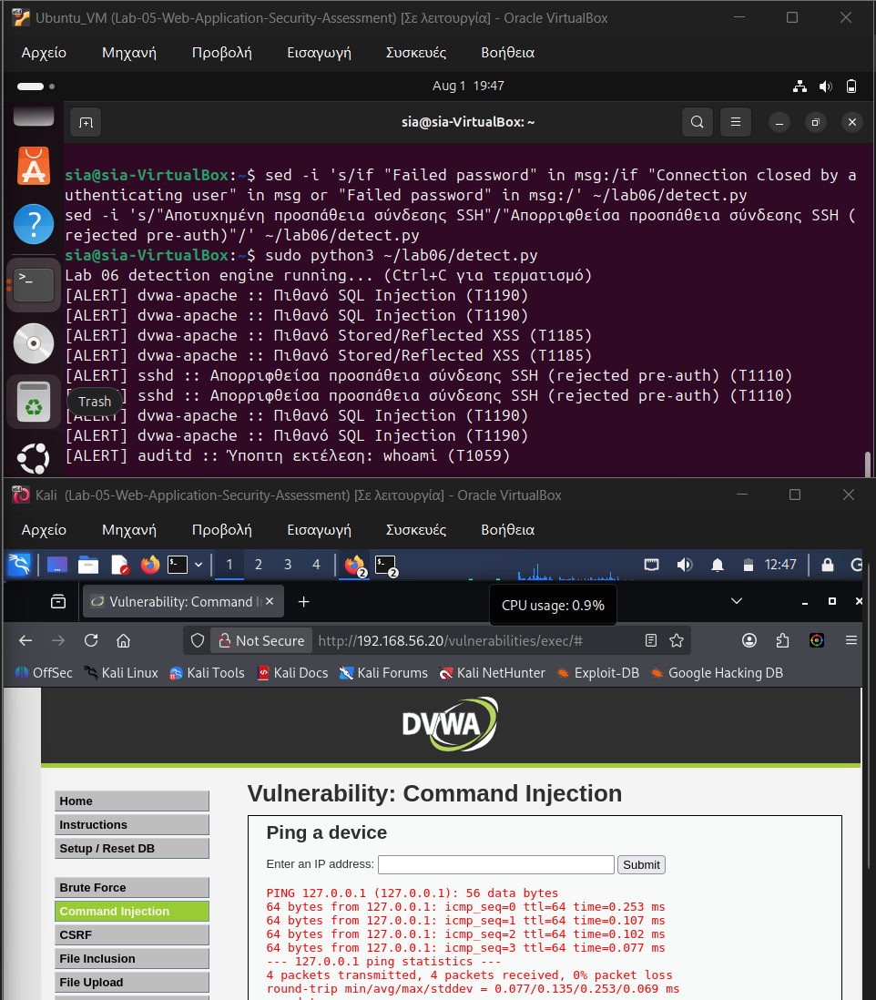

`detect.py`'s `watch_exec()` thread, tailing `/var/log/audit/audit.log` for the `exec_actions` key, caught the resulting `execve` call and logged it, referencing the watchlist match:

```
[ALERT] auditd :: Ύποπτη εκτέλεση: cat (T1059)
```

**Security Impact.** The command ran inside the DVWA Docker container, not directly on the Ubuntu host, yet host-level `auditd` still caught it. This is worth stating precisely: containers share the host kernel rather than running their own, unlike the Kali/Ubuntu split in this homelab, which are genuinely separate VMs with separate kernels. A detection boundary does not automatically align with a virtualization boundary the way it might be assumed to. Host-based auditing of `execve` catches container process execution "for free," which is a real defensive advantage of this architecture, not something that was deliberately engineered for this lab.

**MITRE Mapping.** **T1190 - Exploit Public-Facing Application** (the entry vector); **T1059 - Command and Scripting Interpreter** (the resulting execution).

**Severity.** **High** as a detection result, for the same reason as Finding 3.

**Remediation.** N/A, working control. Worth extending the exec watchlist beyond the current fixed set (`whoami`, `cat`, `id`, `nc`, `ncat`, `bash`, `wget`, `curl`) as new attack patterns are identified.

### Finding 5: Stored XSS Is Structurally Invisible to Access-Log-Based Detection

**Description.** The Stored XSS payload from Lab 05 (`<script>alert('XSS')</script>`, submitted via DVWA's Guestbook) was replayed.

**Evidence.**

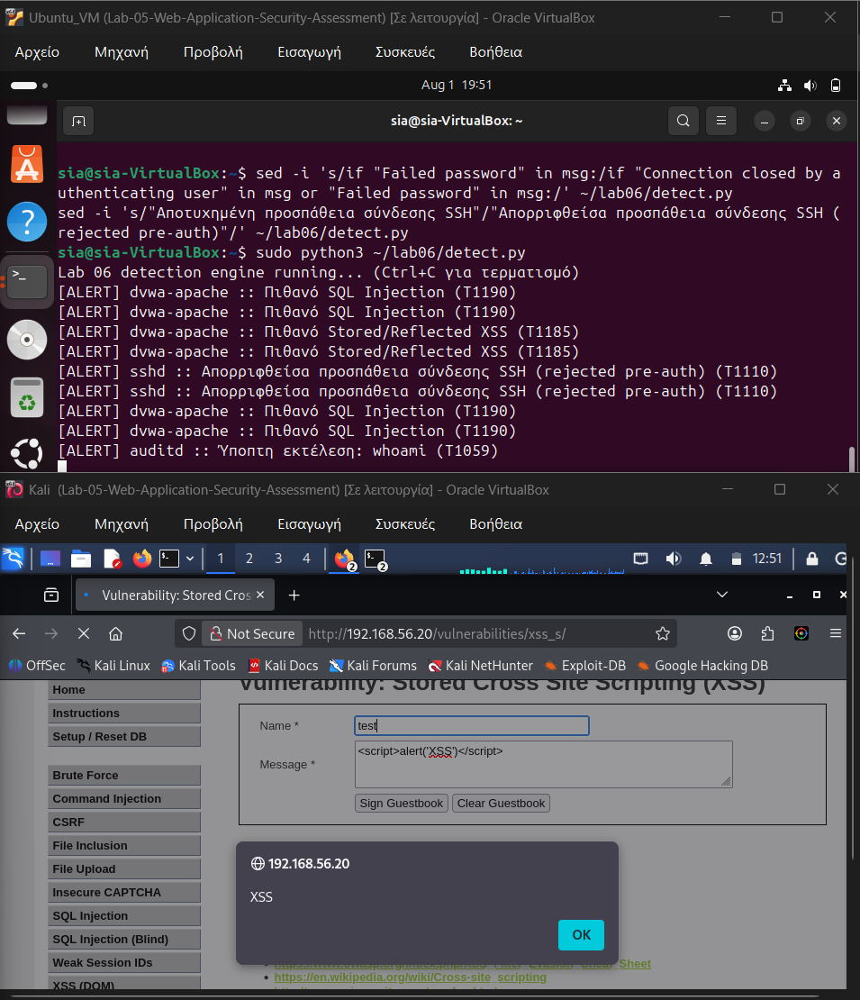

```
$ journalctl -t dvwa-apache --since "5 minutes ago" | grep xss_s
... "POST /vulnerabilities/xss_s/ HTTP/1.1" ...
```

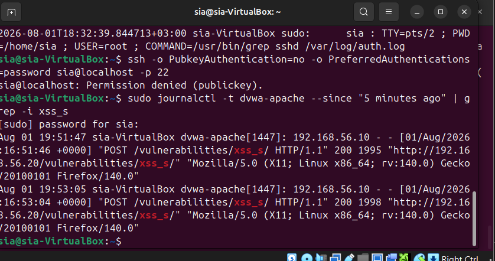

No alert appeared in `detections.log` for this attack.

**Security Impact.** This is not a regex problem, and no amount of pattern tuning would have fixed it. The Apache combined log format records the request line (method, path, protocol) and headers, never the POST request body. The XSS payload lives entirely in the body of a POST request to `/vulnerabilities/xss_s/`. The log shows that a POST happened; it cannot show what was in it, because the data needed to detect this attack was never captured by the telemetry source being watched in the first place. This is a structural gap: the fix is a different data source, not a smarter script.

**MITRE Mapping.** **T1190 - Exploit Public-Facing Application** (the entry vector, undetected here); the plausible downstream consequence if the stored payload had been designed to steal session data is **T1185 - Browser Session Hijacking**.

**Severity.** **High**, as an undetected gap covering a High-severity vulnerability (Lab 05, Finding 4).

**Remediation.** Close this with a telemetry source that actually captures request bodies: application-level logging (DVWA/PHP-level request logging), or a reverse proxy / WAF positioned to log or inspect POST bodies before they reach the application. See Detection Engineering Improvements below.

### Finding 6: Misleading Detection Coverage: an Alert Firing Is Not Proof the Detection Saw the Real Attack

This is the most important finding in this lab.

**Description.** Lab 05's Finding 6 demonstrated that DVWA's security-level enforcement could be bypassed entirely by tampering with a client-side `security` cookie via Burp Suite's Match and Replace, without touching the actual DVWA Security settings page. That same technique was reconsidered here from the defender's side: would this lab's detection tooling actually notice the bypass mechanism itself?

**Evidence.** `detect.py`'s `watch_web()` function was reviewed directly (Phase 3 source, `~/lab06/detect.py`): it regex-matches URL paths and query strings for SQLi/XSS patterns. It contains no logic that inspects, parses, or evaluates cookie values at all.

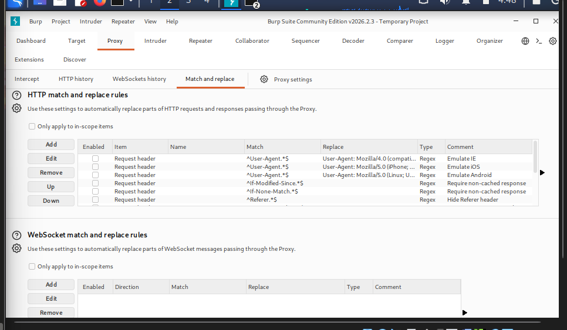

When the SQL Injection payload from Finding 3 is resubmitted with a tampered `security` cookie, the exact same alert as Finding 3 fires:

```
[ALERT] dvwa-apache :: Πιθανό SQL Injection (T1190)
```

**Security Impact.** This is exactly the trap it looks like. The alert fires, and on a dashboard or in a log review, that looks like a success: "SQL injection attempt detected." It is true that a SQL injection *pattern* was detected, in the URL. It is not true that the *cookie-tampering bypass mechanism* was detected: `detect.py` has zero visibility into cookie contents and would fire identically whether the security level was genuinely Low or fraudulently forced to Low via a tampered cookie. A defender reviewing this alert in isolation would have no way to know the real attack technique (client-side security-control bypass) was ever used. An alert firing proves a pattern matched; it does not prove the detection tool understood, or could even see, the actual mechanism behind the attack. This distinction is easy to miss and easy to overclaim in a security report, which is exactly why it is documented here precisely rather than folded into Finding 3's success.

**MITRE Mapping.** **T1211 - Exploitation for Defense Evasion** (the underlying bypass technique, from Lab 05); the detection gap itself does not have a clean ATT&CK mapping, since ATT&CK documents adversary behavior, not defender blind spots.

**Severity.** **High.** A misleading alert is arguably worse than no alert, because it creates false confidence that a specific mechanism is covered when it is not.

**Remediation.** Session and cookie integrity monitoring, logging cookie values (or at minimum their presence/absence and expected format) alongside request data, so a review could distinguish "SQLi pattern matched" from "SQLi pattern matched, and the session's security-relevant state was also tampered with." See Detection Engineering Improvements below.

### Finding 7: Cross-Lab Validation Finding: the Fail2ban Investigation

**Description.** Fail2ban's `sshd` jail has been active since Lab 04. During this lab's attack replay, it was noticed that `fail2ban-client status sshd` still showed `Total failed: 0` despite real, rejected SSH connection attempts already present in `/var/log/auth.log`. This became a full investigation, not a one-line fix.

**Symptom.**

```
$ fail2ban-client status sshd
Currently failed: 0
Total failed:     0
```

Meanwhile `/var/log/auth.log` already contained real rejections:

```
sshd[5490]: Connection closed by authenticating user sia 127.0.0.1 port 49872 [preauth]
sshd[5665]: Connection closed by authenticating user 192.168.56.10 port 54350 ... [preauth]
```

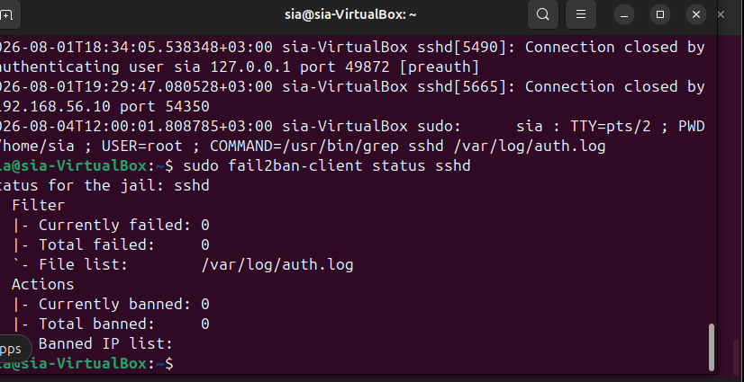

**Root Cause 1.** `sudo fail2ban-regex /var/log/auth.log sshd` was run to check whether Fail2ban's own filter could even match this log line. It could, but the matching default pattern is tagged `<F-NOFAIL>`, a deliberate Fail2ban design choice: certain benign-looking preauth disconnects are excluded from triggering a ban by default, precisely the message this SSH-key-only host produces on every rejected connection.

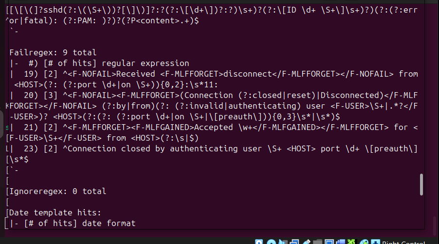

**Fix Attempt 1 (failed).** A custom filter, `/etc/fail2ban/filter.d/sshd.local`, was created with a specific regex for this exact message, added *after* the default `%(known/failregex)s` include:

```
[Definition]
failregex = %(known/failregex)s
            ^Connection closed by authenticating user \S+ <HOST> port \d+ \[preauth\]\s*$
```

Retesting still showed `0/0`. Fail2ban evaluates `failregex` patterns in order and stops at the first match; the NOFAIL-tagged default pattern matched first and short-circuited before the custom line was ever reached.

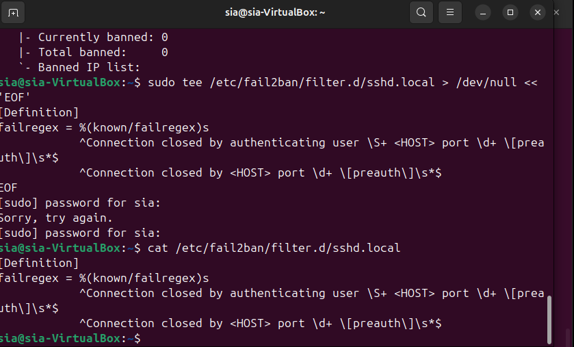

**Root Cause 2.** A second, independent problem surfaced mid-troubleshooting: the default `ignoreip = 127.0.0.1/8 ::1` whitelist was silently excluding any test performed against localhost, with no error or warning logged anywhere, regardless of whether the regex itself was correct.

```
$ grep -i ignoreip /etc/fail2ban/jail.conf /etc/fail2ban/jail.local
ignoreip = 127.0.0.1/8 ::1
```

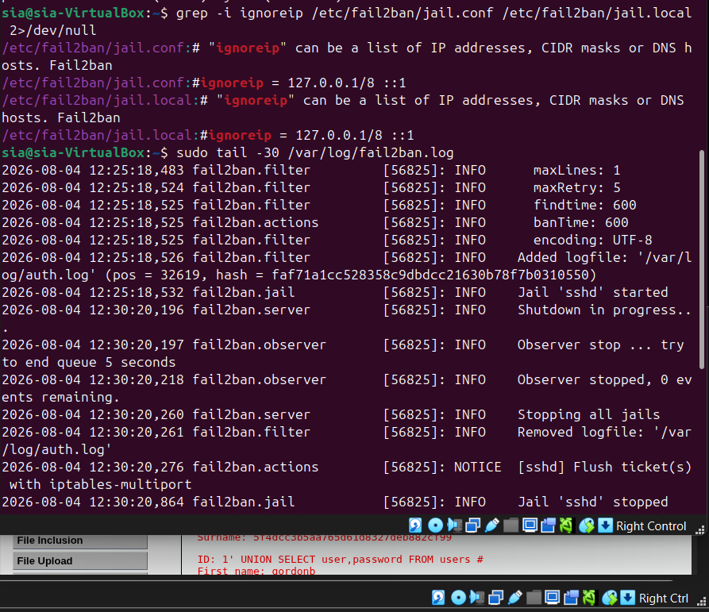

**Final Fix.** `sshd.local` was reordered so the custom regex is evaluated *before* `%(known/failregex)s`, and the retest was run against the host's real IP (`192.168.56.20`) from Kali instead of localhost:

```
$ sudo fail2ban-regex /var/log/auth.log /etc/fail2ban/filter.d/sshd.local
Failregex: 17 total
1) [6] ^Connection closed by authenticating user \S+ <HOST> port \d+ \[preauth\]\s*$
```

The custom pattern now wins the match, 6 hits, with no `NOFAIL` tag involved.

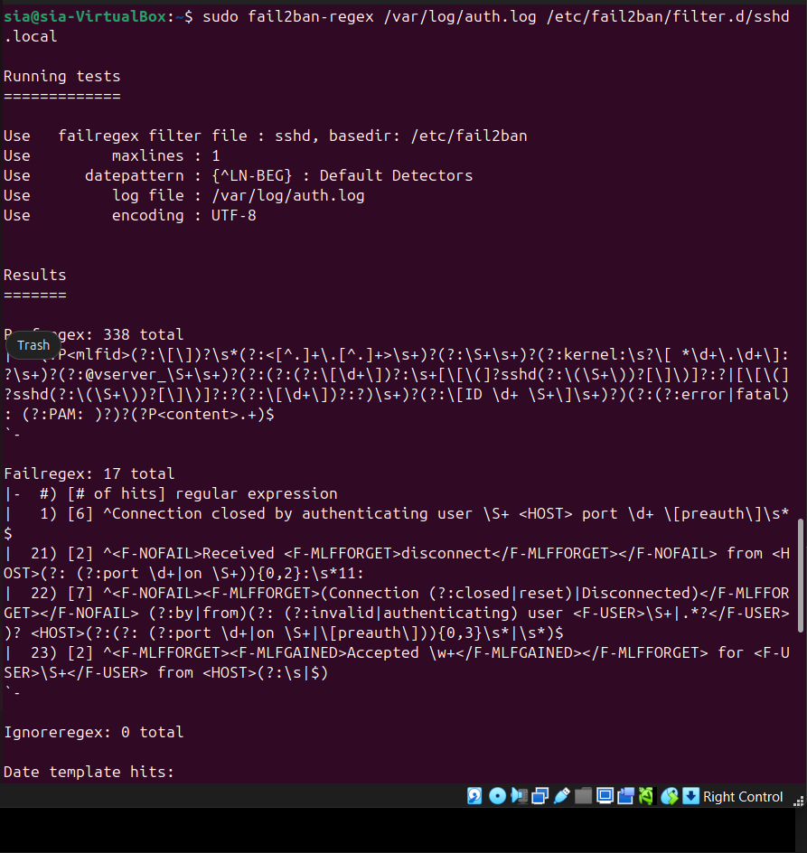

After `sudo systemctl restart fail2ban` and one fresh, real SSH rejection from Kali against `192.168.56.20`:

```
$ sudo fail2ban-client status sshd
Currently failed: 1
Total failed:     1
```

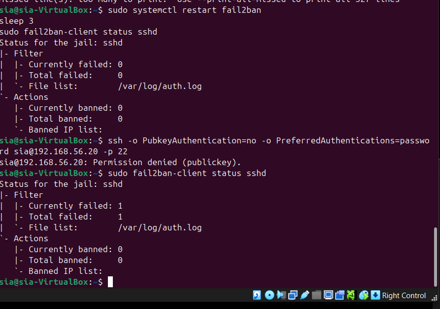

**Security Impact.** This is the same "active is not the same as effective" theme from Finding 1, discovered independently, through a completely different mechanism: not a missing configuration, but two separate, silent design behaviors (`NOFAIL` tagging and `ignoreip` whitelisting) that combined to make a fully "active" jail fail to catch anything, with zero errors anywhere to indicate a problem existed.

**MITRE Mapping.** Defensive finding; relates to **T1110 - Brute Force** as the attack category this control exists to catch.

**Severity.** **High.** Fail2ban had provided zero real protection since Lab 04 despite every surface-level check (`systemctl status`, `fail2ban-client status`) suggesting it was working correctly.

**Remediation.** Implemented and verified live, not deferred: custom regex ordered before the NOFAIL-tagged default, testing performed against a real (non-whitelisted) source IP. Going forward, any Fail2ban filter change should be validated with `fail2ban-regex` against real log data *and* a live end-to-end test from an actual non-whitelisted source, not just a syntax check.

---

## Detection Coverage Matrix

| Attack | Telemetry Source | Detection Mechanism | Result | Limitation |
|---|---|---|---|---|
| 1. Nmap full port scan | None (no network sensor) | None | **Miss** | Host-based tooling cannot see network-layer reconnaissance by design |
| 2. SQL Injection (UNION-based) | Docker syslog -> `dvwa-apache` | `detect.py` `watch_web()` regex | **Detected** | Regex-based; catches tested payload shapes, not every SQLi variant |
| 3. Command Injection | `/var/log/audit/audit.log` (`exec_actions`) | `detect.py` `watch_exec()` | **Detected** | Fixed command watchlist; works because containers share the host kernel |
| 4. Stored XSS | Docker syslog -> `dvwa-apache` | `detect.py` `watch_web()` regex | **Miss** | Structural: Apache access logs never contain POST body content |
| 5. Cookie tampering / security-level bypass | Docker syslog -> `dvwa-apache` | `detect.py` `watch_web()` regex | **Partial / Misleading** | Alert fired on the SQLi pattern in the URL, not on the actual cookie-tampering mechanism, which the script cannot see at all |
| Fail2ban (SSH brute-force class) | `/var/log/auth.log` | Fail2ban `sshd` jail | **Fixed and verified live** | Was silently non-functional since Lab 04 due to NOFAIL tagging + ignoreip whitelist; both issues corrected and confirmed with a real attempt |

## MITRE ATT&CK Mapping

| Finding | Related ATT&CK Technique(s) |
|---|---|
| 2. Network reconnaissance (undetected) | T1595 - Active Scanning |
| 3. SQL Injection (detected) | T1190 - Exploit Public-Facing Application |
| 4. Command Injection (detected) | T1190 - Exploit Public-Facing Application; T1059 - Command and Scripting Interpreter |
| 5. Stored XSS (undetected) | T1190 - Exploit Public-Facing Application; T1185 - Browser Session Hijacking (downstream risk) |
| 6. Cookie tampering (misleading alert) | T1211 - Exploitation for Defense Evasion |
| 7. Fail2ban (SSH brute-force protection) | T1110 - Brute Force |

## Verification Summary

| Check | Status |
|---|---|
| Baseline visibility audited before building anything | Confirmed, and a real gap found (auditd 0 rules) |
| auditd rules loaded and firing on live events | Confirmed via `ausearch -k exec_actions` |
| Docker logs reaching the host journal | Confirmed via `journalctl -t dvwa-apache` |
| detect.py watchers tested individually before attack replay | Confirmed |
| All 5 replayed attacks produce an honestly recorded result (hit, miss, or misleading) | Confirmed |
| Fail2ban fix verified with a real, non-whitelisted SSH rejection, not just a syntax check | Confirmed |

## Detection Engineering Improvements

Not implemented in this lab, unlike the Fail2ban fix above, which was completed and verified live. These are the specific, realistic next steps that would close the remaining gaps:

- **Network-layer IDS** (Suricata or Zeek) to close Finding 2's blind spot: host-based tooling alone will never see reconnaissance traffic that never touches a file or process on the host.
- **Application-level or reverse-proxy logging with POST body visibility** to close Finding 5's structural gap: this requires a different telemetry source entirely, not a better regex against the same Apache access log.
- **Session and cookie integrity monitoring** to close Finding 6's gap: logging or flagging security-relevant cookie/session state changes so an alert can distinguish "pattern matched" from "pattern matched, and the session itself was tampered with."

## Problems Encountered

**The Oracle Cloud Wazuh attempt.** The original plan for this lab was to run Wazuh, a full-featured SIEM, rather than a custom script. The host has 15.6GB RAM total with an i7-13620H; with the Kali and Ubuntu VMs already running, only around 2.9GB was free, well short of Wazuh's roughly 8GB recommended single-node footprint. Oracle Cloud's Always Free tier (Ampere A1) was evaluated as a free remote alternative. The account's home region was locked to Frankfurt (`eu-frankfurt-1`) at signup, since no Greece region exists. Oracle also reduced the Always Free Ampere A1 allocation from 4 OCPU/24GB to 2 OCPU/12GB as of June 2026, shrinking the available headroom before the attempt even started. A public-IP toggle bug in the quick-create instance flow was worked around using the VCN Wizard's "Create VCN with Internet Connectivity" option.

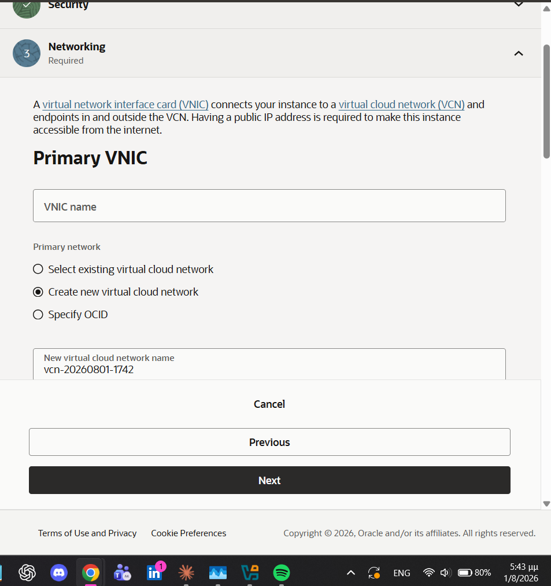

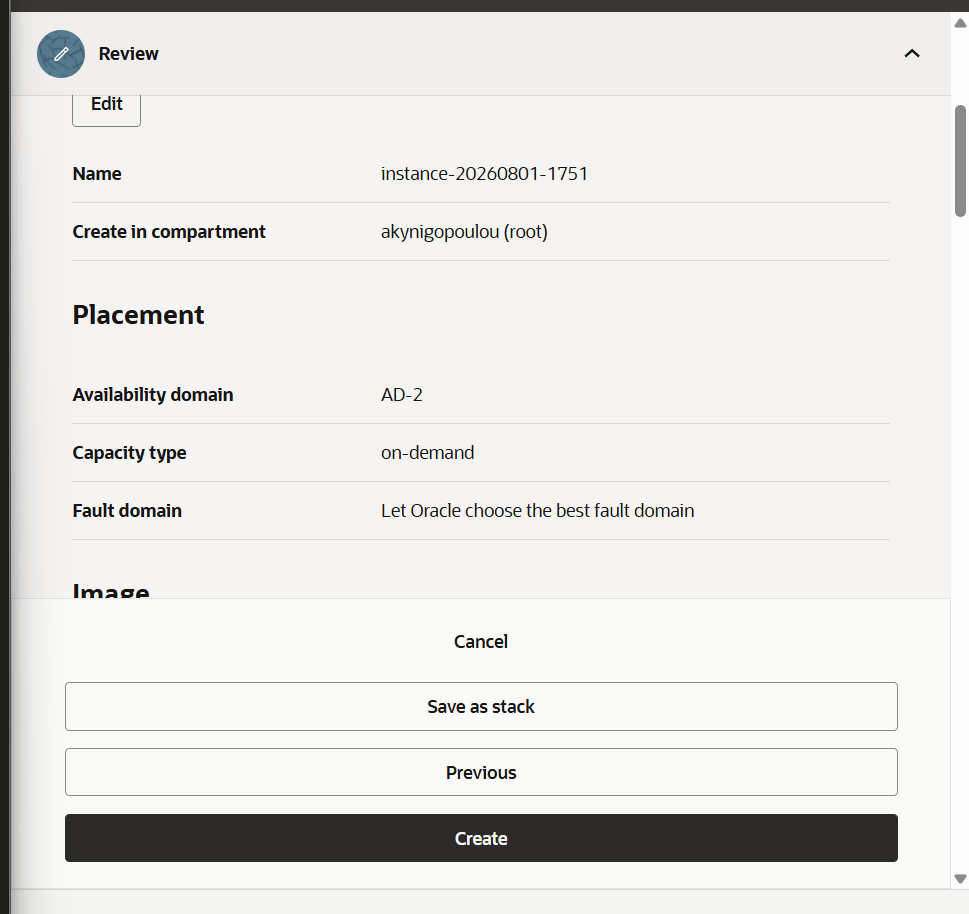

Every creation attempt, across multiple availability domains and after reducing the requested shape down to 1 OCPU/6GB, failed with the same error:

```
Out of capacity for shape VM.Standard.A1.Flex
```

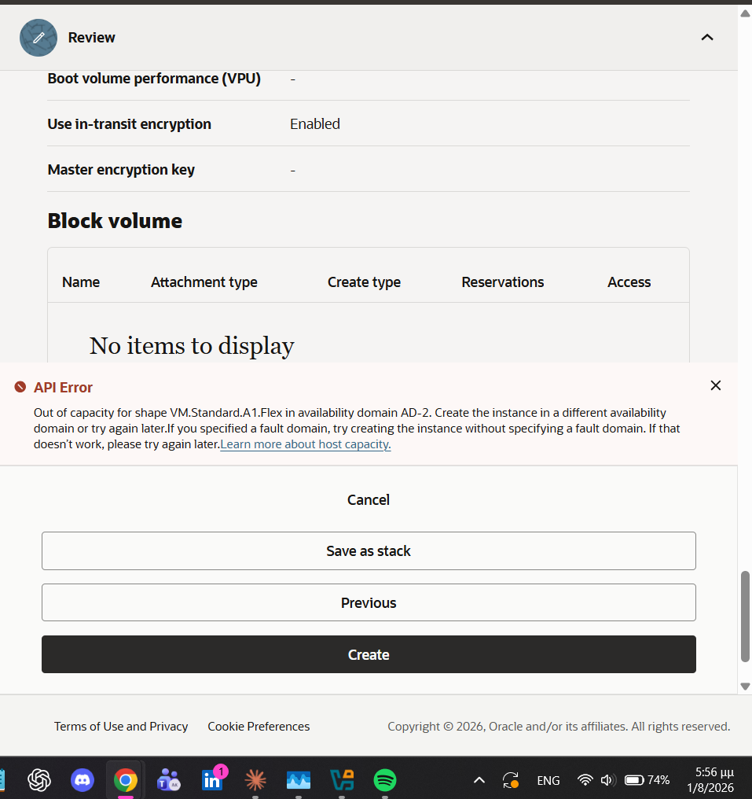

This is a well-documented, widespread Oracle Free Tier capacity issue, and the account's home region cannot be changed after signup. The cloud Wazuh path was abandoned and the lab pivoted to the lightweight, host-based stack (`auditd` + Docker syslog + a custom Python script) that became the rest of this lab. This was a reasoned engineering trade-off under a real, external infrastructure constraint, not a fallback taken because the original plan was too difficult.

**VM crash/freeze mid-lab.** The lab environment froze partway through, most likely from RAM exhaustion running Kali, Burp Suite, Ubuntu, `detect.py`, and Docker simultaneously on a host already tight on memory (see above). After restarting, every custom configuration file created during this lab (`lab06-detection.rules`, `sshd.local`, `detect.py`) was confirmed to still be present on disk and unmodified, and all affected services (`auditd`, `fail2ban`, Docker) reloaded cleanly without needing to be rebuilt from scratch.

## Lessons Learned

Full write-up in [`lessons-learned.md`](lessons-learned.md). The short version: "active," "configured," and "alerting" are three different claims, not one, and this lab found all three failing independently within the same environment.

## Skills Demonstrated

- `auditd` detection rule authoring (identity, privilege escalation, configuration-change, and full `execve` syscall watches)
- Docker log driver configuration (`syslog`) to bridge container telemetry into host-level log aggregation
- Python3 multi-threaded log-tailing and correlation (`threading`, `re`, `subprocess`, `urllib.parse`)
- MITRE ATT&CK technique mapping for both offensive replay and defensive coverage gaps
- Fail2ban filter authoring and regex-precedence debugging
- Root-cause investigation methodology: treating a "silent failure" (0/0, no errors) as requiring multiple independent hypotheses, not a single fix
- Oracle Cloud Infrastructure (OCI) compute and VCN configuration, and troubleshooting under real free-tier capacity constraints
- Precise security writing: distinguishing "an alert fired" from "the detection actually saw the attack mechanism"

## Next Phase

**Lab 07: Windows Security & Active Directory** *(planned)*

Every lab so far has been Linux-only. The next lab extends this homelab into a Windows/Active Directory environment, the other half of nearly every real enterprise network, and the domain where an entirely different set of detection and hardening concerns applies.

---

**Screenshots note:** 18 screenshots are embedded above, covering the key moments of each finding. The full evidence set (29 screenshots, including additional Fail2ban debugging steps) is in [`screenshots/`](screenshots/).

---

[⬅️ Previous: Lab 05 - Web Application Security Assessment](../Lab-05-Web-Application-Security-Assessment/README.md) &nbsp;|&nbsp; [🏠 Home](../README.md) &nbsp;|&nbsp; ➡️ Next: Lab 07 - Windows Security & Active Directory *(planned)*
