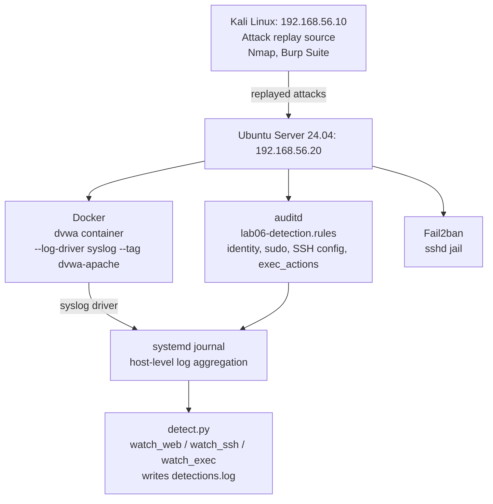

# Architecture: Lab 06

Same physical topology as Labs 01-05. This lab adds no new machines; it adds detection capability on top of the existing Ubuntu host and replays attacks from Labs 03-05 to see whether that capability actually works.

## What changed from Lab 05

Labs 01-05 built and hardened this host, then assessed a web application running on it. This lab does not add new infrastructure; it adds visibility on top of what already exists: audit rules, a syslog-connected Docker log driver, a custom detection script, and a working Fail2ban jail (the jail existed since Lab 04, but was not actually catching anything until this lab's investigation, see Finding 7).
