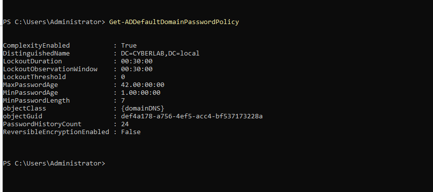
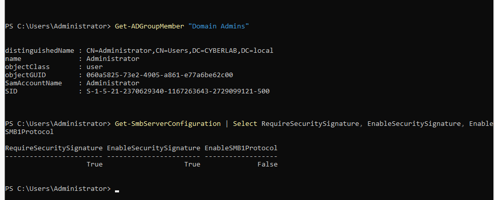
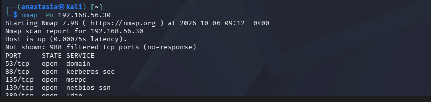
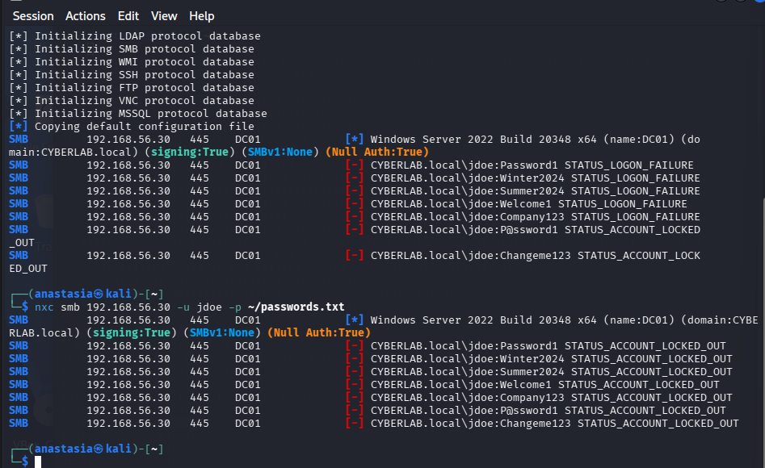
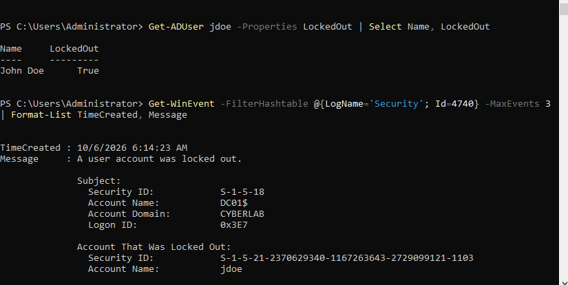
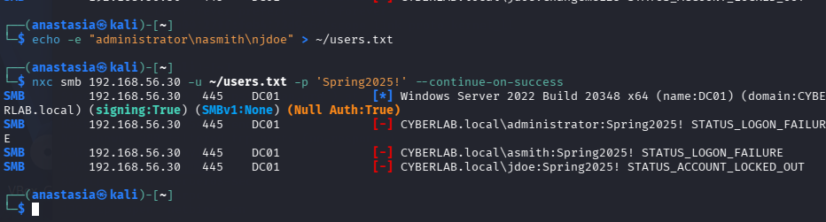
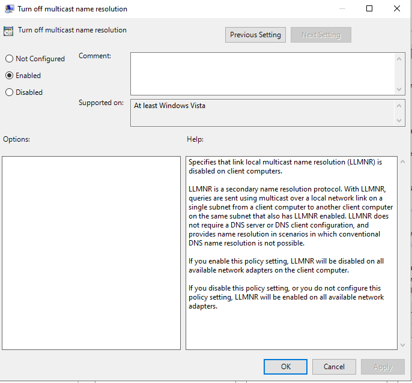
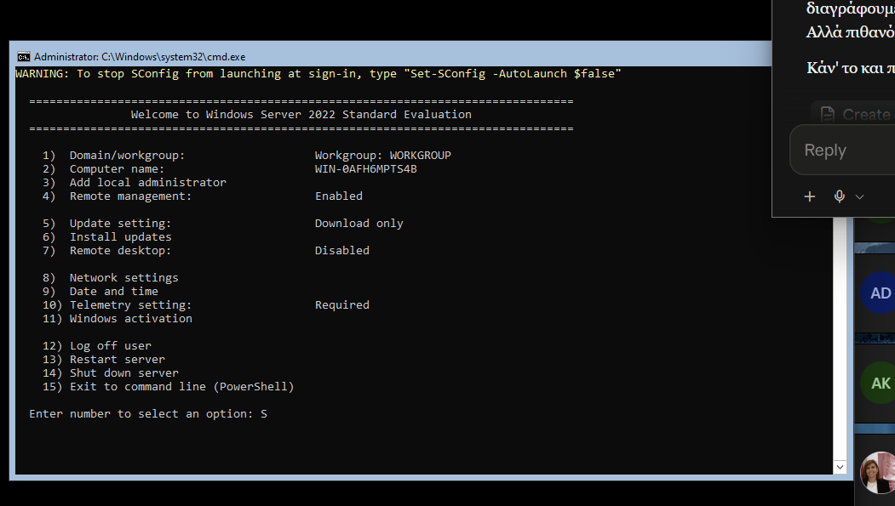

# Windows Security & Active Directory

`Windows Server 2022` `Active Directory` `Kali Linux` `Group Policy` `auditd→auditpol` `NetExec` `MITRE ATT&CK` `Blue Team` `Red Team`

| | |
|---|---|
| **Focus** | Standing up an Active Directory domain, measuring how insecure it is by default, hardening it through Group Policy, and verifying from an attacker's perspective that the hardening actually holds, and being precise about what it does *not* cover |
| **Difficulty** | Intermediate-Advanced |
| **Duration** | ~3 hours (single session) |
| **Tools** | AD DS, DNS, Group Policy (GPMC), `auditpol`, Windows Event Logging, Nmap, NetExec (`nxc`) |

## Architecture

Full diagram and notes: [`architecture/lab-architecture.md`](architecture/lab-architecture.md). This lab retires the Ubuntu host from Labs 01-06 (powered off to free RAM) and introduces a **Windows Server 2022 Domain Controller** as the new target, attacked from the existing Kali box over the same isolated internal network.

## Series Continuity

```
Labs 01-06 -> Linux-only: build, harden, attack, and monitor a Linux host and its web app
Lab 07     -> The other half of the enterprise: Windows + Active Directory
```

Every prior lab was Linux. This one crosses into the Windows/AD world that makes up the majority of real enterprise environments, where a different hardening and detection toolset applies: Group Policy instead of `ufw`/`sshd_config`, the Windows Security event log instead of `auditd`, and Kerberos/NTLM/SMB instead of SSH.

## Executive Summary

A fresh Active Directory domain (`CYBERLAB.local`) was built on Windows Server 2022, baselined, hardened, instrumented for detection, and then attacked from Kali to test whether the hardening and detection actually worked. The headline result is honest rather than triumphant: the default domain password policy was genuinely weak (7-character minimum, **account lockout disabled entirely**), and hardening it closed that gap against brute-force in a way that was verified live, an account locked after exactly five bad passwords, and the Domain Controller logged it. But the same testing surfaced a more interesting finding that is easy to overclaim: **account lockout stops brute-force, yet a careful password spray walks straight past it**, because spraying spends only one attempt per account and never reaches the lockout threshold. This mirrors the recurring theme of Lab 06, that a control being "enabled" is not the same as it being "effective against the attack you actually care about." Lockout is effective against one attack class and structurally blind to another; the real defense against spraying is detection, not lockout, which is exactly why the audit logging built in Phase 4 matters.

## Scenario

Every previous lab hardened a Linux host. Before this homelab could claim to reflect a real enterprise, it needed the other half: a Windows domain. The task was to build a Domain Controller, treat its out-of-the-box state as untrusted, measure it honestly, harden the parts that were weak, and then put on the attacker's hat from Kali to confirm, with evidence, which defenses hold and which only appear to.

## Objectives

- Build a Windows Server 2022 Domain Controller hosting a new AD forest/domain (`CYBERLAB.local`).
- Baseline the default security posture of a fresh AD domain before changing anything.
- Harden the domain through Group Policy: password length, account lockout, and LLMNR.
- Build detection capability (Windows advanced audit policy) and confirm the right events are captured.
- Replay AD reconnaissance, a brute-force, and a password spray from Kali, and record honestly what was blocked, what was detected, and what slipped through.
- Map every finding to MITRE ATT&CK, and be precise about what each result actually proves.

## Environment

- **Windows Server 2022 Standard (Desktop Experience)**: `DC01`, `192.168.56.30`: Domain Controller for `CYBERLAB.local`, also the domain DNS server. Domain functional level: `Windows2016Domain`.
- **Kali Linux**: `192.168.56.10`: attack / reconnaissance source.
- **Internal network** `CyberLab`, isolated from the physical LAN; NAT used only for updates.

## Methodology

```
Phase 1: Build DC (install Windows Server, static IP, rename, promote to AD DS)
     |
Phase 2: Default Posture Assessment (password policy, privileged groups, SMB)
     |
Phase 3: Hardening via Group Policy (password length, account lockout, LLMNR)
     |
Phase 4: Detection (advanced audit policy for logon / credential / account events)
     |
Phase 5: Attack Replay from Kali (recon, brute-force, password spray)
     |
Phase 6: MITRE ATT&CK Mapping & Documentation
```

---

## Findings

### Finding 1: The Default Domain Password Policy Is Genuinely Weak

**Description.** Before changing anything, the default domain password policy was read directly rather than assumed.

**Evidence.**

```
$ Get-ADDefaultDomainPasswordPolicy
ComplexityEnabled          : True
LockoutThreshold           : 0
MinPasswordLength          : 7
MaxPasswordAge             : 42.00:00:00
PasswordHistoryCount       : 24
ReversibleEncryptionEnabled: False
```



**Security Impact.** Two defaults stand out. `MinPasswordLength = 7` is short by any current standard. Far more serious, `LockoutThreshold = 0` means **accounts never lock out, no matter how many wrong passwords are tried.** That is an open door for online brute-force and password-guessing attacks: an attacker can try passwords indefinitely with zero friction. Complexity being enabled and reversible encryption being disabled are the two defaults that are already correct.

**MITRE Mapping.** **T1110 - Brute Force** (the attack class this weak policy enables).

**Severity.** **High.** A domain where accounts never lock is one bad password away from being brute-forced, and nothing stops the attempt.

**Remediation.** Raised `MinPasswordLength` to 14 and set `LockoutThreshold` to 5 with a 30-minute lockout and 30-minute observation window, via the Default Domain Policy GPO (Finding 2 and Finding 4 verify the effect).

### Finding 2: SMB Signing and SMBv1 Are Already Secure by Default on a DC

**Description.** The SMB server configuration and privileged group membership were baselined alongside the password policy.

**Evidence.**

```
$ Get-ADGroupMember "Domain Admins"
Name : Administrator      (only member)

$ Get-SmbServerConfiguration | Select RequireSecuritySignature, EnableSecuritySignature, EnableSMB1Protocol
RequireSecuritySignature : True
EnableSecuritySignature  : True
EnableSMB1Protocol       : False
```



**Security Impact.** Not every default is bad, and a credible assessment says so. A Domain Controller **requires** SMB signing out of the box (protecting against SMB relay / man-in-the-middle), and SMBv1, the protocol behind EternalBlue/WannaCry, is not installed. `Domain Admins` contains only the built-in `Administrator`, which is the expected clean baseline. These were confirmed, not assumed, and left unchanged.

**MITRE Mapping.** Defensive baseline; relates to **T1557 - Adversary-in-the-Middle** (the attack SMB signing defends against) and **T1210 - Exploitation of Remote Services** (the class EternalBlue belongs to).

**Severity.** **Informational** (a positive finding).

**Remediation.** None required; these controls are already correct and were verified.

### Finding 3: Reconnaissance Cleanly Fingerprints the Domain Controller

**Description.** From Kali, an Nmap scan was run against the now-built DC (`nmap -Pn 192.168.56.30`, `-Pn` because the Windows firewall drops ICMP echo by default).

**Evidence.**

```
$ nmap -Pn 192.168.56.30
53/tcp   open  domain
88/tcp   open  kerberos-sec
135/tcp  open  msrpc
139/tcp  open  netbios-ssn
389/tcp  open  ldap
...
```



**Security Impact.** The combination of open 88 (Kerberos), 389 (LDAP), 53 (DNS) and 445 (SMB) is an unmistakable Domain Controller signature. An attacker on the network instantly knows this is the highest-value target in the environment. NetExec later confirmed the exact build and domain from SMB alone: `Windows Server 2022 Build 20348 (name:DC01) (domain:CYBERLAB.local) (signing:True)`.

**MITRE Mapping.** **T1046 - Network Service Discovery**; **T1018 - Remote System Discovery**.

**Severity.** **Medium.** Reconnaissance compromises nothing by itself, but host-based tooling cannot see a port scan, the same structural network-layer blind spot documented in Lab 06, Finding 2.

**Remediation.** Host-based controls cannot close this; it requires a network-layer sensor (IDS such as Suricata/Zeek, or firewall connection logging). Noted as a known limitation, not fixed in this lab.

### Finding 4: Account Lockout Hardening Stops Brute-Force, Verified Live

**Description.** After hardening (Phase 3), the brute-force attack this policy exists to stop was replayed from Kali against the test user `jdoe`, using NetExec over SMB with a list of seven common passwords.

**Evidence.**

```
$ nxc smb 192.168.56.30 -u jdoe -p ~/passwords.txt
jdoe:Password1   STATUS_LOGON_FAILURE        (attempt 1)
jdoe:Winter2024  STATUS_LOGON_FAILURE        (attempt 2)
jdoe:Summer2024  STATUS_LOGON_FAILURE        (attempt 3)
jdoe:Welcome1    STATUS_LOGON_FAILURE        (attempt 4)
jdoe:Company123  STATUS_LOGON_FAILURE        (attempt 5)
jdoe:P@ssword1   STATUS_ACCOUNT_LOCKED_OUT   <-- locked
jdoe:Changeme123 STATUS_ACCOUNT_LOCKED_OUT
```



Confirmed on the DC, both that the account is locked and that detection recorded it:

```
$ Get-ADUser jdoe -Properties LockedOut | Select Name, LockedOut
John Doe   True

$ Get-WinEvent -FilterHashtable @{LogName='Security'; Id=4740} ...
TimeCreated : 10/6/2026 6:14:23 AM
Message     : A user account was locked out.
              Account That Was Locked Out: jdoe
```



**Security Impact.** This is the hardening working exactly as intended: the attack that would have run unlimited against the default (`LockoutThreshold = 0`) now dies after five attempts, and the Domain Controller produces a precise, timestamped **Event 4740** naming the locked account. The detection built in Phase 4 captured 23 failed-logon events (4625/4776) across the attack.

**MITRE Mapping.** **T1110.001 - Brute Force: Password Guessing.**

**Detection Value.** **High**: attack blocked *and* logged.
**Underlying Vulnerability Severity.** **High** (the original weak policy, Finding 1; now remediated).

**Remediation.** N/A, this documents a working control. The lockout threshold (5) and duration (30 min) follow CIS guidance.

### Finding 5: A Password Spray Walks Straight Past Account Lockout

This is the most important finding in this lab, because it is the one easiest to get wrong in a report.

**Description.** The same account-lockout control from Finding 4 was tested against a different attack: a password spray, one single password tried across multiple accounts, rather than many passwords against one account.

**Evidence.**

```
$ nxc smb 192.168.56.30 -u ~/users.txt -p 'Spring2025!' --continue-on-success
administrator:Spring2025!  STATUS_LOGON_FAILURE        (1 attempt, NOT locked)
asmith:Spring2025!         STATUS_LOGON_FAILURE        (1 attempt, NOT locked)
jdoe:Spring2025!           STATUS_ACCOUNT_LOCKED_OUT   (already locked, from Finding 4)
```



**Security Impact.** This is the trap. Account lockout looks like a general-purpose brute-force defense, and against Finding 4's attack it is. But a spray spends exactly **one** attempt per account, so no single account ever approaches the five-attempt threshold, and **nothing locks.** `administrator` and `asmith` each took a failed logon and stayed wide open. A real attacker sprays one weak password (`Spring2025!`, `Autumn2025!`) across hundreds of accounts, confident that lockout will never trigger. The honest conclusion: **account lockout is effective against brute-force and structurally ineffective against password spraying.** The defense that *does* catch spraying is not a prevention control at all, it is detection: a burst of failed logons spread across many distinct accounts in a short window. That pattern is precisely what the Phase 4 audit logging (4625/4776 per account) makes visible. This is the same lesson as Lab 06: "enabled" is not "effective," and effectiveness has to be stated against a specific attack, not in general.

**MITRE Mapping.** **T1110.003 - Brute Force: Password Spraying.**

**Severity.** **High**, as a gap: a control widely assumed to stop password attacks does not stop this one, and the assumption itself is the risk.

**Remediation.** Detection, not lockout: alert on *N* failed logons (4625/4771/4776) across *M* distinct accounts within a time window. Secondary controls that genuinely help are long/strong passwords (Finding 1's length increase raises the cost of any single guess) and MFA. Not implemented as an alerting rule in this lab; documented as the correct next step.

### Finding 6: LLMNR Disabled as Defense-in-Depth

**Description.** LLMNR (Link-Local Multicast Name Resolution) was disabled domain-wide via GPO.

**Evidence.**

```
$ Get-ItemProperty "HKLM:\Software\Policies\Microsoft\Windows NT\DNSClient" -Name EnableMulticast
EnableMulticast : 0
```



**Security Impact.** LLMNR is a legacy fallback name-resolution protocol that an attacker on the same subnet can poison (e.g. with Responder) to capture NTLM hashes or relay authentication. Disabling it removes a well-known credential-theft vector. Honesty note: this hardening **could not be demonstrated** in this lab, because an LLMNR-poisoning attack needs at least one additional Windows client to be tricked into resolving a name, and this environment is a single DC plus a Linux attacker. It is applied and verified as configuration, and flagged as not-demonstrated rather than claimed as tested.

**MITRE Mapping.** **T1557.001 - Adversary-in-the-Middle: LLMNR/NBT-NS Poisoning and SMB Relay.**

**Severity.** **Medium** (defense-in-depth; closes a common vector that this specific topology cannot exercise).

**Remediation.** Implemented. Full coverage would also disable NBT-NS and would be validated with a domain-joined Windows client present.

---

## Detection Coverage Matrix

| Attack | Telemetry Source | Detection Mechanism | Result | Limitation |
|---|---|---|---|---|
| Network recon (Nmap) | None (no network sensor) | None | **Miss** | Host-based tooling cannot see a port scan by design (same as Lab 06) |
| Brute-force (one account) | Security log 4625 / 4776 / 4740 | Account lockout + audit policy | **Blocked + Detected** | None |
| Password spray (many accounts) | Security log 4625 / 4776 | Audit policy (no alerting rule yet) | **Detectable, not blocked** | Lockout structurally cannot stop a 1-attempt-per-account spray |
| LLMNR poisoning | N/A | LLMNR disabled via GPO | **Pre-empted (not demonstrated)** | Needs a domain-joined Windows client to exercise |

## MITRE ATT&CK Mapping

| Finding | Related ATT&CK Technique(s) |
|---|---|
| 1. Weak password policy | T1110 - Brute Force |
| 2. SMB signing / SMBv1 baseline | T1557 - Adversary-in-the-Middle; T1210 - Exploitation of Remote Services |
| 3. Reconnaissance | T1046 - Network Service Discovery; T1018 - Remote System Discovery |
| 4. Brute-force blocked + detected | T1110.001 - Password Guessing |
| 5. Password spray evades lockout | T1110.003 - Password Spraying |
| 6. LLMNR disabled | T1557.001 - LLMNR/NBT-NS Poisoning and SMB Relay |

## Verification Summary

| Check | Status |
|---|---|
| Baseline read before changing anything | Confirmed; real weakness found (lockout = 0, length = 7) |
| Hardening applied and re-read from AD | Confirmed: length 14, lockout 5 / 30 min (`Get-ADDefaultDomainPasswordPolicy`) |
| Advanced audit policy enabled | Confirmed via `auditpol /get` (Logon, Credential Validation, User Account Management = Success+Failure) |
| Brute-force actually locks the account | Confirmed live: `STATUS_ACCOUNT_LOCKED_OUT` + `LockedOut : True` + Event 4740 |
| Spray evasion actually occurs | Confirmed live: two accounts took a failed attempt and did not lock |
| Every result recorded as block, detect, or miss honestly | Confirmed |

## Problems Encountered

**Installed Server Core by mistake.** During a confused first installation (see next point), the edition **without** "Desktop Experience" was selected, which installs Server Core, no GUI, SConfig-only. Since the whole point of this lab was to learn AD and Group Policy through their graphical tools, the install was redone cleanly: existing partitions deleted, and the `Standard Evaluation (Desktop Experience)` edition chosen deliberately.



**Installer boot loop.** On the first install, a key was pressed at the "Press any key to boot from CD" prompt *after* the mid-install reboot, which restarted the installer from scratch instead of continuing from disk. The fix and the lesson: that prompt is only for the very first boot; after the file-copy reboot, either do nothing or eject the ISO so the machine boots from the hard disk.

**VM instability under memory pressure.** The guest froze several times mid-task. Root cause was host memory pressure, 15.6 GB total with other applications open, the same class of constraint that forced the Wazuh-to-custom-script pivot in Lab 06. Mitigations that worked: powering the Ubuntu VM off entirely for this lab, closing host applications before running Kali and the DC together, and installing the VirtualBox Guest Additions (which also fixed an unusable mouse and enabled copy-paste).

## Lessons Learned

Full write-up in [`lessons-learned.md`](lessons-learned.md). The short version: a security control has to be judged against a *specific* attack, not in the abstract. Account lockout is a genuine, verifiable defense against brute-force and, in the very same breath, no defense at all against password spraying, and writing that up honestly matters more than being able to say "lockout: enabled."

## Skills Demonstrated

- Active Directory forest/domain deployment on Windows Server 2022 (AD DS, DNS, DC promotion via PowerShell)
- Windows network configuration for a DC (static IP on the correct adapter, DNS-points-to-self)
- Group Policy authoring: password policy, account lockout policy, and administrative-template settings (LLMNR)
- Windows advanced audit policy configuration with `auditpol`, mapped to specific Security Event IDs (4625, 4740, 4771, 4776)
- Offensive AD testing from Kali: Nmap DC fingerprinting and NetExec (`nxc`) brute-force and password-spray
- Precise security writing: distinguishing brute-force from spraying, and "control enabled" from "control effective against this attack"
- MITRE ATT&CK mapping across reconnaissance, credential access, and defense-evasion techniques

## Detection Engineering Improvements

Realistic next steps, in the spirit of Lab 06's honestly-deferred improvements:

- **A spray-detection alerting rule** correlating failed logons (4625/4771/4776) across many distinct accounts in a short window, the control that actually catches Finding 5.
- **A network-layer sensor** (Suricata/Zeek) to close Finding 3's reconnaissance blind spot.
- **A domain-joined Windows client**, which would both enable an LLMNR-poisoning test (Finding 6) and make the lab a more realistic multi-host domain.
- **MFA / strong-password enforcement** as the durable answer to online password attacks generally.

## Next Phase

**Lab 08: Enterprise Attack Simulation & Incident Response** *(planned)*

The final lab in the series ties the Linux and Windows halves together into a single simulated intrusion and a structured incident-response exercise.

---

**Screenshots note:** 8 screenshots are embedded above, covering the key moments of each finding. The full evidence set (20 screenshots, including the VM build, network configuration, GPO editing screens, and detection setup) is in [`screenshots/`](screenshots/).

---

[⬅️ Previous: Lab 06 - Detection Engineering & System Monitoring](../Lab-06-Detection-Engineering-and-System-Monitoring/README.md) &nbsp;|&nbsp; [🏠 Home](../README.md) &nbsp;|&nbsp; [➡️ Next: Lab 08 - Enterprise Attack Simulation & Incident Response](../Lab-08-Enterprise-Attack-Simulation-and-Incident-Response/README.md)
