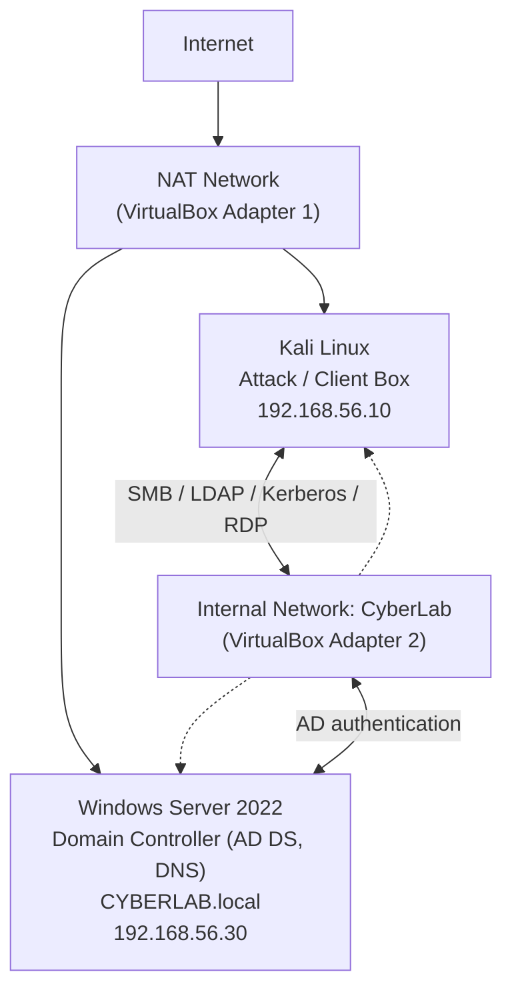

# Network Diagram: Lab 07

## Logical Topology

```
                              Internet
                                  |
                                  |
                            NAT Network
                                  |
                +-----------------+-----------------+
                |                                   |
        +---------------+                   +------------------------+
        |     Kali       |                   |   Windows Server 2022  |
        |  Attack Box    |<----------------->|   Domain Controller    |
        | 192.168.56.10  |  Internal Network |   CYBERLAB.local       |
        |  (CyberLab)    |     "CyberLab"    |    192.168.56.30       |
        +---------------+                   +------------------------+
```

## Mermaid Version (renders natively on GitHub/GitLab)



## Adapter Summary

| VM | Adapter 1 (NAT) | Adapter 2 (Internal Network) | Role |
|----|------------------|-------------------------------|------|
| Kali Linux | DHCP (internet access, updates) | 192.168.56.10/24 static | Attack / client box |
| Windows Server 2022 | DHCP (internet access, updates) | 192.168.56.30/24 static | Domain Controller (target) |

Both VMs share the Internal Network named **CyberLab**, isolated from the host's physical LAN. NAT is used only so each VM can independently reach the internet for updates; all AD/lab traffic between the two machines happens exclusively over the internal network.

## Notes on this lab's scope

- The Ubuntu host from Labs 01-06 is **powered off** for the duration of this lab to free RAM. Lab 07 is Windows/AD-focused and does not use it.
- A single Windows Server doubles as both the Domain Controller and the attack target. A separate domain-joined Windows client is **out of scope** here (RAM constraint), and noted as a limitation to revisit in a later lab.
- The Domain Controller is also the domain's DNS server (installed automatically during AD DS promotion).

## Key services exposed by a Domain Controller

| Port | Service | Why it matters for security |
|------|---------|------------------------------|
| 53 | DNS | AD depends on DNS; also a recon source |
| 88 | Kerberos | Primary AD authentication protocol |
| 135 / 139 / 445 | RPC / NetBIOS / SMB | File sharing, remote management, major attack surface |
| 389 / 636 | LDAP / LDAPS | Directory queries (users, groups, computers) |
| 3268 / 3269 | Global Catalog | Forest-wide directory lookups |
| 3389 | RDP | Remote desktop administration |
