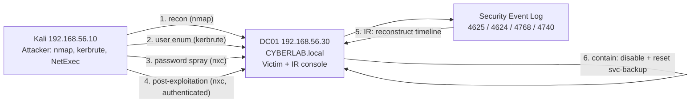

# Architecture: Lab 08

Same physical topology as Lab 07. This lab adds no new machines; it runs a full
intrusion against the existing `CYBERLAB.local` Domain Controller from Kali, then
performs incident response using the audit logging built in Lab 07.

```
                              Internet
                                  |
                            NAT Network
                                  |
                +-----------------+-----------------+
                |                                   |
        +---------------+                   +------------------------+
        |     Kali       |                   |   Windows Server 2022  |
        |  ATTACKER      |===== attack =====>|   DC01 / CYBERLAB.local |
        | 192.168.56.10  |  Internal Network |    192.168.56.30       |
        |                |<=== IR traces ====|  (victim + IR console)  |
        +---------------+     "CyberLab"     +------------------------+
```



## The two hats

| Role | Machine | What it does |
|------|---------|--------------|
| Red team (attacker) | Kali | Recon -> enumeration -> password spray -> foothold -> post-exploitation |
| Blue team (IR) | DC01 | Reconstruct the attack from the Security event log, identify IOCs, contain |

## The planted weakness

A service account `svc-backup` was created with a weak, predictable password
(`<svc-backup-test-password>`) that satisfies the Lab 07 password policy (14+ chars, complex)
yet is trivially guessable, simulating the single most common real-world AD
weakness: a set-and-forget service-account password. Everything else in the
domain keeps the Lab 07 hardening.
