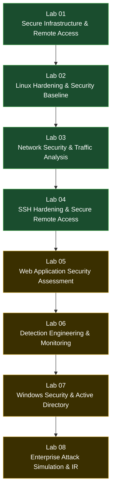

# Cyber Security Homelab

A self-directed, hands-on cybersecurity homelab built from scratch in VirtualBox: infrastructure, hardening, network security, and secure service deployment, each documented as a standalone lab with real command output, screenshots, and a written record of what actually went wrong and how it was diagnosed.

This is not a list of tutorials followed step by step. Each lab follows the same repeatable pattern (Scenario -> Objectives -> Implementation -> Validation -> Lessons Learned), is verified independently rather than assumed to work because a config file was written, and is documented the way a real infrastructure or security change would be documented on the job.

## Why This Exists

I created this homelab to deepen my practical cybersecurity skills through hands-on experimentation. My goal is to understand how secure systems are designed, configured, hardened, verified, and maintained while documenting the complete engineering process,from planning and implementation to troubleshooting and validation.Rather than simply following tutorials, this repository documents the reasoning behind every decision, the challenges encountered, and the lessons learned throughout the project.

## Learning Path

## Lab Index

| Lab | Topic | Status |
|-----|-------|--------|
| [Lab 01](Lab-01-Infrastructure-and-Secure-Remote-Access/) | Secure Infrastructure & Remote Access | ✅ Complete |
| [Lab 02](Lab-02-Linux-Hardening/) | Enterprise Linux Hardening & Security Baseline | ✅ Complete |
| [Lab 03](Lab-03-Network-Security-and-Traffic-Analysis/) | Network Security & Traffic Analysis | ✅ Complete |
| [Lab 04](Lab-04-SSH-Hardening-and-Secure-Remote-Access/) | SSH Hardening & Secure Remote Access | ✅ Complete |
| Lab 05 | Web Application Security Assessment | 🟡 Planned |
| Lab 06 | Detection Engineering & System Monitoring | 🟡 Planned |
| Lab 07 | Windows Security & Active Directory | 🟡 Planned |
| Lab 08 | Enterprise Attack Simulation & Incident Response | 🟡 Planned |

Each lab folder is self-contained and includes:

- `README.md`: a full technical write-up (overview, objectives, architecture, implementation, verification, problems encountered, lessons learned)
- `commands.md`: every command used, organized by phase
- `lessons-learned.md`: a reflective write-up of what the lab actually taught
- `screenshots/`: the evidence for every claim made in the README
- `architecture/`: network/architecture diagrams for that lab

## Skills Matrix

| Skill | Lab(s) |
|---|---|
| Virtualization & Network Design (VirtualBox) | 01 |
| SSH Key-Based Authentication | 01, 04 |
| Linux Firewall Administration (UFW) | 01, 02 |
| Linux System Administration | 01, 02, 04 |
| Account & Password Policy Hardening | 02 |
| Attack Surface Reduction | 02, 04 |
| Linux Audit Framework (`auditd`) | 02 |
| Detection Engineering | 02 |
| MITRE ATT&CK-Informed Analysis | 02, 03 |
| Network Reconnaissance & Host Discovery | 03, 04 |
| Nmap (scanning, service detection, NSE scripts) | 03, 04 |
| Wireshark & Packet-Level Protocol Analysis | 03 |
| TCP/IP, DNS, and TLS Traffic Analysis | 03 |
| Vulnerability & Configuration Auditing (Lynis, `ssh-audit`) | 04 |
| Brute-Force Mitigation (Fail2Ban) | 04 |
| Security Control Validation (proving, not assuming) | 02, 03, 04 |

## Environment

- **Hypervisor:** Oracle VirtualBox
- **Virtual machines:** Kali Linux (attack / client box), Ubuntu Server 24.04 LTS (hardening target)
- **Networking:** isolated internal network for all inter-VM lab traffic, NAT reserved only for internet/package access
- **Approach:** every configuration change is independently verified (`ping`, `ssh -v`, `nmap`, `ufw status`, `ausearch`, `fail2ban-client`, etc.) rather than assumed to have taken effect

## License

See [`LICENSE`](LICENSE). All rights reserved; this repository is public for portfolio and evaluation purposes only.
