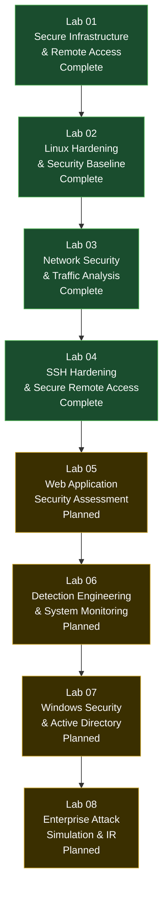

# Cyber Security Homelab

**A self-directed, hands-on cybersecurity homelab: infrastructure, hardening, network security, and secure service deployment, each lab built, attacked, defended, and documented like a real engineering deliverable.**

`4 Labs Complete` `70+ Real Screenshots` `2 VMs` `0 Tutorials Copy-Pasted`

This is not a list of tutorials followed step by step. Each lab is designed, built, verified independently (not just assumed to work because a config file was written), and documented the way a real infrastructure or security change would be documented on the job, including the mistakes made along the way.

## How Every Lab in This Repo Is Built

The same methodology repeats across every lab, on purpose:

```
Scenario  ->  Objectives  ->  Implementation  ->  Validation  ->  Lessons Learned
```

Nothing is marked done because a command ran without an error. Every control is independently re-checked with the tool that would actually catch a failure, a firewall rule is confirmed with a port scan, a Fail2Ban jail is confirmed by actually triggering it, encrypted SSH traffic is confirmed opaque by capturing it, not by trusting the banner. Where something broke during a lab, that failure is documented in full, root cause and all, rather than edited out.

## Why This Exists

I created this homelab to deepen my practical cybersecurity skills through hands-on experimentation. My goal is to understand how secure systems are designed, configured, hardened, verified, and maintained while documenting the complete engineering process,from planning and implementation to troubleshooting and validation.Rather than simply following tutorials, this repository documents the reasoning behind every decision, the challenges encountered, and the lessons learned throughout the project.

## Learning Path



Each lab deliberately builds on the state left by the one before it: Lab 02 hardens the exact VM Lab 01 deployed, Lab 03 validates that hardening from the network, and Lab 04 takes the one service Lab 03 found exposed and carries it through a full security lifecycle.

## Skills Matrix

A recruiter-speed summary of what's actually demonstrated where.

| Skill | Lab(s) |
|---|---|
| Virtualization & Network Design (VirtualBox) | 01 |
| SSH Key-Based Authentication | 01, 04 |
| Linux Firewall Administration (UFW) | 01, 02 |
| Linux System Administration | 01, 02, 04 |
| Account & Password Policy Hardening | 02 |
| Attack Surface Reduction | 02, 04 |
| Linux Audit Framework (`auditd`) | 02 |
| Detection Engineering | 02 |
| MITRE ATT&CK-Informed Analysis | 02, 03 |
| Network Reconnaissance & Host Discovery | 03, 04 |
| Nmap (scanning, service detection, NSE scripts) | 03, 04 |
| Wireshark & Packet-Level Protocol Analysis | 03 |
| TCP/IP, DNS, and TLS Traffic Analysis | 03 |
| Vulnerability & Configuration Auditing (Lynis, `ssh-audit`) | 04 |
| Brute-Force Mitigation (Fail2Ban) | 04 |
| Security Control Validation (proving, not assuming) | 02, 03, 04 |
| systemd Service & Socket Troubleshooting | 01, 04 |

## Lab Index

| Lab | Topic | Focus | Status |
|---|---|---|---|
| [Lab 01](Lab-01-Infrastructure-and-Secure-Remote-Access/) | Secure Infrastructure & Remote Access | Build the two-VM lab, isolate the network, establish SSH key-based access | ✅ Complete |
| [Lab 02](Lab-02-Linux-Hardening/) | Enterprise Linux Hardening & Security Baseline | Assess and harden the Ubuntu host: accounts, passwords, firewall, services, auditing | ✅ Complete |
| [Lab 03](Lab-03-Network-Security-and-Traffic-Analysis/) | Network Security & Traffic Analysis | Validate Lab 02's hardening from the network with Nmap and Wireshark | ✅ Complete |
| [Lab 04](Lab-04-SSH-Hardening-and-Secure-Remote-Access/) | SSH Hardening & Secure Remote Access | Take the one exposed service through assessment, hardening, attack simulation, and validation | ✅ Complete |
| Lab 05 | Web Application Security Assessment | Move up a layer, from network and host security to a running web application | 🟡 Planned |
| Lab 06 | Detection Engineering & System Monitoring | Centralized logging and alerting across the lab environment | 🟡 Planned |
| Lab 07 | Windows Security & Active Directory | Extend the lab beyond Linux into a Windows/AD environment | 🟡 Planned |
| Lab 08 | Enterprise Attack Simulation & Incident Response | A full scenario tying every prior lab's controls together | 🟡 Planned |

Each completed lab folder includes:

- `README.md`: a full technical write-up (executive summary, objectives, architecture, findings, validation, problems encountered, lessons learned)
- `commands.md`: every command used, organized by phase
- `lessons-learned.md`: a reflective write-up of what the lab actually taught
- `screenshots/`: the evidence for every claim made in the README
- `architecture/`: diagrams for that lab

## Environment

- **Hypervisor:** Oracle VirtualBox
- **Virtual machines:** Kali Linux (attack / client box), Ubuntu Server 24.04 LTS (hardening target)
- **Networking:** isolated internal network for all inter-VM lab traffic, NAT reserved only for internet/package access
- **Approach:** every configuration change is independently verified (`ping`, `ssh -v`, `nmap`, `ufw status`, `ausearch`, `fail2ban-client`, etc.) rather than assumed to have taken effect

## License

See [`LICENSE`](LICENSE). All rights reserved; this repository is public for portfolio and evaluation purposes only.
